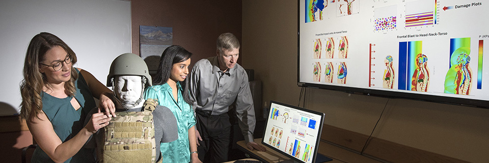

# Sandia Injury Biomechanics Laboratory (SIBL)



## Purpose

The Sandia Injury Biomechanics Laboratory analyzes injury due to blast, ballistics, and blunt trauma to help the nation protect the U.S. warfighter. Our contributions to the science of injury causation and prevention aim to significantly reduce the U.S. warfighter's exposure to serious, severe, and fatal injuries.

For more information, see our [website](http://www.sandia.gov/biomechanics/).

## Library

* [XYFigure](xyfigure/README.md)

## Getting Started

For an overview, [read the guide](https://guides.github.com/activities/hello-world/) from GitHub.

### Get a local copy of the repository using `git clone` with SSH

```console
$ cd ~  # Starting from the home directory is optional, but recommended.
$ git clone git@github.com:sandialabs/sibl.git
```

### Push to the repository

In the `~/sibl/.git/config` file, add the following:

```python
[user]
    name = James Bond  # your first and last name
    email = jb007@company.com  # your email address
```

Configure ssh keys between your local and the repo.  This assumes to you have an existing public key file in `~/.ssh/id_rsa/id_rsa.pub`.  See [this](https://help.github.com/en/github/authenticating-to-github/connecting-to-github-with-ssh) to create a public key.  See [this](https://help.github.com/en/github/authenticating-to-github) for troubleshooting.

Copy the entire **public** key to the GitHub site under [Settings > SSH and GPG keys](https://github.com/settings/keys).

From within the repo `~/sibl/`, set the username and email on a *per-repo* basis:

```console
$ git config user.name "James Bond"  # your first and last name in quotations
$ git config user.email "jb007@company.com"  # your email address in quotations
```

## Contact

* Chad B. Hovey, Sandia National Laboratories, chovey@sandia.gov

## License

* [License](LICENSE)
* [Third-Party Notice](NOTICE.md)

Sandia National Laboratories is a multimission laboratory managed and operated by National Technology and Engineering Solutions of Sandia, LLC., a wholly owned subsidiary of Honeywell International, Inc., for the U.S. Department of Energy's National Nuclear Security Administration under contract DE-NA-0003525.
