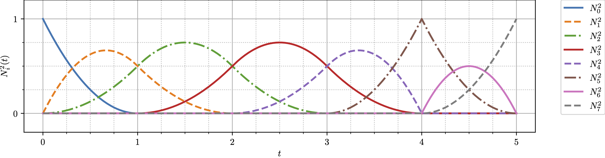
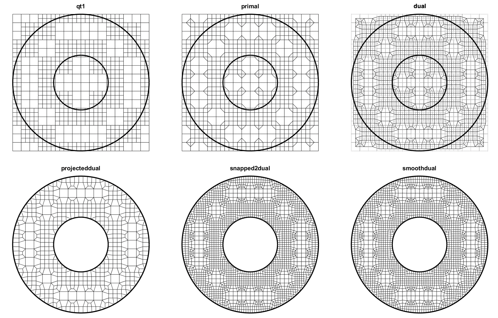

# Sandia Injury Biomechanics Laboratory (SIBL)

    

  

 

[![test-coverage][test-coverage_badge]](https://sandialabs.github.io/sibl/coverage_reports/htmlcov/index.html)

[test-coverage_badge]: https://sandialabs.github.io/sibl/coverage.svg

## Purpose

The Sandia Injury Biomechanics Laboratory analyzes injury due to blast, ballistics, and blunt trauma to help the nation protect the U.S. warfighter. Our contributions to the science of injury causation and prevention aim to significantly reduce the U.S. warfighter's exposure to serious, severe, and fatal injuries.

For more information on the program &mdash; including publications, presentations, and reports &mdash; see our [Sandia National Laboratories website](https://www.sandia.gov/biomechanics/).

## Library

The *SIBL Geometry Engine* is an open-source geometry and mesh engine written in Python and C++ used for 
* Bézier curves, surfaces, and volumes,
* B-spline curves, surfaces, and volumes, and
* Automatic mesh generation of a 2D quadrilateral mesh from a dualized, feature-refined quadtree.

> Figure 1:  Eight B-spline quadratic basis functions (reproduction of Cottrell *et al.* Figure 2.5[^Cottrell2009] and Piegl and Tiller Figure 2.6[^Piegl1997]).

> Figure 2: Automatic mesh generation workflow using dualization.

## Documentation

* Learn the formulation and Python implementation from the teaching slides: [pdf download](geo/doc/bezier_b-spline/Hovey_2022_Bezier_B-Spline_SAND2022-7702_C.pdf) (3.3 MB).
* Review the Python library API through the test suite: `~/sibl> pytest -v`
* Automatically create a 2D dualized mesh from a discrete, well-defined boundary. Start here: [Lessons](geo/doc/dual/README.md)
* Use [xyfigure](cli/doc/README.md) and a `.json` configuration file to create high quality LaTeX figures.
* Approximate the angular velocity of a quasi-rigid body using the Three Point Angular Velocity Algorithm ([TPAV](cli/tests/tpav/README.md)).

## Contributing

* [Configure](config/README.md) the development environment.
* Follow the developer [workflow](config/workflow.md).
* To contribute, submit a merge request.

## Contact

* Chad B. Hovey, Sandia National Laboratories, chovey@sandia.gov

## License

* [License](LICENSE)
* [Third-Party Notice](NOTICE.md)

Sandia National Laboratories is a multimission laboratory managed and operated by National Technology and Engineering Solutions of Sandia, LLC, a wholly owned subsidiary of Honeywell International, Inc., for the U.S. Department of Energy's National Nuclear Security Administration under contract DE-NA-0003525.

## Copyright

Copyright 2020 National Technology and Engineering Solutions of Sandia, LLC (NTESS). Under the terms of Contract DE-NA0003525 with NTESS, the U.S. Government retains certain rights in this software.

### Notice

For five (5) years from  the United States Government is granted for itself and others acting on its behalf a paid-up, nonexclusive, irrevocable worldwide license in this data to reproduce, prepare derivative works, and perform publicly and display publicly, by or on behalf of the Government. There is provision for the possible extension of the term of this license. Subsequent to that period or any extension granted, the United States Government is granted for itself and others acting on its behalf a paid-up, nonexclusive, irrevocable worldwide license in this data to reproduce, prepare derivative works, distribute copies to the public, perform publicly and display publicly, and to permit others to do so. The specific term of the license can be identified by inquiry made to National Technology and Engineering Solutions of Sandia, LLC or DOE.
 
NEITHER THE UNITED STATES GOVERNMENT, NOR THE UNITED STATES DEPARTMENT OF ENERGY, NOR NATIONAL TECHNOLOGY AND ENGINEERING SOLUTIONS OF SANDIA, LLC, NOR ANY OF THEIR EMPLOYEES, MAKES ANY WARRANTY, EXPRESS OR IMPLIED, OR ASSUMES ANY LEGAL RESPONSIBILITY FOR THE ACCURACY, COMPLETENESS, OR USEFULNESS OF ANY INFORMATION, APPARATUS, PRODUCT, OR PROCESS DISCLOSED, OR REPRESENTS THAT ITS USE WOULD NOT INFRINGE PRIVATELY OWNED RIGHTS.
 
Any licensee of this software has the obligation and responsibility to abide by the applicable export control laws, regulations, and general prohibitions relating to the export of technical data. Failure to obtain an export control license or other authority from the Government may result in criminal liability under U.S. laws.

[^Cottrell2009]: Cottrell, J. A., Hughes, T. J., and Bazilevs, Y. (2009). *Isogeometric analysis: toward integration of CAD and FEA.* John Wiley & Sons.
[^Piegl1997]: Piegl, L. and Tiller, W. (1997). *The NURBS book.* Springer Science & Business Media.

