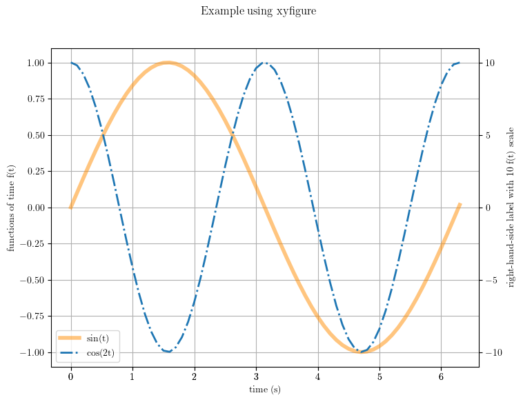
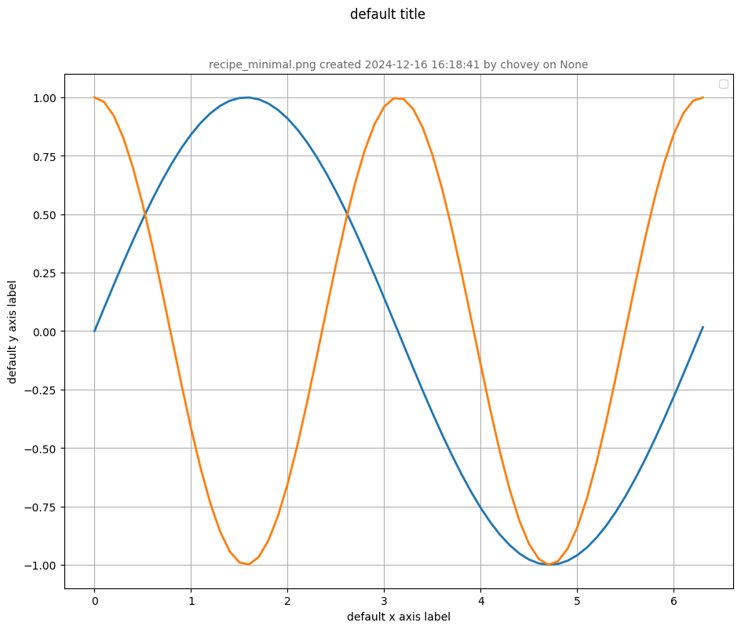
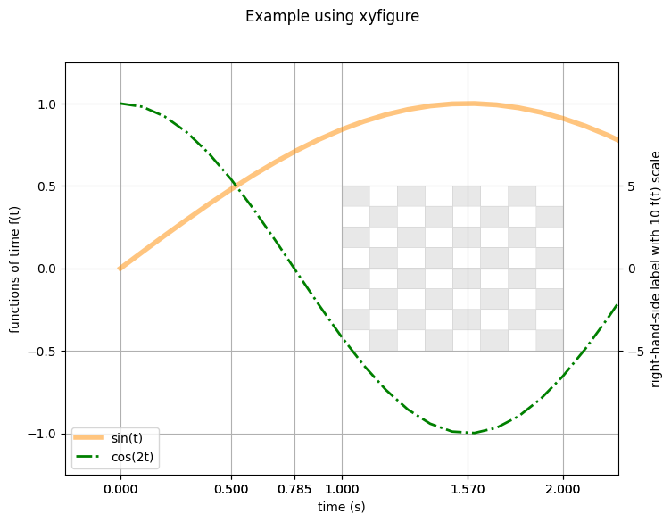
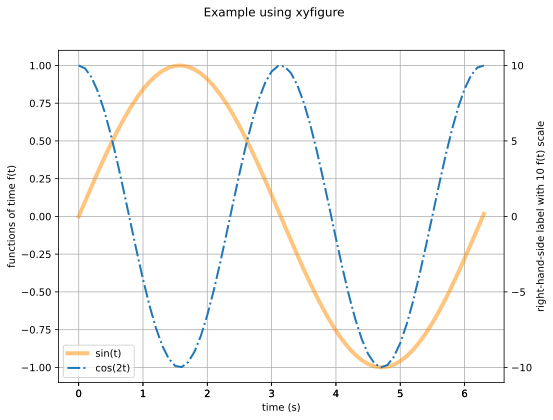

# xyfigure

Given a comma separated values (`.csv`) file, plot columns with `xyfigure`

* Create the example data [file](data.xlsx) in Microsoft Excel.  Here we create a time column `t` (the x-axis), and two functions (two different data series for the y-axis) of time columns `sin(t)` and `cos(2t)`.  
* Then, from within Excel, export the .xlsx file as a .csv [file](data.csv).

## Getting Started

Create a virtual environment:

```sh
cd ~/sibl
python -m venv .venv
```

Activate the virtual environment:

```sh
source ~/sibl/.venv/bin/activate
cd ~/sibl/cli
pip install -e .
```

## Example 1

With the input [recipe.yml](recipe.yml):

```sh
xyfigure io/example/recipe.yml
```

Output:

```sh
Processing file: io/example/recipe.yml
Finished XYViewBase constructor.
Creating view with guid = "figure"
  Adding all models to current view.
  Figure dpi set to 100
  Figure size set to [8.0, 6.0] inches.
  Serialized view to: /Users/chovey/sibl/cli/io/example/recipe.png
====================================
End of xyfigure execution.
```

Result:



## Example 2

A minimum working example, with [recipe_minimal.yml](recipe_minimal.yml):

```sh
xyfigure io/example/recipe_minimal.yml
```

Output:

```sh
Processing file: io/example/recipe_minimal.yml
Finished XYViewBase constructor.
Creating view with guid = "figure-output"
  Adding all models to current view.
  Figure dpi set to 100
  Figure size set to [11.0, 8.5] inches.
No artists with labels found to put in legend.  Note that artists whose label start with an underscore are ignored when legend() is called with no argument.
  Serialized view to: /Users/chovey/sibl/cli/io/example/recipe_minimal.png
====================================
End of xyfigure execution.
```

Result:



## Example 3

An elaborate example, with [recipe_with_background.yml](recipe_with_background.yml):

```sh
xyfigure io/example/recipe_with_background.yml
```

Output:

```sh
Processing file: io/example/recipe_with_background.yml
Finished XYViewBase constructor.
Creating view with guid = "figure"
  Adding all models to current view.
  Figure dpi set to 100
  Figure size set to [8.0, 6.0] inches.
  Serialized view to: /Users/chovey/sibl/cli/io/example/recipe_with_background.png
====================================
End of xyfigure execution.
```

Result:



---
> **Deprecation Warning:**
> `.json` files still work as input files, but they have been deprecated on 2024-12-16 in favor a `.yml` format input files.
---

## Getting Started

Here we create an example data file from an Excel spreadsheet and walk through the steps to create a simple `xyfigure`.

### Workflow

* **Step 1: Data** 
  * Create the example data [file](data.xlsx) in Microsoft Excel.  Here we create a time column `t` (the x-axis), and two functions (two different data series for the y-axis) of time columns `sin(t)` and `cos(2t)`.  
  * Then, from within Excel, export the .xlsx file as a .csv [file](data.csv).
  * *Note:* Generally the data does not come from an Excel file; rather, it will come from the output of a simulation.

* **Step 2: json Recipe**
  * Create the [recipe.json](recipe.json) file, which controls the appearance of the figure.
  * The .json file is composed of nested (key, value) pairs.

* **Step 3: Run the recipe on the data**
  * From the folder that contains the json file, run the Python script:
    ```console
    $ cd ~/sibl/cli/io/example/
    $ python ~/sibl/cli/src/xyfigure/client.py recipe.json 
    ```

The output file `recipe.svg` contains this figure:



will result, written to the `~/sibl/cli/io/example/` folder.

## Getting Minimalistic

Most of the keywords documented in the documentation are *optional*.  If the optional keywords are not specified, `xyfigure` selects sensible default values.  Users override the default behaviour by specifying the optional keywords.  

Here is the sine and cosine example from above, as a minimal [json](recipe_minimal.json) file, with only two optional keywords:

* `ycolumn`, to specify the location of the cosine data in the `data.csv` file, and
* `serialize`, to write the generated figure to disc.

From the folder that contains the json file, run the Python script:
```console
$ cd ~/sibl/cli/io/example/
$ python ~/sibl/cli/src/xyfigure/client.py recipe_minimal.json 
```

Here is the output: 

## Getting More Sophisticated

Here we plot the chess board [image](chess_800_800_px.png)  behind the figure, and override the default tick marks with some specific tick marks.  We also use the alpha channel for a transparent chess board appearance.

The [json](recipe_with_background.json) file results in this figure:


