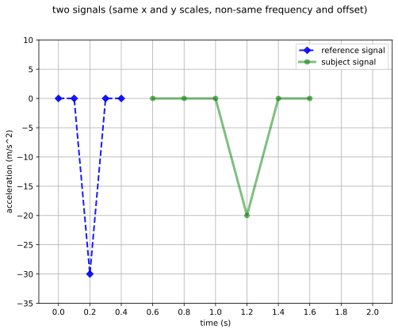
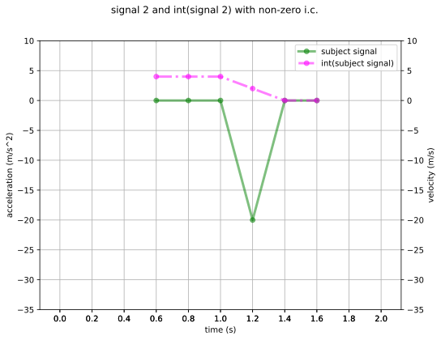
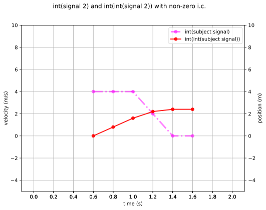
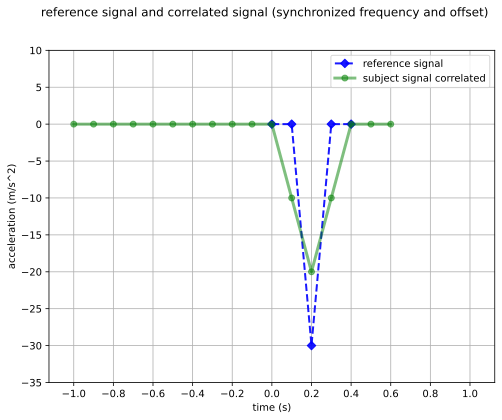
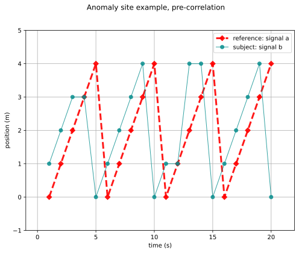
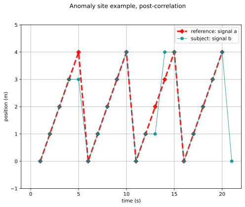

# Cross-Correlation

## Example: 

* two triangular acceleration pulses, with 
  * time integration and 
  * cross-correlation

Input file: [correlation_recipe.json](correlation_recipe.json)

Outputs:

Error metrics:

* cross-correlation relative error: 33 percent
* L2-norm error rate = 102 percent

## Example: 

* sawtooth examples of [Anomaly site](https://anomaly.io/understand-auto-cross-correlation-normalized-shift/)

Input file: [anomaly_recipe.json](anomaly_recipe.json)

Outputs:

Error metrics:

* cross-correlation relative error: 2.5 percent
* L2-norm error rate = 8.3 percent
