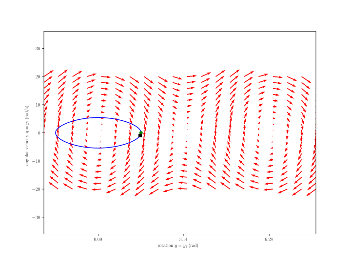
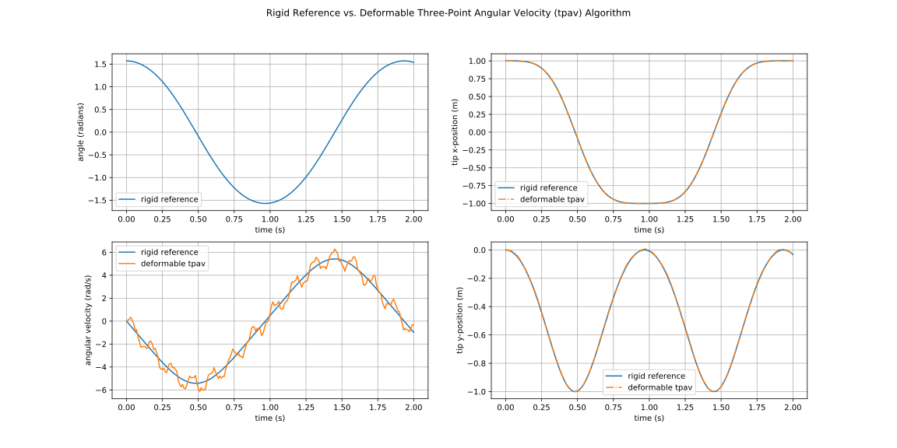
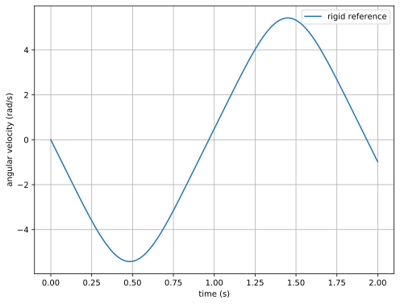
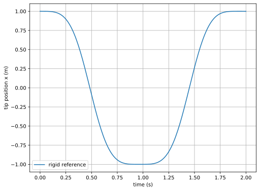
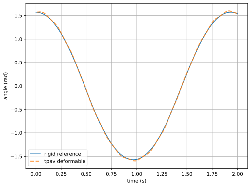
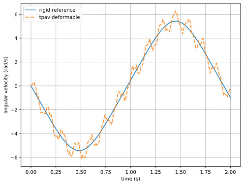

# Three-Point Angular Velocity (TPAV)

## Objective

Given velocity of three points on a quasi-rigid body, calculate the angular velocity of a quasi-rigid body.

## Methods

See Terpsma RJ, Hovey CB. *Blunt Impact Brain Injury Using Cellular Injury Criterion.* Sandia National Lab.(SNL-NM), Albuquerque, NM (United States); 2020 Oct 1 (SAND2020-11444), pp 100-109.  [Download](https://www.osti.gov/servlets/purl/1716577) (20 MB) at OSTI.

## Verification

The three-point angular velocity (tpav) algorithm is applied to a mildly deformable (quasi-rigid) body, and compared to a rigid body dynamics simulation reference.

* [pendulum_rigid_reference.py](pendulum_rigid_reference.py) integrates the ordinary differential equation governing the rigid pendulum finite rotation motion and outputs the following:
  * [pendulum_rigid_state.csv](pendulum_rigid_state.csv) state variables
  * pendulum_rigid_state.svg state variable figure 
* [history.csv](history.csv) is the output for the quasi-rigid body pendulum simulation from SSM
* [pendulum_tpav.py](pendulum_tpav.py) overlays the quasi-rigid tpav results with the rigid baseline results, and outputs the following two files:
  * pendulum_tpav_rigid.svg  
  * pendulum_tpav_deformable.svg  

## Workflow

* [history.csv](history.csv) from SSM
* [history_to_tpav.json](history_to_tpav.json) contains indices of the **P**, **Q**, and **R** points position and velocity, used as inputs to the client that runs the three-point angular velocity algorithm
* [client.py](client.py) use:

```bash
(siblenv) [~/sibl/xyfigure/process/tpav]$ python client.py --help
usage: client.py [-h] [--verbose] history history_to_tpav

positional arguments:
  history          history is a '.csv' that contains the SSM tracer points
                   output file
  history_to_tpav  history_to_tpav is a '.json' file that maps 'history.csv'
                   to tpav API format [t, rPx, rPy, rPz, rQx, rQy, rQz, rRx,
                   rRy, rRz, vPx, vPy, vPz, vQx, vQy, vQz, vRx, vRy, vRz],
                   output angular velocity file is 'angular_velocity.csv'

optional arguments:
  -h, --help       show this help message and exit
  --verbose        increased feedback in command line
```

* [tpav_postpro.json](tpav_postpro.json) is used by XYFigure to post-process the rigid body reference and tpav deformable body output:

```bash
(siblenv) [~/sibl/xyfigure/process/tpav]$ python ../../code/client.py tpav_postpro.json 
```









We observe that the angular velocity output from the tpav algorithm has:

* one low frequency, corresponding to the rigid body rotation of 0.5 Hz (1 cycle per 2 seconds), and 
* one high frequency, corresponding to the deformable body motion of 7.0 Hz (14 cycles per 2 seconds).  

To quiet the high frequency noise and retain only the low frequency signal, we use a 5 Hz, 4th-order, low-pass Butterworth filter the [tpav_postpro.json](tpav_postpro.json) file, which produces the filtered tpav angular velocity:


