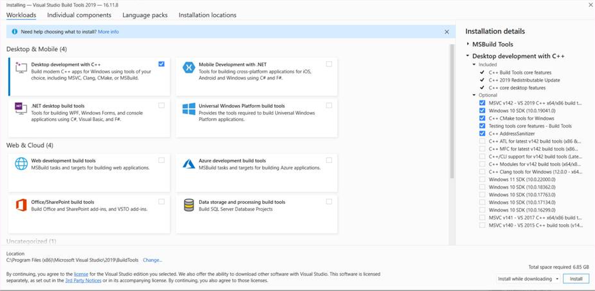

# Configuration

## Developer configuration

* Required
  * [Miniconda](https://docs.conda.io/en/latest/miniconda.html) (or [Anaconda](https://docs.anaconda.com/), as an alternative, as both support [conda](https://docs.conda.io/en/latest/) package manager).
  * Version control: [Git](https://git-scm.com/)
  * macOS only
    * May require installation of [Xcode command line tools](https://developer.apple.com/xcode/features/) prior to installation of Git.
  * Windows only
    * May require Microsoft C++ Build Tools (see [Updates](#updates) dated 2021-12-20 below).
  * `> cd ~/sibl/config; ./env_create.sh` to create the conda enivironment.
* Optional
  * [Neovim](https://neovim.io/) (version 0.5.0) for compatibility with the vscode-neovim [plugin](https://github.com/asvetliakov/vscode-neovim).
  * IDE: [VS Code](https://code.visualstudio.com/), with [settings](https://dev.to/adamlombard/how-to-use-the-black-python-code-formatter-in-vscode-3lo0) for using Black to automatically format Python.

### Updates

* 2021-12-20: `xybind` and Windows:
  * Upon running `env_create.sh`, the `xybind` module will error out on Windows because of a lacking standalone MSVC compiler.  Following are the steps to fix on Windows.
  * Download the [Microsoft C++ Build Tools](https://visualstudio.microsoft.com/visual-cpp-build-tools/)
  * Install (as a list of boxes to check):
    * Development with C++
    * Optional
      * MSVC v142...
      * Windows 10 SDK...
      * C++ CMake tools...
      * Testing tools...
      * C++ AddressSanitizer
    * 6.86 GB download
    * Select the Install button
  * Install (screenshot):
  
  * Success when VisualStudio Build Tools 2019 (16.11.8) installation completes.
  * Restart the Windows computer.
  * Relaunch the `env_create.sh` scipt.
  * Test the install with
    * `$ conda activate siblenv; cd ~/sibl; pytest -v`
* 2021-12-15: Windows an Python 3.9 with `xybind`
  * [Download](https://visualstudio.microsoft.com/visual-cpp-build-tools/) Microsoft C++ Build Tools, downloads `vs_buildtools__c6a4b5ec79d2436b97e7ac254ee30591.exe` (1,431 kB).
    * Individual components: Compilers, build tools, runtimes: C++/CLI support for v142 build tools (Latest) (1.26 GB).
  * [Download](https://marketplace.visualstudio.com/items?itemName=ms-vscode.cpptools) C/C++ for Visual Studio Code
* ~~2021-11-18: Update from Python 3.9 to 3.10 (optional)~~
  * ~~Windows: from [Python.org](https://www.python.org/downloads/release/python-3100/), download the Windows installer (64-bit), MD5 `c3917c08a7fe85db7203da6dcaa99a70`, which downloads `python-3.10.0-amd64.exe` as 27,653kB.~~
    * ~~Check hash: `$ certutil -hashfile python-3.10.0-amd64.exe MD5`~~
    * ~~Checks as `c3917c08a7fe85db7203da6dcaa99a70`~~
    * ~~Installs to `Titan$ C:\Users\chadh\AppData\Local\Programs\Python\Python310`~~
    * ~~Stop using `Titan$ C:\Users\chadh\miniconda3\python` (Python 3.9).  As of 2021-12-15, there is no Miniconda installer for Windows for Python 3.10.~~
* 2021-07-18: Update from Python 3.8.5 to 3.9.
  * Update Miniconda
  * Update `env_create.sh` and then
  * rerun to build the `siblenv` environment again.

```bash
> cd /opt; rm -rf miniconda3 # remove Python 3.8
# install for 3.9
# download Python 3.9 Miniconda installer from https://docs.conda.io/en/latest/miniconda.html
> shasum -a 256 ~/Downloads/Miniconda3-py39_4.9.2-MacOSX-x86_64.pkg  # check SHA256 hash
# install "only for me", which installs to /Users/sparta/opt/miniconda3
> cd ~/.config/fish
# update config_sparta.fish
> cp config_sparta.fish config.fish  # then restart iterm2
> which python
(base)  Sun Jul 18 17:41:41 2021 /Users/sparta/opt/miniconda3/bin/python

> cd ~/sibl/config
> ./env_create.sh
```

If using VS Code, make sure the environment points to `/Users/sparta/opt/miniconda3/envs/siblenv/bin/python`.

All other configuration note have been [deprecated](deprecated.md).

## Trusted Host

Here we demonstrate upgrading pip first, then upgrading the scikit-image package via pip.

```bash
(siblenv) $ python -m pip install --trusted-host pypi.org --trusted-host files.pythonhosted.org --upgrade pip
(siblenv) $ pip install scikit-image --upgrade
```

## Git

For an overview, [read the guide](https://guides.github.com/activities/hello-world/) from GitHub.

Get a local copy of the repository using `git clone` with SSH

```console
$ cd ~  # Starting from the home directory is optional, but recommended.
$ git clone git@github.com:sandialabs/sibl.git
```


In the `~/sibl/.git/config` file, add the following:

```python
[user]
    name = James Bond  # your first and last name
    email = jb007@company.com  # your email address
```

Configure ssh keys between your local and the repo.  This assumes to you have an existing public key file in `~/.ssh/id_rsa/id_rsa.pub`.  See [this](https://help.github.com/en/github/authenticating-to-github/connecting-to-github-with-ssh) to create a public key.  See [this](https://help.github.com/en/github/authenticating-to-github) for troubleshooting.

Copy the entire **public** key to the GitHub site under [Settings > SSH and GPG keys](https://github.com/settings/keys).

From within the repo `~/sibl/`, set the username and email on a *per-repo* basis:

```console
$ git config user.name "James Bond"  # your first and last name in quotations
$ git config user.email "jb007@company.com"  # your email address in quotations
```

## ~~Gitflow~~

* ~~macOS `> brew install git-flow`~~
* ~~Windows [download and install](https://git-scm.com/download/win) `git-flow`~~

## References

* Conda [build](https://docs.conda.io/projects/conda-build/en/latest/resources/build-scripts.html)
* Conda [managing environments](https://docs.conda.io/projects/conda/en/latest/user-guide/tasks/manage-environments.html)
* Conda [cheat sheet](https://docs.conda.io/projects/conda/en/4.6.0/_downloads/52a95608c49671267e40c689e0bc00ca/conda-cheatsheet.pdf)
* [Docker Hub](https://hub.docker.com/)
* [Pyschool](https://github.com/hovey/pyschool/blob/master/zfolder/doc/introduction.md) example deployment and a specific [configuration](https://github.com/hovey/pyschool/blob/master/zfolder/doc/configuration.md) example.
