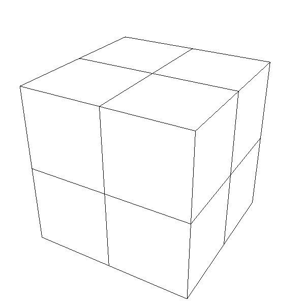
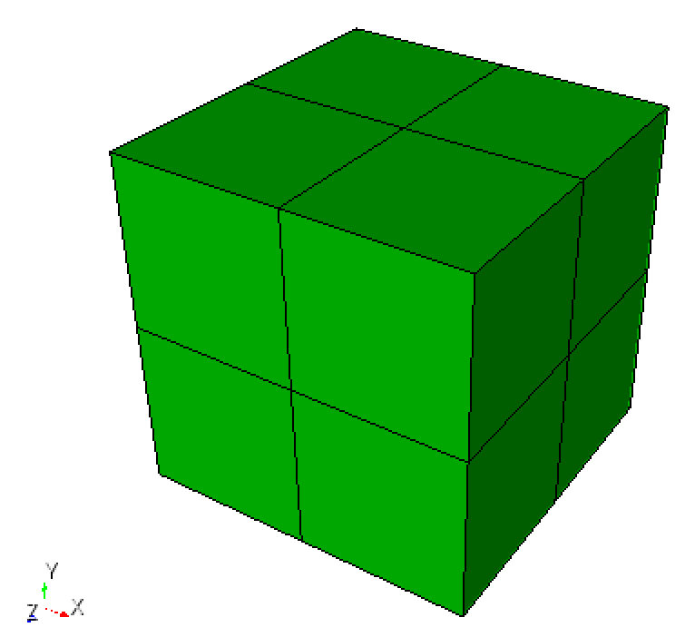

# README

## `.mesh` files

* `HEXAHEXA_2x2x2` subdivides the unit 3D cube into a `2x2x2` mesh of 8 hexahedral elements, using 27 vertices, and 24 boundary quadrilaterals [^Burkardt][^Frey2001]
  * [hexahexa_2x2x2.mesh](hexahexa_2x2x2.mesh)
  * 

## Convert to `.inp` files

```python
~/sibl/geo/data/mesh(git:master)✔> python ~/sibl/geo/src/ptg/translator.py hexahexa_2x2x2.mesh
```

  *  (as viewed in Cubit)

## References

[^Frey2001]: Frey, P. MEDIT: An interactive mesh visualization software, Technical Report RT-0253, Institut National de Recherche en Informatique et en Automatique, 03 December 2001. Report: https://hal.inria.fr/inria-00069921/document.  Download: http://www-rocq.inria.fr/gamma/medit/medit.html.
[^Burkardt]: Burkardt, J. https://people.sc.fsu.edu/~jburkardt/data/mesh/mesh.html
