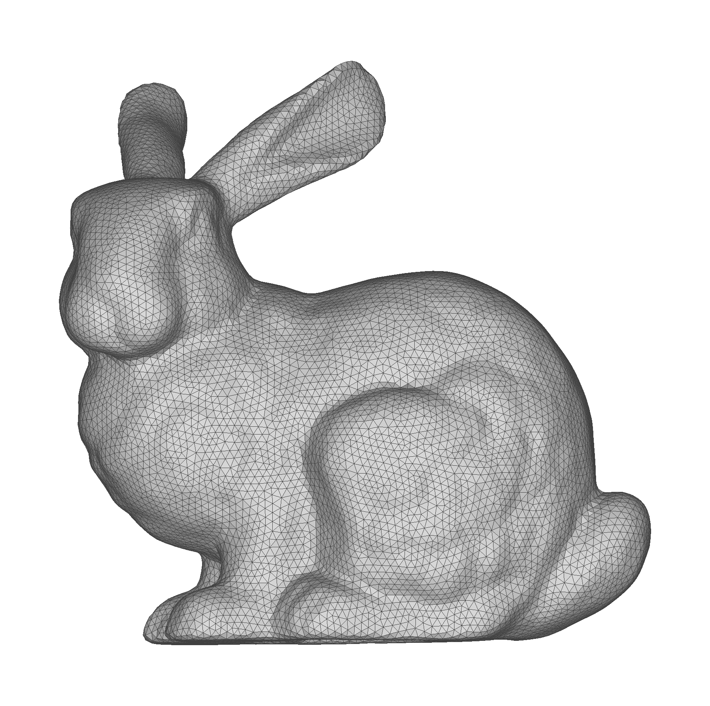
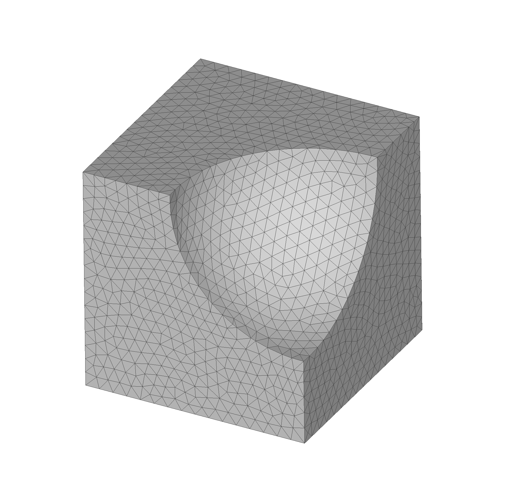
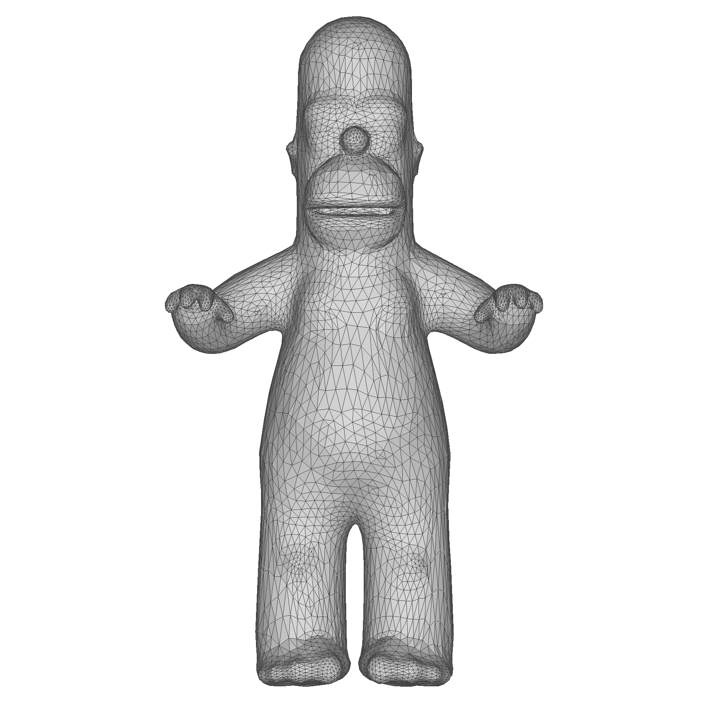
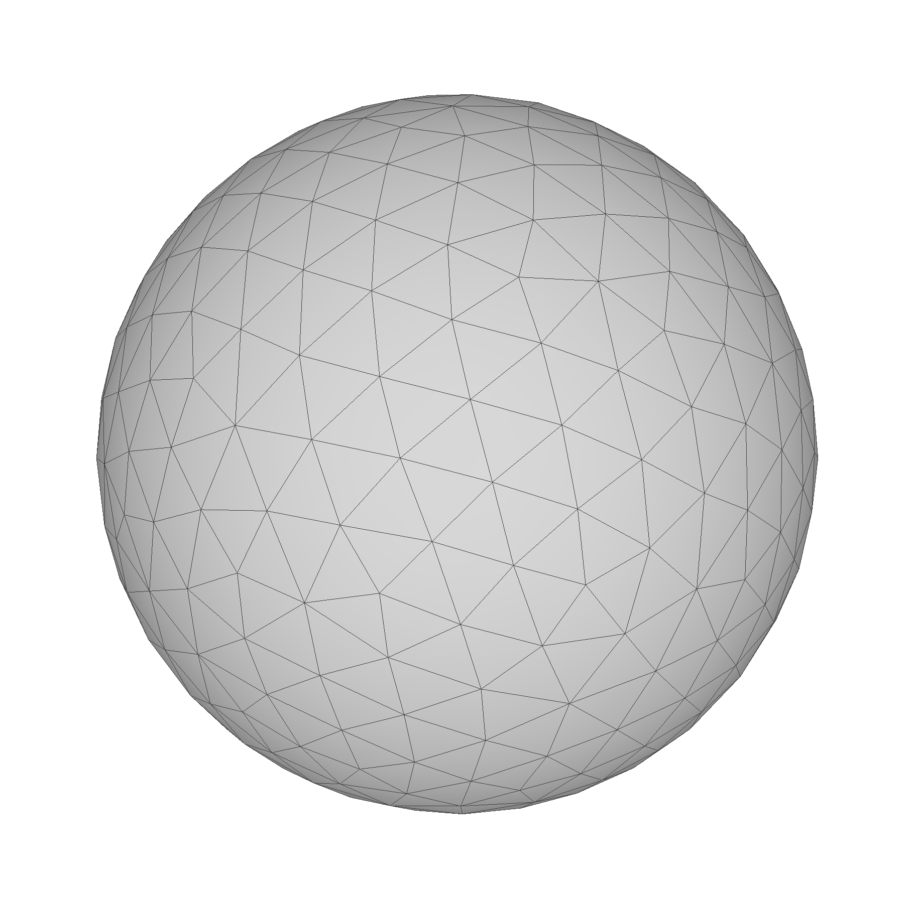

# README

## Source files

* `bunny.obj` [^1]
  * 14290 vertices, 28576 faces (921k)
  * 
* `cube_minus_sphere.obj` [^1]
  * 2066 vertices, 4128 faces (124k) 
  * 
* `homer.obj` [^2]
  * 6002 vertices, 12000 faces (361k)
  * 
* `sphere.obj` [^1]
  * 8447 vertices, 16890 faces (1.1M)
  * 
* `sphere_coarse.obj` [^1]
  * 530 vertices, 1056 faces (62k) 
  * 

## References

[^1]: Livesu, M. `cinolib/examples/data` at https://github.com/mlivesu/cinolib.
[^2]: Jacobson, A., `common-3d-test-models/data` at https://github.com/alecjacobson/common-3d-test-models.
