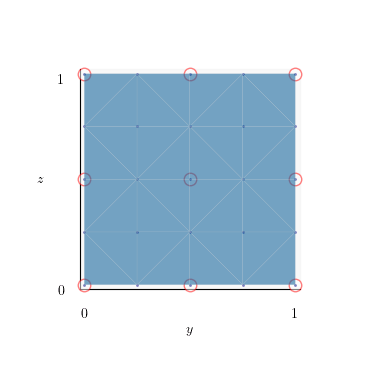
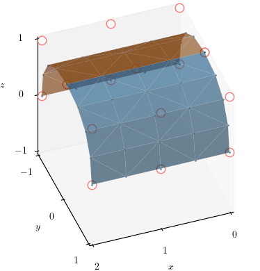

# doc

## Introduction

Pixel To Geometry (PTG) is the process of using stacked 2D image data, composed of pixels, to reconstruct a 3D object (e.g., 
a curve in 3D, a surface in 3D, or a volume).
PTG describes a **decoding** process of a physical system that was original **encoded** into a series of 2D medical images.  

## Questions

* H0: Segmentation based on threshold pixel intensity (quantisation) is sufficient to classify bone versus non-bone in the IRCAD data set based on ground truth F1-score.

## Road map

* Encode/Decode [unit test font](unit-test-font.md)
* Encode/Decode [unit test](unit-test.md)
* Tri-quadratic quarter cylinder [unit test](unit-test-triquad-qtr-cyl.md)
* Encode/Decode [unit test femur](unit-test-femur.md)
* Encode/Decode femur, patella, tibia, fibula
* Encode/Decode human skeleton

## Decode Workflow

1. Segmenting the CT (bone vs not bone) - is threshold-based segmentation good enough?
2. Stack the slices
3. Classify the bones in the masks - Chad will generate binary (0 and 1 only) slices that we will use for training. Initially will be for numbers and letters.

## Design

* Object-oriented programming (OOP) as a default, functional programming (FP) where appropriate.
* [PEP 8](https://www.python.org/dev/peps/pep-0008/) via [Black](https://github.com/psf/black)
* Everitt, Paul.  Test driven design (TDD) and Visual Testing with pytest [tutorials](https://www.jetbrains.com/pycharm/guide/tutorials/visual_pytest/) 10 June 2020

## Theory

* Bezier Geometry, updated [2021-04-02](bezier/Bezier-Geometry-2021-04-02.pdf)
* B-Spline Geometry, updated [2021-04-10](bspline/B-Spline-Geometry-2021-04-10.pdf)

## Animations

* See also [bspline_surface_biquad2tri_animation_flip_book.pdf](fig/bspline_surface_biquad2tri_animation_flip_book.pdf)

* See also [bspline_surface_cyl2sphere_animation_flip_book.pdf](fig/bspline_surface_cyl2sphere_animation_flip_book.pdf) 

## References

* [Black](https://youtu.be/esZLCuWs_2Y) by Łukasz Langa - Life Is Better Painted Black, or: How to Stop Worrying and Embrace Auto-Formatting
* [Definitions](definitions.md)
* Shene, C-K 2011.  [CS3621 Introduction to Computing with Geometry Notes
Dr. C.-K. Shene](https://pages.mtu.edu/~shene/COURSES/cs3621/NOTES/notes.html)
* Schultz, Dave yyyy. [Introducing Rhino 6](https://www.linkedin.com/learning/introducing-rhino-6) and [designstudio](https://www.schultzeworks.com) for gallery examples.
* Sentdex, First pass through data with 3DConvNet on [kaggle](https://www.kaggle.com/sentdex/first-pass-through-data-w-3d-convnet).
* Aggarwal, Shashwat 2018.  3D-MNIST Image Classification on [medium](https://medium.com/shashwats-blog/3d-mnist-b922a3d07334) for [Data Science Bowl 2017](https://www.kaggle.com/c/data-science-bowl-2017).

