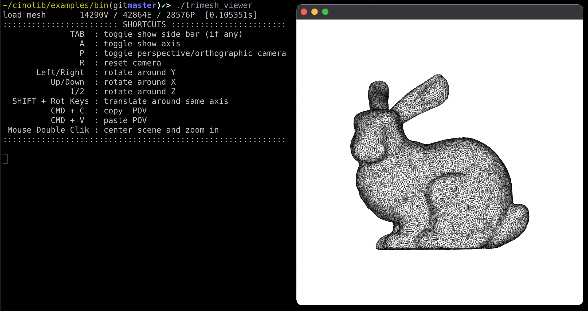

# Readme

## Overview

The **goal** of this document is to record the steps required to get [CinoLib](https://github.com/mlivesu/cinolib), created by Livesu and contributors, installed and running as a **local user workflow** to produce a hexahedral mesh from a surface representation.

The specific example will be the duck model shown in the figure below (originally created in, and reproduced from [Livesu 2021b](references.md#livesu-2021b)).


> *Figure 0.1:  Reproduction from Fig. 1 of [Livesu 2021b](references.md#livesu-2021b).*

[References](references.md)

## Preconditions

The `cmake` application must already be present.
Test for an existing installation:

```bash
~✔> which cmake
                      # <-- nothing is returned here
```

If the result from the above-stated command returns nothing, then
install `cmake` either with a [CMake installer](https://cmake.org/download/) 
or with the [Homebrew](https://brew.sh/) package manager as follows:

```bash
~✔> brew install cmake
```

## Getting Started

In this example, we install and run `cinolib` for the user `sparta`, e.g.,

```bash
~✔> echo $USER
sparta
```

## git clone

```bash
~✔> git clone git@github.com:mlivesu/cinolib.git
```

## cmake

```bash
~✔> cd ~/cinolib/examples
~/cinolib/examples(gitmaster)✔> mkdir build
~/cinolib/examples(gitmaster)✔> cd build
~/cinolib/examples/build(gitmaster)✔>

~/cinolib/examples/build(gitmaster)✔> cmake .. -DCMAKE_BUILD_TYPE=Release -Dcinolib_DIR=/Users/sparta/cinolib
-- The C compiler identification is AppleClang 12.0.0.12000032
-- The CXX compiler identification is AppleClang 12.0.0.12000032
-- Detecting C compiler ABI info
-- Detecting C compiler ABI info - done
-- Check for working C compiler: /Library/Developer/CommandLineTools/usr/bin/cc - skipped
-- Detecting C compile features
-- Detecting C compile features - done
-- Detecting CXX compiler ABI info
-- Detecting CXX compiler ABI info - done
-- Check for working CXX compiler: /Library/Developer/CommandLineTools/usr/bin/c++ - skipped
-- Detecting CXX compile features
-- Detecting CXX compile features - done
CINOLIB OPTIONAL MODULES: OpenGL, GLFW, ImGui
-- Found OpenGL: /Library/Developer/CommandLineTools/SDKs/MacOSX11.0.sdk/System/Library/Frameworks/OpenGL.framework
-- Looking for pthread.h
-- Looking for pthread.h - found
-- Performing Test CMAKE_HAVE_LIBC_PTHREAD
-- Performing Test CMAKE_HAVE_LIBC_PTHREAD - Success
-- Found Threads: TRUE
-- Using Cocoa for window creation
CINOLIB OPTIONAL MODULE: Tetgen
CINOLIB OPTIONAL MODULE: Triangle
CINOLIB OPTIONAL MODULE: Exact Predicates
CINOLIB OPTIONAL MODULE: Boost
-- Found Boost: /usr/local/lib/cmake/Boost-1.76.0/BoostConfig.cmake (found version "1.76.0")
CINOLIB OPTIONAL MODULE: VTK
CMake Warning at /Users/sparta/cinolib/cinolib-config.cmake:115 (find_package):
  By not providing "FindVTK.cmake" in CMAKE_MODULE_PATH this project has
  asked CMake to find a package configuration file provided by "VTK", but
  CMake did not find one.

  Could not find a package configuration file provided by "VTK" with any of
  the following names:

    VTKConfig.cmake
    vtk-config.cmake

  Add the installation prefix of "VTK" to CMAKE_PREFIX_PATH or set "VTK_DIR"
  to a directory containing one of the above files.  If "VTK" provides a
  separate development package or SDK, be sure it has been installed.
Call Stack (most recent call first):
  CMakeLists.txt:15 (find_package)


Could not find VTK!
-- Configuring done
-- Generating done
-- Build files have been written to: /Users/sparta/cinolib/examples/build
```

## make

```
~/cinolib/examples/build(gitmaster)✔> make
[  1%] Building C object imgui/glfw/src/CMakeFiles/glfw.dir/context.c.o
[  2%] Building C object imgui/glfw/src/CMakeFiles/glfw.dir/init.c.o
[  3%] Building C object imgui/glfw/src/CMakeFiles/glfw.dir/input.c.o
[  4%] Building C object imgui/glfw/src/CMakeFiles/glfw.dir/monitor.c.o
[  5%] Building C object imgui/glfw/src/CMakeFiles/glfw.dir/vulkan.c.o
[  6%] Building C object imgui/glfw/src/CMakeFiles/glfw.dir/window.c.o
[  7%] Building C object imgui/glfw/src/CMakeFiles/glfw.dir/cocoa_init.m.o
[  8%] Building C object imgui/glfw/src/CMakeFiles/glfw.dir/cocoa_joystick.m.o
[  9%] Building C object imgui/glfw/src/CMakeFiles/glfw.dir/cocoa_monitor.m.o
[ 10%] Building C object imgui/glfw/src/CMakeFiles/glfw.dir/cocoa_window.m.o
[ 10%] Building C object imgui/glfw/src/CMakeFiles/glfw.dir/cocoa_time.c.o
[ 11%] Building C object imgui/glfw/src/CMakeFiles/glfw.dir/posix_thread.c.o
[ 12%] Building C object imgui/glfw/src/CMakeFiles/glfw.dir/nsgl_context.m.o
[ 13%] Building C object imgui/glfw/src/CMakeFiles/glfw.dir/egl_context.c.o
[ 14%] Building C object imgui/glfw/src/CMakeFiles/glfw.dir/osmesa_context.c.o
[ 15%] Linking C static library libglfw3.a
[ 15%] Built target glfw
[ 16%] Building CXX object imgui/CMakeFiles/imgui.dir/imgui.cpp.o
[ 16%] Building CXX object imgui/CMakeFiles/imgui.dir/imgui_demo.cpp.o
[ 17%] Building CXX object imgui/CMakeFiles/imgui.dir/imgui_draw.cpp.o
[ 18%] Building CXX object imgui/CMakeFiles/imgui.dir/imgui_tables.cpp.o
[ 19%] Building CXX object imgui/CMakeFiles/imgui.dir/imgui_widgets.cpp.o
[ 20%] Building CXX object imgui/CMakeFiles/imgui.dir/imgui_impl_opengl2.cpp.o
[ 21%] Building CXX object imgui/CMakeFiles/imgui.dir/imgui_impl_glfw.cpp.o
[ 22%] Linking CXX static library libimgui.a
[ 22%] Built target imgui
[ 23%] Building CXX object _deps/tetgen-build/CMakeFiles/tetgen.dir/tetgen.cxx.o
[ 24%] Building CXX object _deps/tetgen-build/CMakeFiles/tetgen.dir/predicates.cxx.o
[ 25%] Linking CXX static library libtetgen.a
[ 25%] Built target tetgen
[ 26%] Building CXX object _deps/triangle-build/CMakeFiles/triangle.dir/triangle.cpp.o
[ 27%] Linking CXX static library libtriangle.a
[ 27%] Built target triangle
[ 28%] Building C object predicates/CMakeFiles/predicates.dir/shewchuk.c.o
[ 29%] Linking C static library libpredicates.a
[ 29%] Built target predicates
[ 30%] Building CXX object 01_trimesh_viewer/CMakeFiles/trimesh_viewer.dir/main.cpp.o
[ 31%] Linking CXX executable ../../bin/trimesh_viewer
[ 31%] Built target trimesh_viewer
[ 32%] Building CXX object 02_quadmesh_viewer/CMakeFiles/quadmesh_viewer.dir/main.cpp.o
[ 33%] Linking CXX executable ../../bin/quadmesh_viewer
[ 33%] Built target quadmesh_viewer
[ 34%] Building CXX object 03_polygonmesh_viewer/CMakeFiles/polygonmesh_viewer.dir/main.cpp.o
[ 35%] Linking CXX executable ../../bin/polygonmesh_viewer
[ 35%] Built target polygonmesh_viewer
[ 36%] Building CXX object 04_tetmesh_viewer/CMakeFiles/tetmesh_viewer.dir/main.cpp.o
[ 37%] Linking CXX executable ../../bin/tetmesh_viewer
[ 37%] Built target tetmesh_viewer
[ 38%] Building CXX object 05_hexmesh_viewer/CMakeFiles/hexmesh_viewer.dir/main.cpp.o
[ 39%] Linking CXX executable ../../bin/hexmesh_viewer
[ 39%] Built target hexmesh_viewer
[ 39%] Building CXX object 06_polyhedralmesh_viewer/CMakeFiles/polyhedralmesh_viewer.dir/main.cpp.o
[ 40%] Linking CXX executable ../../bin/polyhedralmesh_viewer
[ 40%] Built target polyhedralmesh_viewer
[ 41%] Building CXX object 07_texture_loading/CMakeFiles/texture_loading.dir/main.cpp.o
[ 42%] Linking CXX executable ../../bin/texture_loading
[ 42%] Built target texture_loading
[ 43%] Building CXX object 08_picking/CMakeFiles/picking.dir/main.cpp.o
[ 44%] Linking CXX executable ../../bin/picking
[ 44%] Built target picking
[ 45%] Building CXX object 09_polyharmonic_functions_srf/CMakeFiles/polyharmonic_functions_srf.dir/main.cpp.o
[ 46%] Linking CXX executable ../../bin/polyharmonic_functions_srf
[ 46%] Built target polyharmonic_functions_srf
[ 47%] Building CXX object 10_polyharmonic_functions_vol/CMakeFiles/polyharmonic_functions_vol.dir/main.cpp.o
[ 48%] Linking CXX executable ../../bin/polyharmonic_functions_vol
[ 48%] Built target polyharmonic_functions_vol
[ 49%] Building CXX object 11_sphere_mapping/CMakeFiles/sphere_mapping.dir/main.cpp.o
[ 50%] Linking CXX executable ../../bin/sphere_mapping
[ 50%] Built target sphere_mapping
[ 51%] Building CXX object 12_polygon_mesh_generation/CMakeFiles/polygon_mesh_generation.dir/main.cpp.o
[ 52%] Linking CXX executable ../../bin/polygon_mesh_generation
[ 52%] Built target polygon_mesh_generation
[ 53%] Building CXX object 13_polyhedral_mesh_generation/CMakeFiles/polyhedral_mesh_generation.dir/main.cpp.o
[ 54%] Linking CXX executable ../../bin/polyhedral_mesh_generation
[ 54%] Built target polyhedral_mesh_generation
[ 55%] Building CXX object 14_heat_geodesics/CMakeFiles/heat_geodesics.dir/main.cpp.o
[ 56%] Linking CXX executable ../../bin/heat_geodesics
[ 56%] Built target heat_geodesics
[ 57%] Building CXX object 15_polygon_measures/CMakeFiles/polygon_measures.dir/main.cpp.o
[ 58%] Linking CXX executable ../../bin/polygon_measures
[ 58%] Built target polygon_measures
[ 59%] Building CXX object 16_sphere_sampling/CMakeFiles/sphere_sampling.dir/main.cpp.o
[ 59%] Linking CXX executable ../../bin/sphere_sampling
[ 59%] Built target sphere_sampling
[ 60%] Building CXX object 17_iso_contours/CMakeFiles/iso_contours.dir/main.cpp.o
[ 61%] Linking CXX executable ../../bin/iso_contours
[ 61%] Built target iso_contours
[ 62%] Building CXX object 18_iso_surfaces/CMakeFiles/iso_surfaces.dir/main.cpp.o
[ 63%] Linking CXX executable ../../bin/iso_surfaces
[ 63%] Built target iso_surfaces
[ 64%] Building CXX object 19_harmonic_map/CMakeFiles/harmonic_map.dir/main.cpp.o
[ 65%] Linking CXX executable ../../bin/harmonic_map
[ 65%] Built target harmonic_map
[ 66%] Building CXX object 20_coarse_quad_layouts/CMakeFiles/coarse_quad_layout.dir/main.cpp.o
[ 67%] Linking CXX executable ../../bin/coarse_quad_layout
[ 67%] Built target coarse_quad_layout
[ 68%] Building CXX object 21_coarse_hex_layouts/CMakeFiles/coarse_hex_layout.dir/main.cpp.o
[ 69%] Linking CXX executable ../../bin/coarse_hex_layout
[ 69%] Built target coarse_hex_layout
[ 70%] Building CXX object 22_remesher/CMakeFiles/remesher.dir/main.cpp.o
[ 71%] Linking CXX executable ../../bin/remesher
[ 71%] Built target remesher
[ 72%] Building CXX object 23_sharp_creases/CMakeFiles/sharp_creases.dir/main.cpp.o
[ 73%] Linking CXX executable ../../bin/sharp_creases
[ 73%] Built target sharp_creases
[ 74%] Building CXX object 24_sliced_CLI_loader/CMakeFiles/sliced_CLI_loader.dir/main.cpp.o
[ 75%] Linking CXX executable ../../bin/sliced_CLI_loader
[ 75%] Built target sliced_CLI_loader
[ 76%] Building CXX object 25_surface_painter/CMakeFiles/surface_painter.dir/main.cpp.o
[ 77%] Linking CXX executable ../../bin/surface_painter
[ 77%] Built target surface_painter
[ 78%] Building CXX object 26_export_surface/CMakeFiles/export_surface.dir/main.cpp.o
[ 79%] Linking CXX executable ../../bin/export_surface
[ 79%] Built target export_surface
[ 80%] Building CXX object 27_import_surface/CMakeFiles/import_surface.dir/main.cpp.o
[ 81%] Linking CXX executable ../../bin/import_surface
[ 81%] Built target import_surface
[ 82%] Building CXX object 28_tetrahedralize/CMakeFiles/tetrahedralize.dir/main.cpp.o
[ 83%] Linking CXX executable ../../bin/tetrahedralize
[ 83%] Built target tetrahedralize
[ 84%] Building CXX object 29_ambient_occlusion/CMakeFiles/ambient_occlusion.dir/main.cpp.o
[ 85%] Linking CXX executable ../../bin/ambient_occlusion
[ 85%] Built target ambient_occlusion
[ 86%] Building CXX object 30_mesh_format_converter/CMakeFiles/mesh_format_converter.dir/main.cpp.o
[ 87%] Linking CXX executable ../../bin/mesh_format_converter
[ 87%] Built target mesh_format_converter
[ 88%] Building CXX object 31_LSCM/CMakeFiles/LSCM.dir/main.cpp.o
[ 89%] Linking CXX executable ../../bin/LSCM
[ 89%] Built target LSCM
[ 90%] Building CXX object 32_homotopy_basis/CMakeFiles/homotopy_basis.dir/main.cpp.o
[ 91%] Linking CXX executable ../../bin/homotopy_basis
[ 91%] Built target homotopy_basis
[ 92%] Building CXX object 33_edge_collapse/CMakeFiles/edge_collapse.dir/main.cpp.o
[ 92%] Linking CXX executable ../../bin/edge_collapse
[ 92%] Built target edge_collapse
[ 92%] Building CXX object 34_Hermite_RBF/CMakeFiles/HermiteRBF.dir/main.cpp.o
[ 93%] Linking CXX executable ../../bin/HermiteRBF
[ 93%] Built target HermiteRBF
[ 94%] Building CXX object 35_Poisson_sampling/CMakeFiles/Poisson_sampling.dir/main.cpp.o
[ 95%] Linking CXX executable ../../bin/Poisson_sampling
[ 95%] Built target Poisson_sampling
[ 96%] Building CXX object 36_canonical_polygonal_schema/CMakeFiles/canonical_polygonal_schema.dir/main.cpp.o
[ 97%] Linking CXX executable ../../bin/canonical_polygonal_schema
[ 97%] Built target canonical_polygonal_schema
[ 98%] Building CXX object 37_find_intersections/CMakeFiles/find_intersections.dir/main.cpp.o
[ 99%] Linking CXX executable ../../bin/find_intersections
[ 99%] Built target find_intersections
[100%] Building CXX object 38_octree/CMakeFiles/octree.dir/main.cpp.o
[100%] Linking CXX executable ../../bin/octree
[100%] Built target octree
~/cinolib/examples/build(gitmaster)✔>
```

## run

```bash
~/cinolib/examples/build(gitmaster)✔> cd ../bin
~/cinolib/examples/bin(gitmaster)✔> ls
HermiteRBF                 export_surface             iso_surfaces               polyharmonic_functions_vol sphere_sampling
LSCM                       find_intersections         mesh_format_converter      polyhedral_mesh_generation surface_painter
Poisson_sampling           harmonic_map               octree                     polyhedralmesh_viewer      tetmesh_viewer
ambient_occlusion          heat_geodesics             picking                    quadmesh_viewer            tetrahedralize
canonical_polygonal_schema hexmesh_viewer             polygon_measures           remesher                   texture_loading
coarse_hex_layout          homotopy_basis             polygon_mesh_generation    sharp_creases              trimesh_viewer
coarse_quad_layout         import_surface             polygonmesh_viewer         sliced_CLI_loader
edge_collapse              iso_contours               polyharmonic_functions_srf sphere_mapping

~/cinolib/examples/bin(gitmaster)✔>./trimesh_viewer
```



## see also

See also the [Gen-Adapt-Ref-for-Hexmeshing repository](https://github.com/cg3hci/Gen-Adapt-Ref-for-Hexmeshing) and the [Gena](gena.md) notes.

