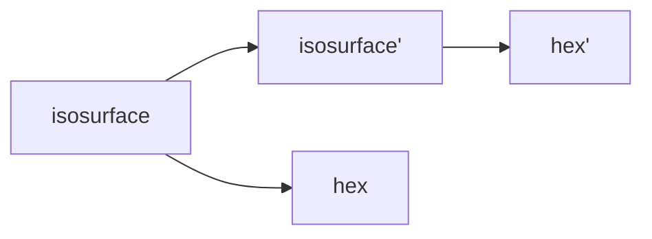
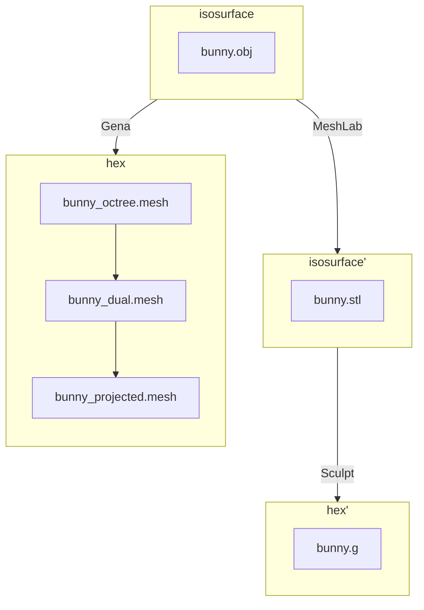

# Stanford bunny

## Introduction

The Stanford bunny comes from a a CT scan of a terra-cotta bunny.[^stanford_volume_data]
The CT scan contains 360 slices of 512 x 512 pixels, rectangular voxel grid, with
X:Y:Z aspect ratio of each voxel at 1:1:1.  There are 360 binary files, one file per slide, 
with file format of 16-bit integer (Mac byte order) with no header.  

## Objective

* Compare mesh created with Sculpt to Gen-Adapt-Ref-for-Hexmeshing.

## Materials

* [`bunny.obj`](../../data/obj/README.md)
* [Gena](../../doc/cinolib/gena.md)
* Sculpt [version to come]


## Workflow

### Overview



### Detail



## Methods

```bash
cbh@atlas build % ./make_grid --surface
```

## Results

| bunny.obj | bunny.stl | 
|:--:|:--:|
|  | to come |
| 14290 vertices, 28576 faces | ... | 

* Population histogram of scaled Jacobian (to come).

## References

[^stanford_volume_data]: https://graphics.stanford.edu/data/voldata/, Terry Yoo of the National Library of Medicine, using a scanner provided by Sandy Napel and Geoff Rubin of Stanford Radiology, of the terra-cotta bunny provided by Marc Levoy of Stanford CS.

