# Stanford bunny

## Introduction

The Stanford bunny comes from a a CT scan of a terra-cotta bunny.[^stanford_volume_data]
The CT scan contains 360 slices of 512 x 512 pixels, rectangular voxel grid, with
X:Y:Z aspect ratio of each voxel at 1:1:1.  There are 360 binary files, one file per slide, 
with file format of 16-bit integer (Mac byte order) with no header.  

## Objective

* Compare mesh created with Sculpt to Gen-Adapt-Ref-for-Hexmeshing.

## Materials

* See bunny.obj on the [data/obj folder](../../data/obj/README.md)
* [Gena](../../doc/cinolib/gena.md)
* Sculpt (to come)

## Workflow

### Overview

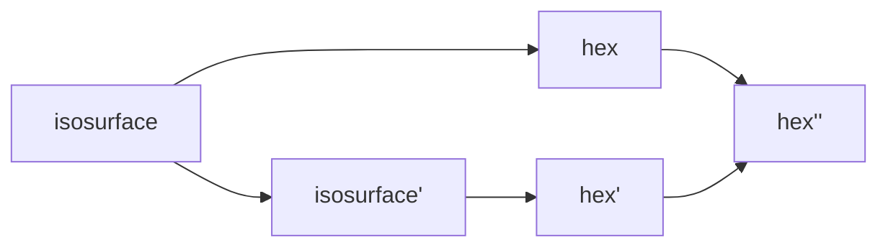

### Detail

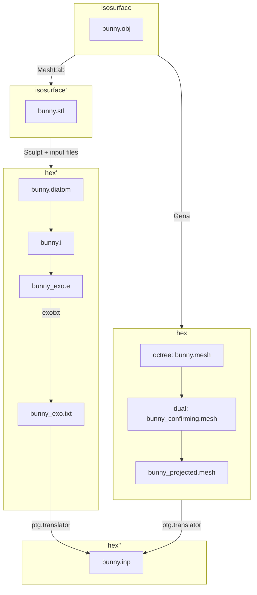

## Methods

One the `[cbh@atlas]` machine:

```bash
cd ~/Gen-Adapt-Ref-for-Hexmeshing/build
./make_grid --surface --input_mesh_path=/Users/cbh/sibl/geo/data/obj/bunny.obj --output_grid_path=/Users/cbh/sibl/geo/data/mesh/bunny.mesh --use_octree --project_mesh=true
```

In a web browser, open https://www.hexalab.net/, then open the following files:

* `bunny.mesh`
* `bunny_conforming.mesh`
* `bunny_projected.mesh`

The view settings,
[`HLsettings-default.txt`](fig/HLsettings-default.txt),
are used with hexalab.

## Results

| bunny.obj | bunny_projected.mesh | 
|:--:|:--:|
|  | 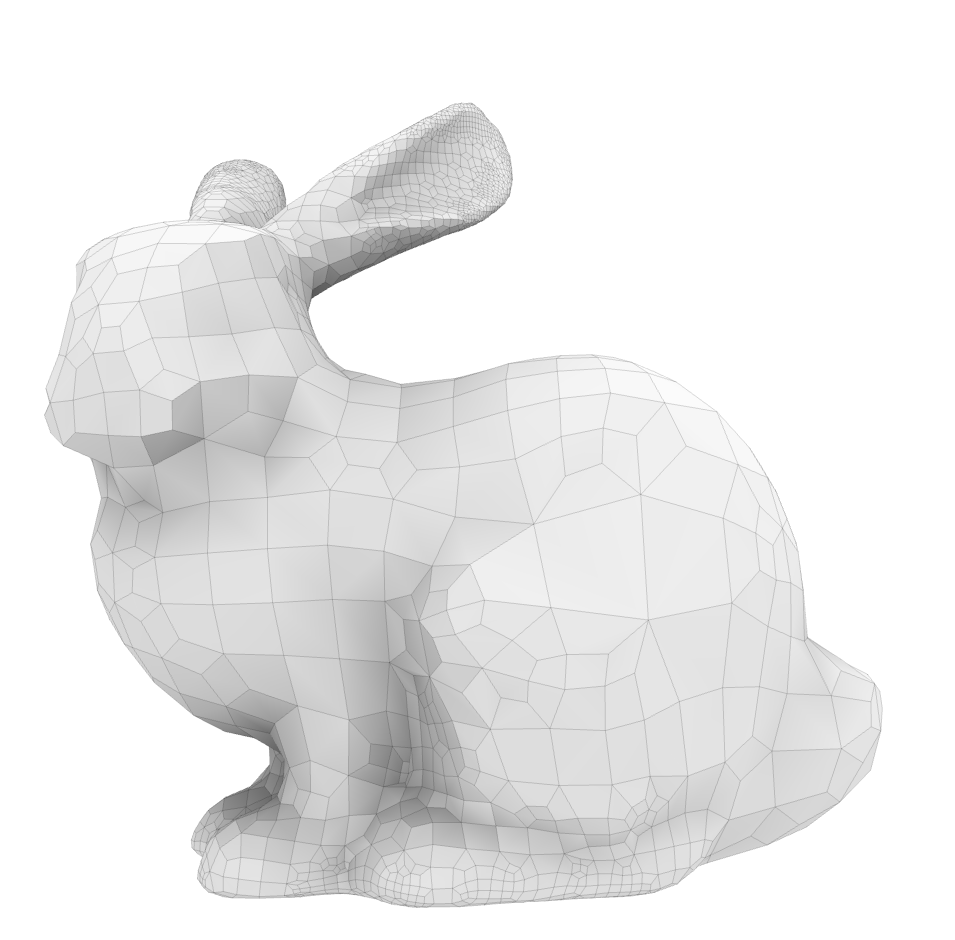 |
| 14290 vertices, 28576 faces | 12237 vertices, 9732 hexes | 


| Default View | Alternative View |
|:--:|:--:|
| bunny.obj</br>  | 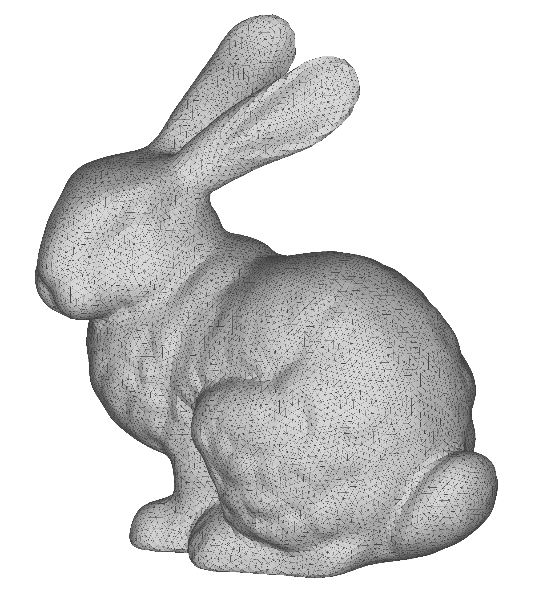 |
| bunny.mesh</br> 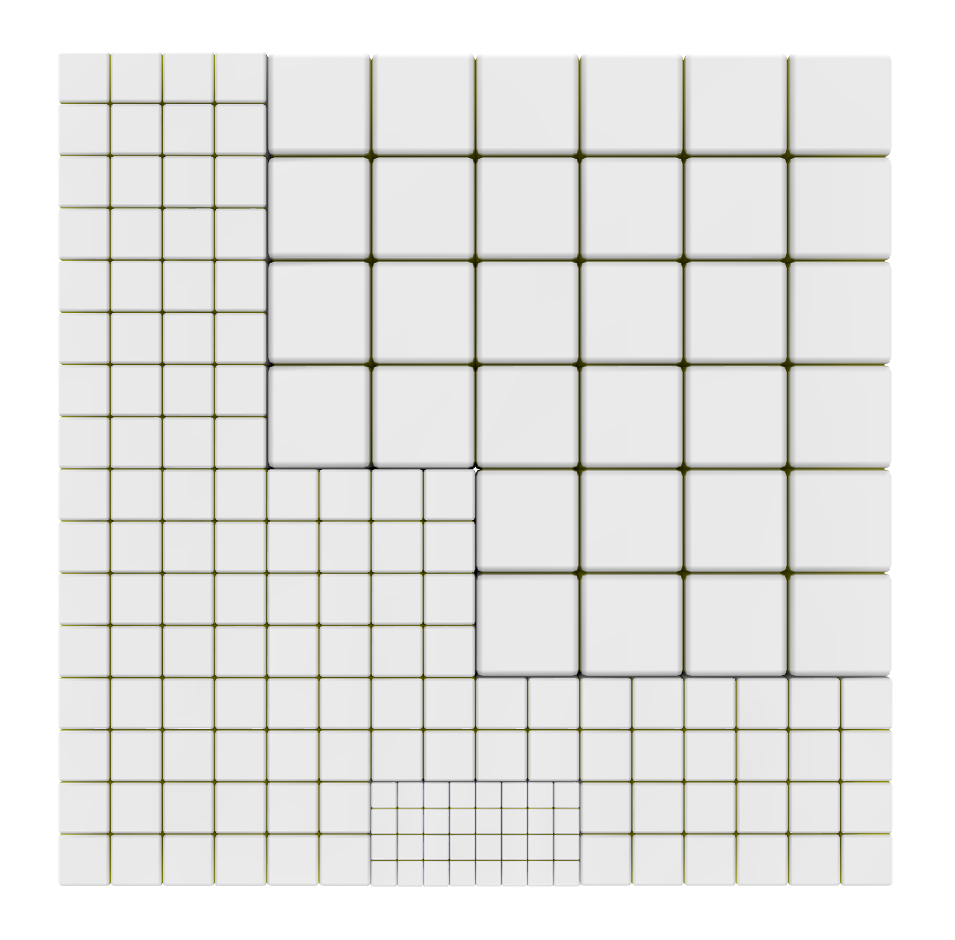 | 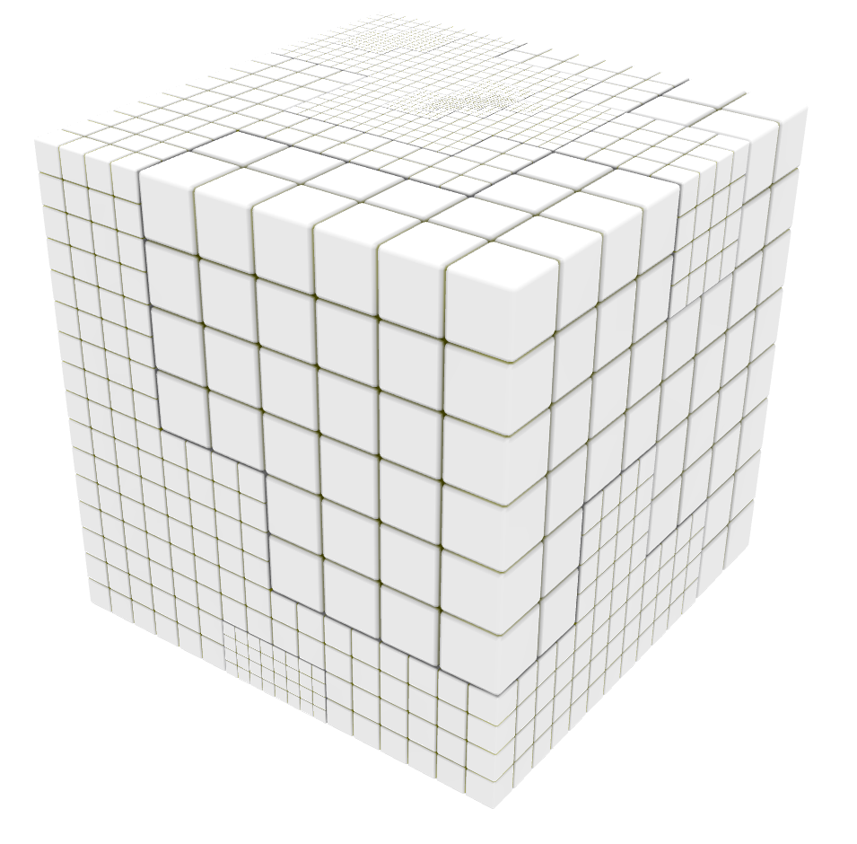 |
| bunny_conforming.mesh</br> 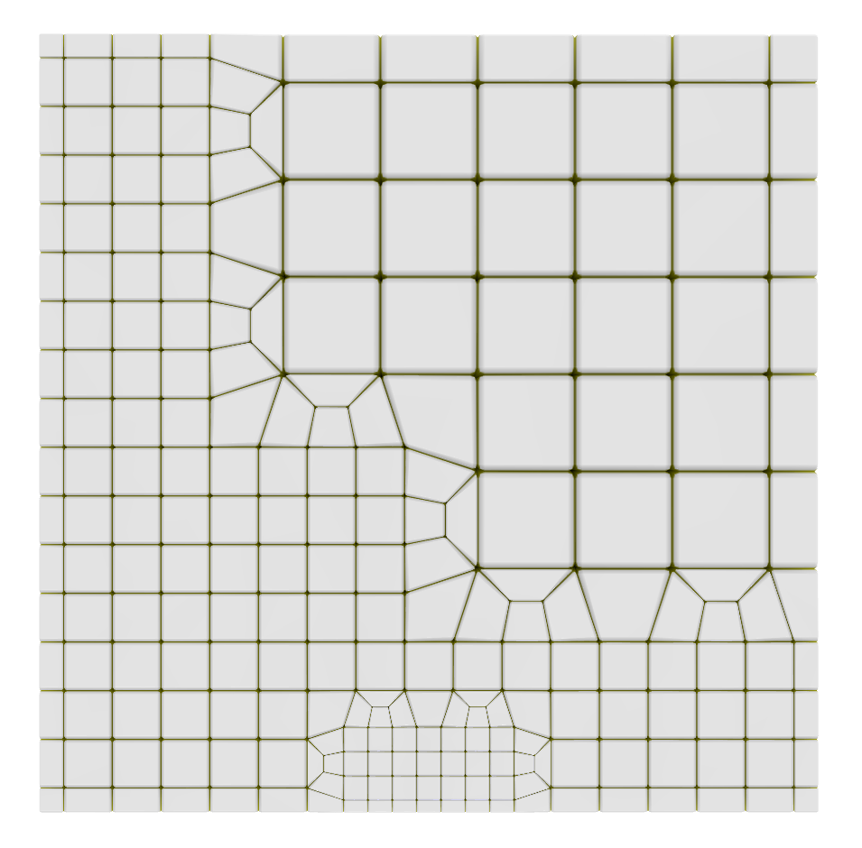 | 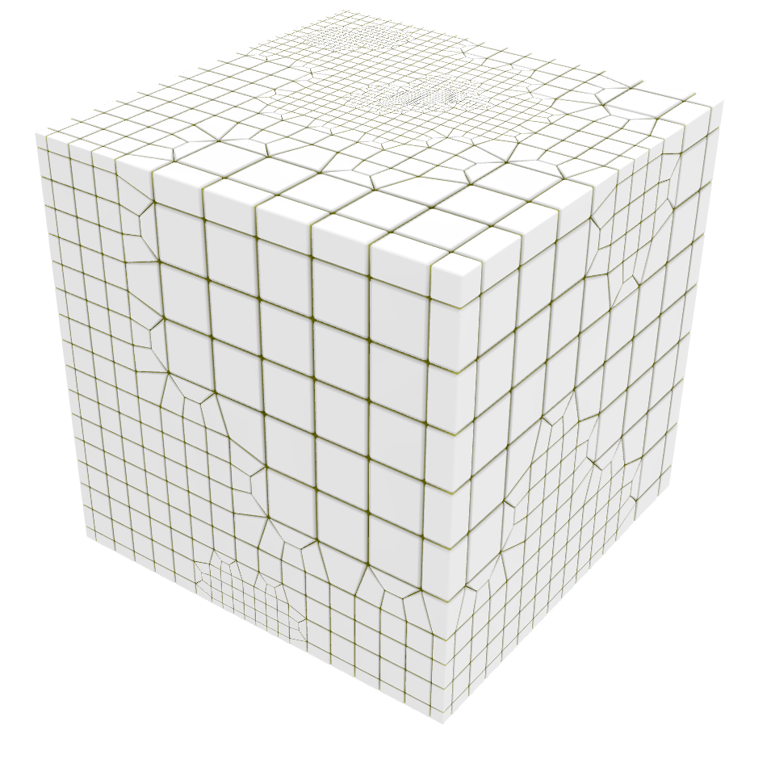 |
| bunny_projected.mesh</br>  | 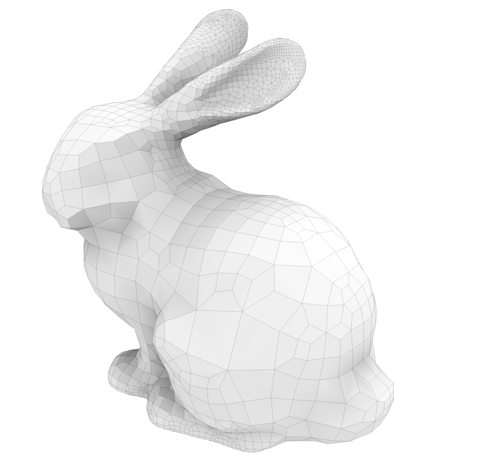 |

* `bunny.stl`

### Convert `bunny.mesh -> bunny.inp`

```python
~/sibl/geo/data/mesh(git:master)✔> python ~/sibl/geo/src/ptg/translator.py bunny.mesh
```

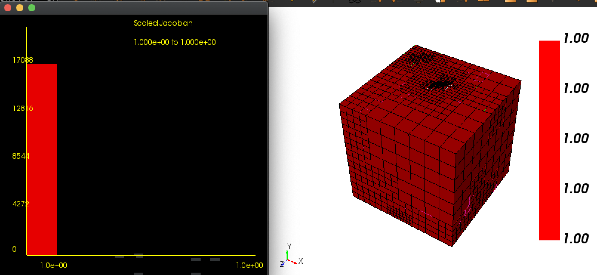

```bash
Cubit>quality volume all scaled jacobian global draw histogram draw mesh

 Hex quality, 17088 elements:
	Scaled Jacobian ranges from 1.000e+00 to 1.000e+00 (17088 entities)
	     Red ranges from 1.000e+00 to 1.000e+00 (17088 entities)
	 Magenta ranges from 1.000e+00 to 1.000e+00 (0 entities)
	DkYellow ranges from 1.000e+00 to 1.000e+00 (0 entities)
	  Yellow ranges from 1.000e+00 to 1.000e+00 (0 entities)
	   Green ranges from 1.000e+00 to 1.000e+00 (0 entities)
	    Cyan ranges from 1.000e+00 to 1.000e+00 (0 entities)
	    Blue ranges from 1.000e+00 to 1.000e+00 (0 entities)

 Hex quality, 17088 elements:
------------------------------------
   Function Name    Average      Std Dev      Minimum   (id)     Maximum   (id) 
 ---------------    ---------    ---------    ---------------    ---------------
 Scaled Jacobian    1.000e+00    0.000e+00    1.000e+00 (369)    1.000e+00 (369)
------------------------------------
```

### Convert `bunny_conforming.mesh -> bunny_conforming.inp`

```python
~/sibl/geo/data/mesh(git:master)✔> python ~/sibl/geo/src/ptg/translator.py bunny_conforming.mesh
```

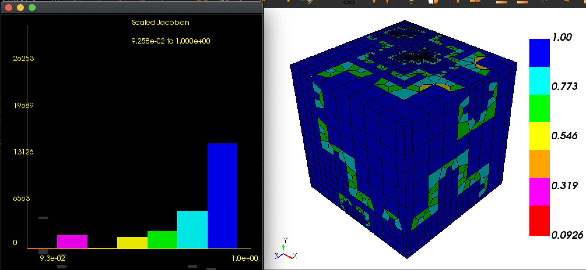

```bash
Cubit>quality volume all scaled jacobian global draw histogram draw mesh

 Hex quality, 26253 elements:
	Scaled Jacobian ranges from 9.258e-02 to 1.000e+00 (26253 entities)
	     Red ranges from 9.258e-02 to 2.222e-01 (52 entities)
	 Magenta ranges from 2.222e-01 to 3.518e-01 (1872 entities)
	DkYellow ranges from 3.518e-01 to 4.815e-01 (48 entities)
	  Yellow ranges from 4.815e-01 to 6.111e-01 (1634 entities)
	   Green ranges from 6.111e-01 to 7.407e-01 (2472 entities)
	    Cyan ranges from 7.407e-01 to 8.704e-01 (5314 entities)
	    Blue ranges from 8.704e-01 to 1.000e+00 (14861 entities)

Volume 1  Hex quality, 26253 elements:
------------------------------------
   Function Name    Average      Std Dev      Minimum   (id)       Maximum   (id)   
 ---------------    ---------    ---------    -----------------    -----------------
 Scaled Jacobian    8.414e-01    2.121e-01    9.258e-02 (21858)    1.000e+00 (11950)
------------------------------------
```

### Convert `bunny_projected.mesh -> bunny_projected.inp`

```python
~/sibl/geo/data/mesh(git:master)✔> python ~/sibl/geo/src/ptg/translator.py bunny_conforming.mesh
```

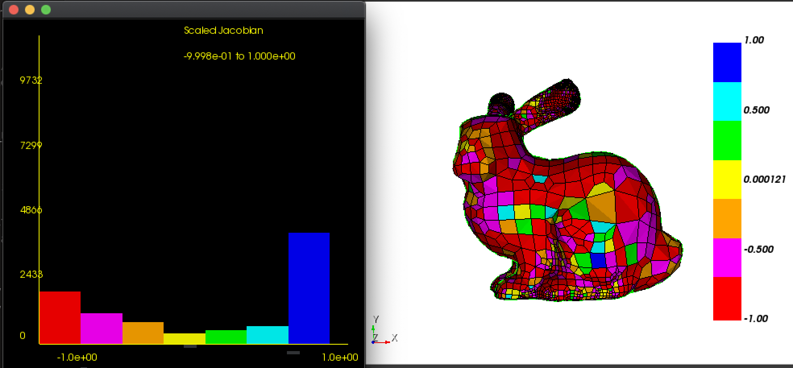

```bash
Cubit>quality volume all scaled jacobian global draw histogram draw mesh list

ERROR: Malformed element.


 Hex quality, 9732 elements:
	Scaled Jacobian ranges from -9.998e-01 to 1.000e+00 (9732 entities)
	     Red ranges from -9.998e-01 to -7.498e-01 (1980 entities)
	 Magenta ranges from -7.498e-01 to -4.999e-01 (1167 entities)
	DkYellow ranges from -4.999e-01 to -2.499e-01 (807 entities)
	  Yellow ranges from -2.499e-01 to 0.000e+00 (387 entities)
	   Green ranges from 0.000e+00 to 3.333e-01 (527 entities)
	    Cyan ranges from 3.333e-01 to 6.667e-01 (678 entities)
	    Blue ranges from 6.667e-01 to 1.000e+00 (4186 entities)

Volume 1  Hex quality, 9732 elements:
------------------------------------
   Function Name    Average      Std Dev      Minimum   (id)      Maximum   (id)
 ---------------    ---------    ---------    ----------------    --------------
 Scaled Jacobian    1.651e-01    7.795e-01    -9.998e-01 (8441)    1.000e+00 (2)
------------------------------------
```

## References

[^stanford_volume_data]: https://graphics.stanford.edu/data/voldata/, Terry Yoo of the National Library of Medicine, using a scanner provided by Sandy Napel and Geoff Rubin of Stanford Radiology, of the terra-cotta bunny provided by Marc Levoy of Stanford CS.

