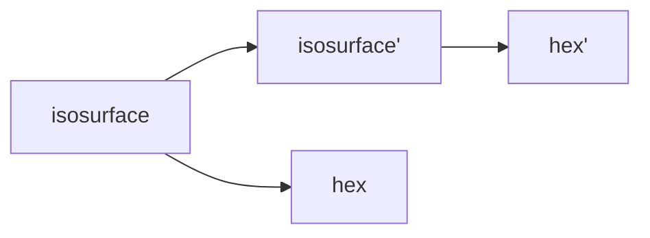
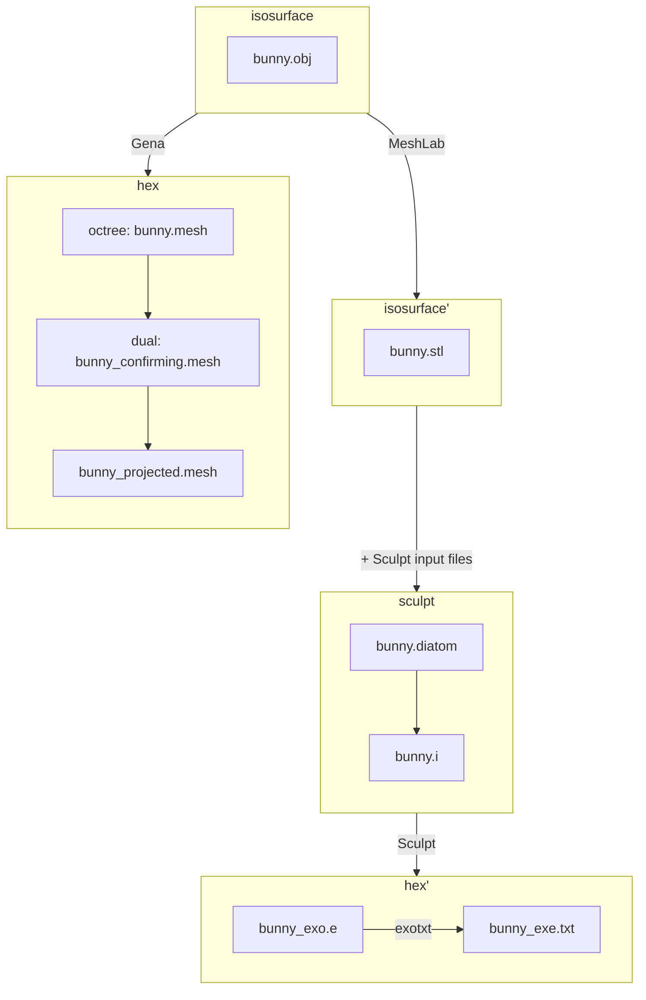

# Stanford bunny

## Introduction

The Stanford bunny comes from a a CT scan of a terra-cotta bunny.[^stanford_volume_data]
The CT scan contains 360 slices of 512 x 512 pixels, rectangular voxel grid, with
X:Y:Z aspect ratio of each voxel at 1:1:1.  There are 360 binary files, one file per slide, 
with file format of 16-bit integer (Mac byte order) with no header.  

## Objective

* Compare mesh created with Sculpt to Gen-Adapt-Ref-for-Hexmeshing.

## Materials

* See bunny.obj on the [data/obj folder](../../data/obj/README.md)
* [Gena](../../doc/cinolib/gena.md)
* Sculpt (to come)

## Workflow

### Overview



### Detail



## Methods

One the `[cbh@atlas]` machine:

```bash
cd ~/Gen-Adapt-Ref-for-Hexmeshing/build
./make_grid --surface --input_mesh_path=/Users/cbh/sibl/geo/data/obj/bunny.obj --output_grid_path=/Users/cbh/sibl/geo/data/mesh/bunny.mesh --use_octree --project_mesh=true
```

In a web browser, open https://www.hexalab.net/, then open the following files:

* `bunny.mesh`
* `bunny_conforming.mesh`
* `bunny_projected.mesh`

The view settings,
[`HLsettings-default.txt`](fig/HLsettings-default.txt),
are used with hexalab.

## Results

| bunny.obj | bunny_projected.mesh | 
|:--:|:--:|
|  |  |
| 14290 vertices, 28576 faces | 12237 vertices, 9732 hexes | 


| Default View | Alternative View |
|:--:|:--:|
| bunny.obj</br>  |  |
| bunny.mesh</br>  |  |
| bunny_conforming.mesh</br>  |  |
| bunny_projected.mesh</br>  |  |

* `bunny.stl`

* Population histogram of scaled Jacobian (to come).

## References

[^stanford_volume_data]: https://graphics.stanford.edu/data/voldata/, Terry Yoo of the National Library of Medicine, using a scanner provided by Sandy Napel and Geoff Rubin of Stanford Radiology, of the terra-cotta bunny provided by Marc Levoy of Stanford CS.

