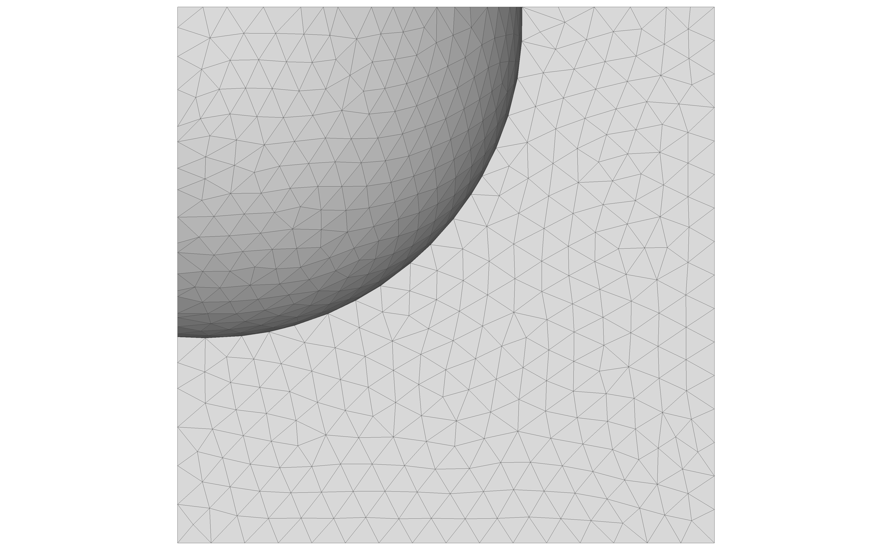
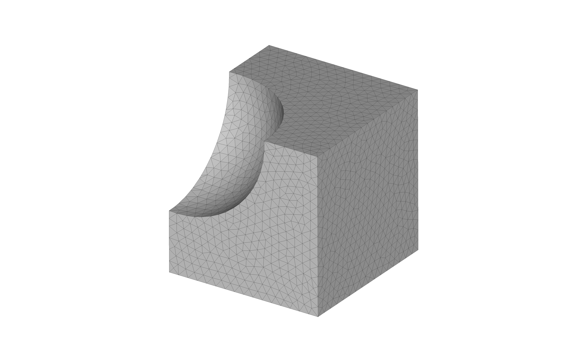
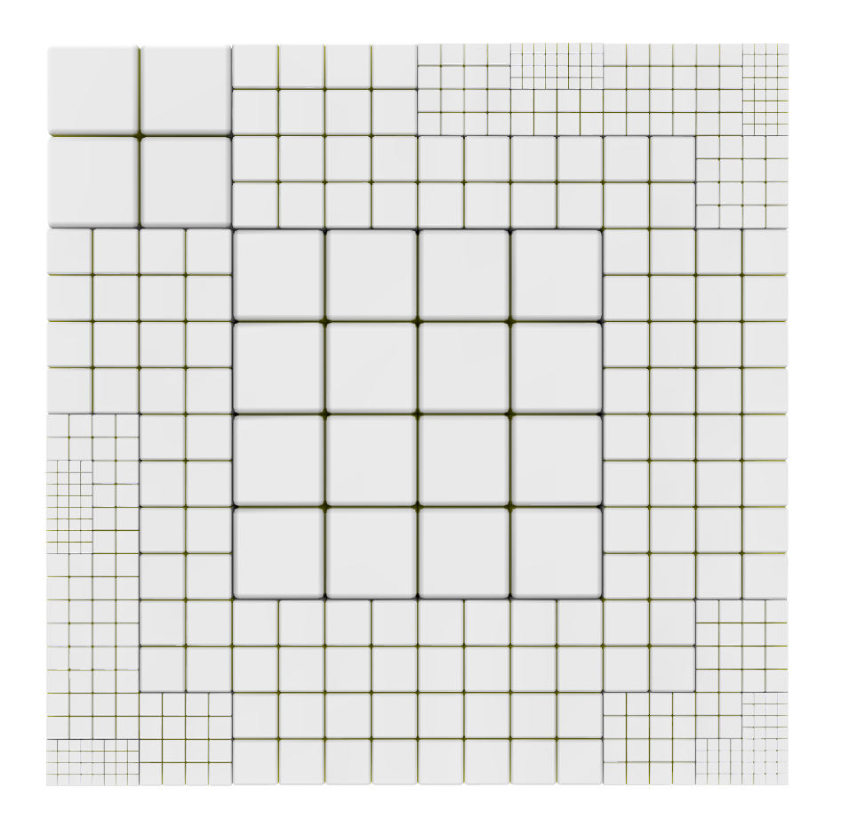
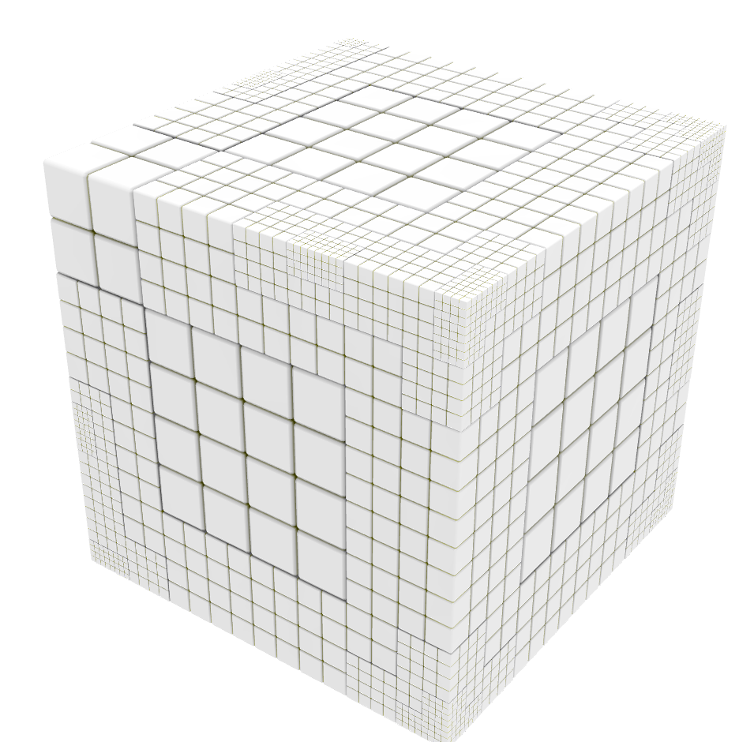
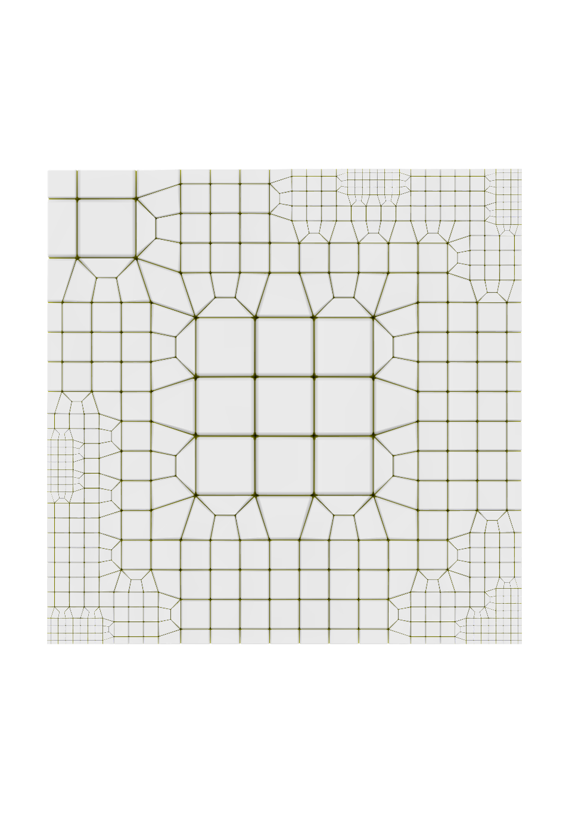
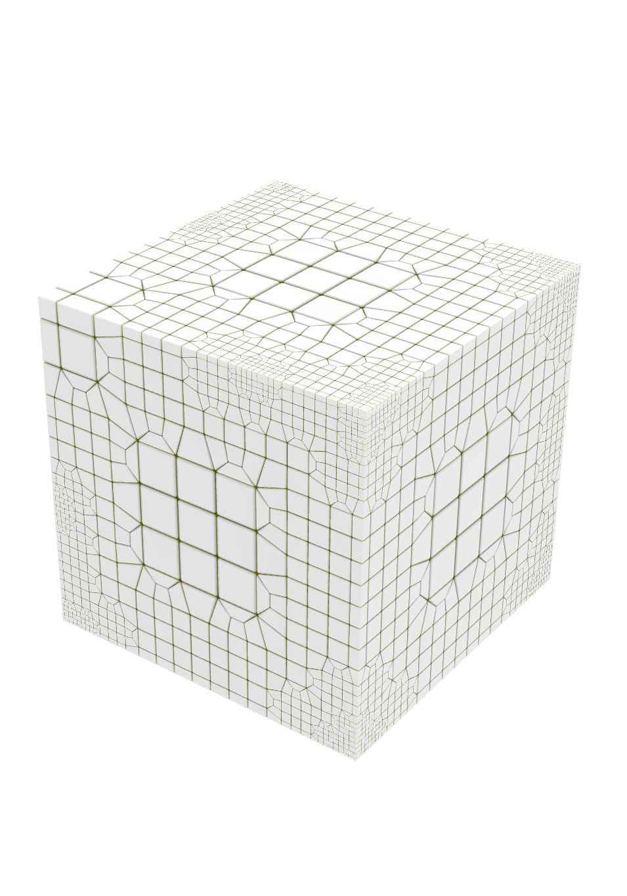
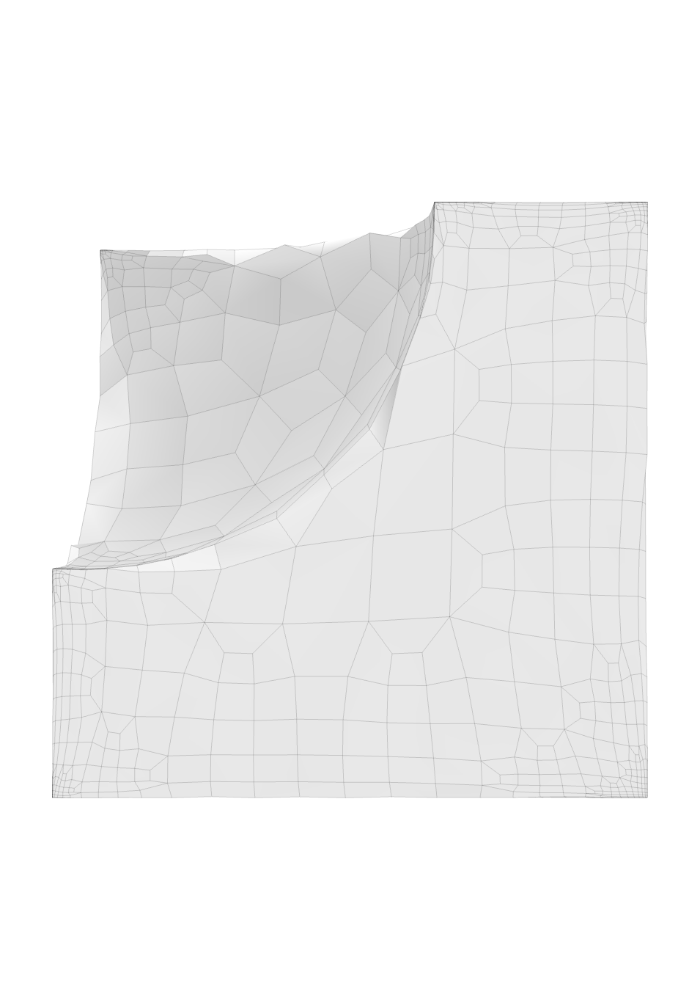
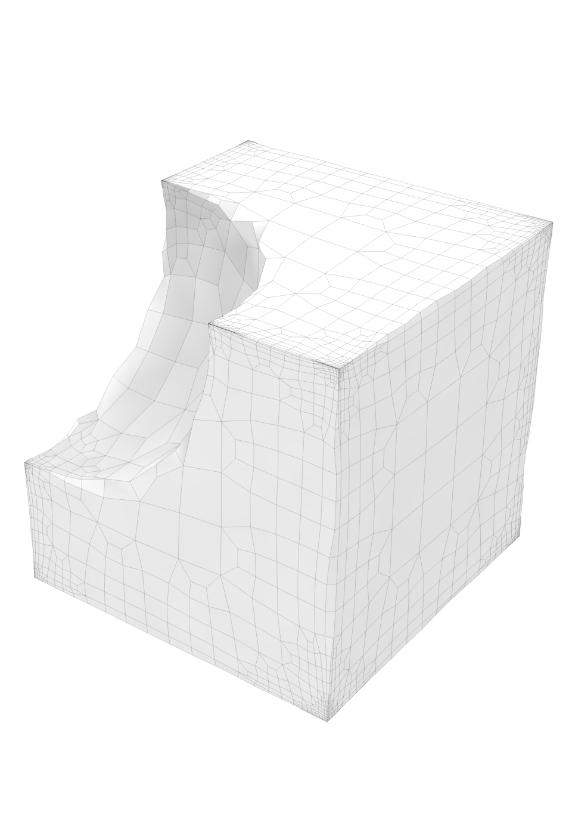

# cube minus sphere

## Objective

* Compare mesh created with Sculpt to Gen-Adapt-Ref-for-Hexmeshing.

## Materials

* cube_minus_sphere.obj file on [data page](../../data/obj/README.md)
* [Gena](../../doc/cinolib/gena.md)
* Sculpt (to come)

## Workflow

See [Stanford bunny workflow](https://github.com/sandialabs/sibl/blob/master/geo/doc/cinolib/bunny.md#workflow)

## Methods

One the `[cbh@atlas]` machine:

```bash
cd ~/Gen-Adapt-Ref-for-Hexmeshing/build
./make_grid --surface --input_mesh_path=/Users/cbh/sibl/geo/data/obj/cube_minus_sphere.obj --output_grid_path=/Users/cbh/sibl/geo/data/mesh/cube_minus_sphere.mesh --use_octree --project_mesh=true
```

In a web browser, open https://www.hexalab.net/, then open the following files:

* `cube_minus_sphere.mesh`
* `cube_minus_sphere_conforming.mesh`
* `cube_minus_sphere_projected.mesh`

The view settings,
[`HLsettings-default.txt`](fig/HLsettings-default.txt),
are used with hexalab.

| Default View | Alternative View |
|:--:|:--:|
| cube_minus_sphere.obj</br>  |  |
| cube_minus_sphere.mesh</br>  |  |
| cube_minus_sphere_conforming.mesh</br>  |  |
| cube_minus_sphere_projected.mesh  |  |

| Default View | Alternative View |
|:--:|:--:|
| cube_minus_sphere.obj</br>  |  |
| cube_minus_sphere.mesh</br>  |  |
| cube_minus_sphere_conforming.mesh</br>  |  |
| cube_minus_sphere_projected.mesh  |  |


