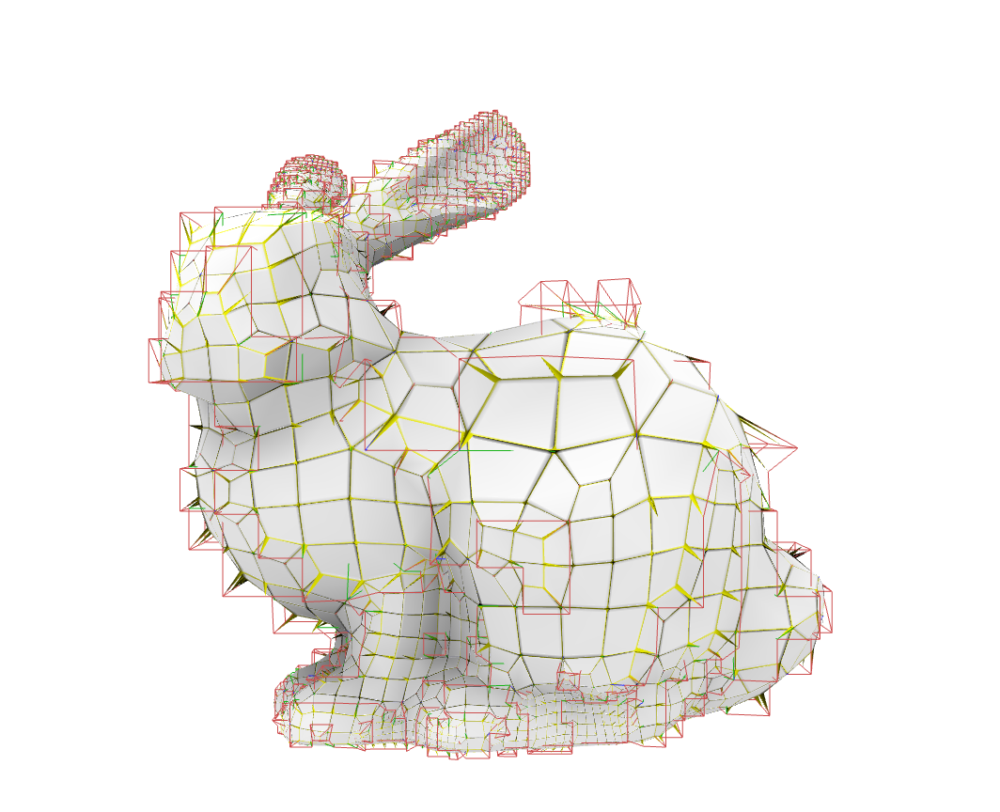
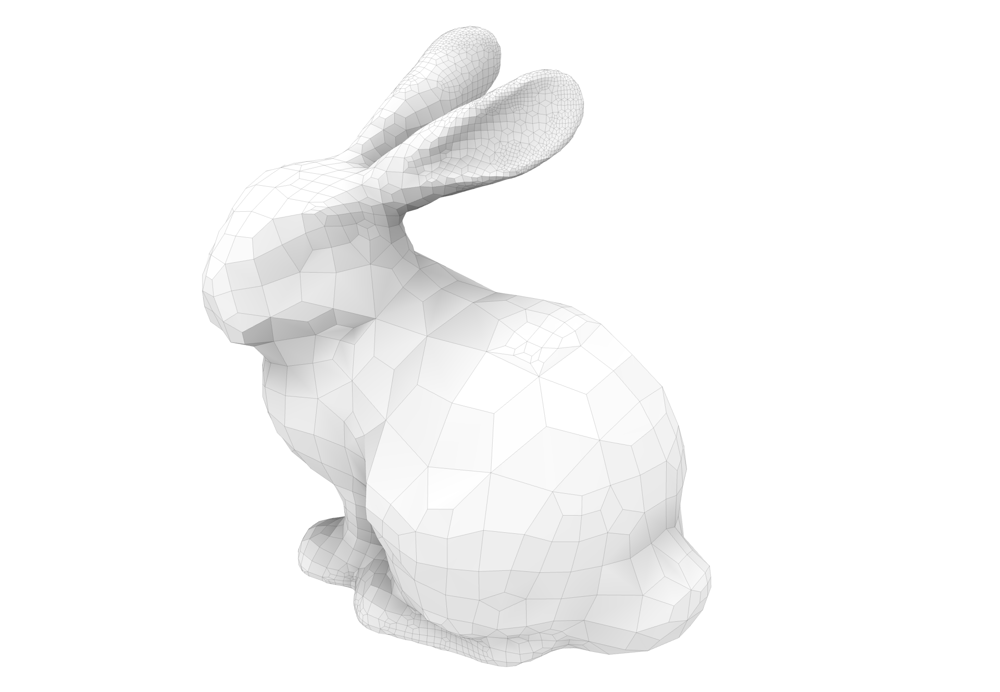

# Questio and Answer

## 2022-03-27 Gubrobi

### Q: Is there a workflow that does not require Gubroi?

A: Yes, "...you could used the classical octree-based pairing strategy,
which is purely algorithmic and does not require solving a 
numerical problem." [ML 2022-03-28] 

The [Pitzalis_2021_generalized_adaptive_refinement](../ref/Pitzalis_2021_generalized_adaptive_refinement.pdf)
paper shows the (OP + WB) worklow, which does not use Integer
Linear Programming (ILP) and hence does not require Gurobi.  

Gurobi makes possible the ILP (GP + WB) workflow, which provides smaller 
hexahedral count than (OP + WB).

Gurobi is currently the fastest existing ILP solver.  Alternatively, open 
source solvers could be used, they are just slower.  Fro example, 
Google's OR-tools (https://developers.google.com/optimization) is an option.

### Q: How is the octree-based pairing strategy invoked?

A: Use the `--use_octree` option when invoking the `make_grid` binary.

All of the octree-based pairing code is in 
https://github.com/cg3hci/Gen-Adapt-Ref-for-Hexmeshing and there is no 
separate repository for the octree-based code, even though the ILP 
strategy is preferred over the octree-based strategy since fewer hexahedral
elements result with the ILP approach. [LP 2022-03-28]

### Q: Why do red lines appear as in the following?

|  |  |

A: Red lines "...are internal irregular edges that remained outside of the shape
because only boundary nodes have been projected on the target surface... you can
disable the visualization of singular edges in Hexalab [using the] dedicated 
slider at that the bottom part of the side bar, just position the slider at the
left maximum." [ML 2022-03-28]

