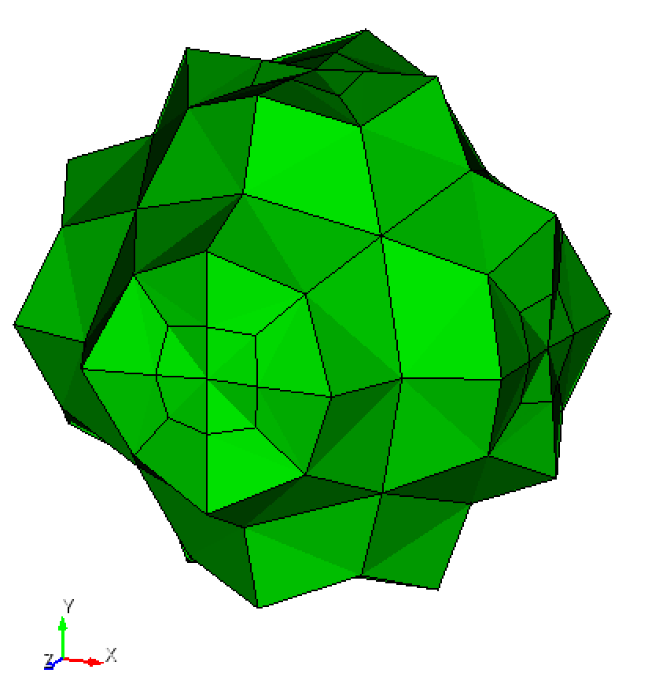
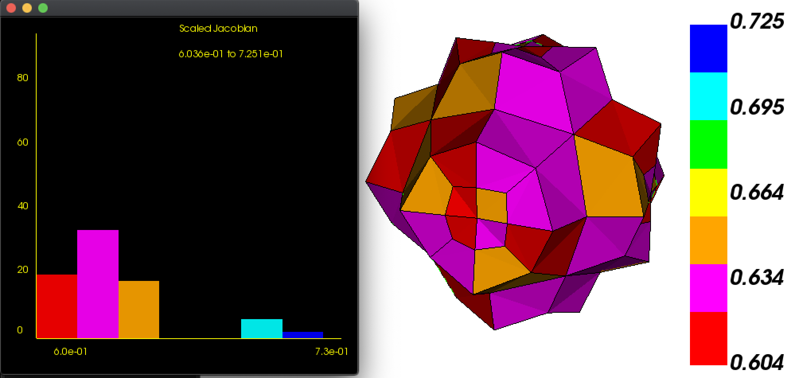

# sphere

## Objective

* Compare mesh created with Sculpt to Gen-Adapt-Ref-for-Hexmeshing.

## Materials

* sphere.obj file on [data page](../../data/obj/README.md)
* [sphere.stl](../../data/stl/sphere.stl)
* [Gena](../../doc/cinolib/gena.md)
* [HexaLab](https://www.hexalab.net)
* Sculpt (to come)

## Workflow

See [Stanford bunny workflow](https://github.com/sandialabs/sibl/blob/master/geo/doc/cinolib/bunny.md#workflow)

## Methods

### Gena

On the `[cbh@atlas]` machine:

```bash
cd ~/Gen-Adapt-Ref-for-Hexmeshing/build
./make_grid \
  --surface \
  --input_mesh_path=/Users/cbh/sibl/geo/data/obj/sphere.obj \
  --output_grid_path=/Users/cbh/sibl/geo/data/mesh/sphere.mesh \
  --use_octree \
  --project_mesh=true
```

### Sculpt

Based on historical document, `/geometry/data/bob/fe/chama_test/`:

* Diatom input file [`sphere.diatom`](../../data/sculpt/sphere.diatom)
* Sculpt input file [`sphere.i`](../../data/sculpt/sphere.i)

On an HPC login node:

```bash
/projects/cubit/sculpt-alpha -j 16 -i chama_test.i  # single processor
/projects/cubit/sculpt-alpha -i chama_test.i  # 16 processors
/projects/cubit/sculpt64-16.04 -i sphere.i
cp sphere_exo.e.1.0 sphere_exo.e
exotxt sphere_exo.e.1.0 sphere_exo.txt
scp sphere_exo.e.1.0 chovey@machine_name.srn.sandia.gov:~/sibl/geo/data/sculpt/.
```

## Results

### Gena

In a web browser, open https://www.hexalab.net/, then open the following files:

* [`sphere.mesh`](../../data/mesh/sphere.mesh)
* [`sphere_conforming.mesh`](../../data/mesh/sphere_conforming.mesh)
* [`sphere_projected.mesh`](../../data/mesh/sphere_projected.mesh)

The view settings,
[`HLsettings-default.txt`](fig/HLsettings-default.txt),
are used with hexalab.

| Default View | Alternative View |
|:--:|:--:|
| sphere.obj</br>  | |
| sphere.mesh</br>  |  |
| sphere_conforming.mesh</br>  |  |
| sphere_projected.mesh</br>  |  |

### Roundings

* Question 2022-04-20-a: With [`sphere_projected.mesh`](../../data/mesh/sphere_projected.mesh), with `Separation: Roundings` in figure (c) and (d), why to the spikes appear?

| | Irregular nonzero | Irregular zero |
|:--|:--:|:--:|
| Separation: Flat Lines Separation | (a)  | (b)  | 
| Separation: Roundings | (c)  | (d)  |

### Metrics

* Question 2022-04-20-b: With [`sphere.mesh`](../../data/mesh/sphere.mesh), why does the scaled Jacobian appear correct as 1.0 for all hexes in (a), but reports all zeros in the [`sphere_mesh.csv`](fig/sphere_mesh.csv) file (b).  
  * Why doesn't line `101` report a count of `64` hex elements all with scaled Jacobian of 1.0?  I suppose the reason that the histogram in (a) not show a population bar is because the underlying data as zero for the SJ=1 case (line `101`).  
  * Looking at `83`, `84`, `94` and `95`, I wonder if the SJ calculation is a float of `1.0000000000000001` and needs to be `max(x, 1.0)` filtered in HexaLab, give make line `101` appears as `1.0,64` instead of `1,0`?

| GUI | Tail of the [`sphere_mesh.csv`](fig/sphere_mesh.csv) output |
|:--:|:--:|
| (a)   | (b)  |


### Sculpt



```bash
Cubit>quality vol all scaled jacobian global draw histogram list

 Hex quality, 80 elements:
	Scaled Jacobian ranges from 6.036e-01 to 7.251e-01 (80 entities)
	     Red ranges from 6.036e-01 to 6.209e-01 (20 entities)
	 Magenta ranges from 6.209e-01 to 6.383e-01 (34 entities)
	DkYellow ranges from 6.383e-01 to 6.556e-01 (18 entities)
	  Yellow ranges from 6.556e-01 to 6.730e-01 (0 entities)
	   Green ranges from 6.730e-01 to 6.903e-01 (0 entities)
	    Cyan ranges from 6.903e-01 to 7.077e-01 (6 entities)
	    Blue ranges from 7.077e-01 to 7.251e-01 (2 entities)

Volume 1  Hex quality, 80 elements:
------------------------------------
   Function Name    Average      Std Dev      Minimum   (id)    Maximum   (id)
 ---------------    ---------    ---------    --------------    --------------
 Scaled Jacobian    6.376e-01    2.833e-02    6.036e-01 (11)    7.251e-01 (4)
------------------------------------
```



## TODO

* Sculpt workflow
  * `sphere.stl` --> `sphere_exo.txt`
  * output scaled Jacobian data in a reliable way 
    * HexaLab is not yet reliable, but it does output the underlying histogram data
    * Cubit is reliable but not customizable, no output of histogram data
    * Python to the rescue
  * `_exo.e.txt` --> `.inp`
  * `.mesh` --> `.inp`