# sphere

## Objective

* Compare mesh created with Sculpt to Gen-Adapt-Ref-for-Hexmeshing.

## Materials

* sphere.obj file on [data page](../../data/obj/README.md)
* [Gena](../../doc/cinolib/gena.md)
* [HexaLab](https://www.hexalab.net)
* Sculpt (to come)

## Workflow

See [Stanford bunny workflow](https://github.com/sandialabs/sibl/blob/master/geo/doc/cinolib/bunny.md#workflow)

## Methods

One the `[cbh@atlas]` machine:

```bash
cd ~/Gen-Adapt-Ref-for-Hexmeshing/build
./make_grid --surface --input_mesh_path=/Users/cbh/sibl/geo/data/obj/sphere.obj --output_grid_path=/Users/cbh/sibl/geo/data/mesh/sphere.mesh --use_octree --project_mesh=true
```

## Results

In a web browser, open https://www.hexalab.net/, then open the following files:

* [`sphere.mesh`](../../data/mesh/sphere.mesh)
* [`sphere_conforming.mesh`](../../data/mesh/sphere_conforming.mesh)
* [`sphere_projected.mesh`](../../data/mesh/sphere_projected.mesh)

The view settings,
[`HLsettings-default.txt`](fig/HLsettings-default.txt),
are used with hexalab.

| Default View | Alternative View |
|:--:|:--:|
| sphere.obj</br> 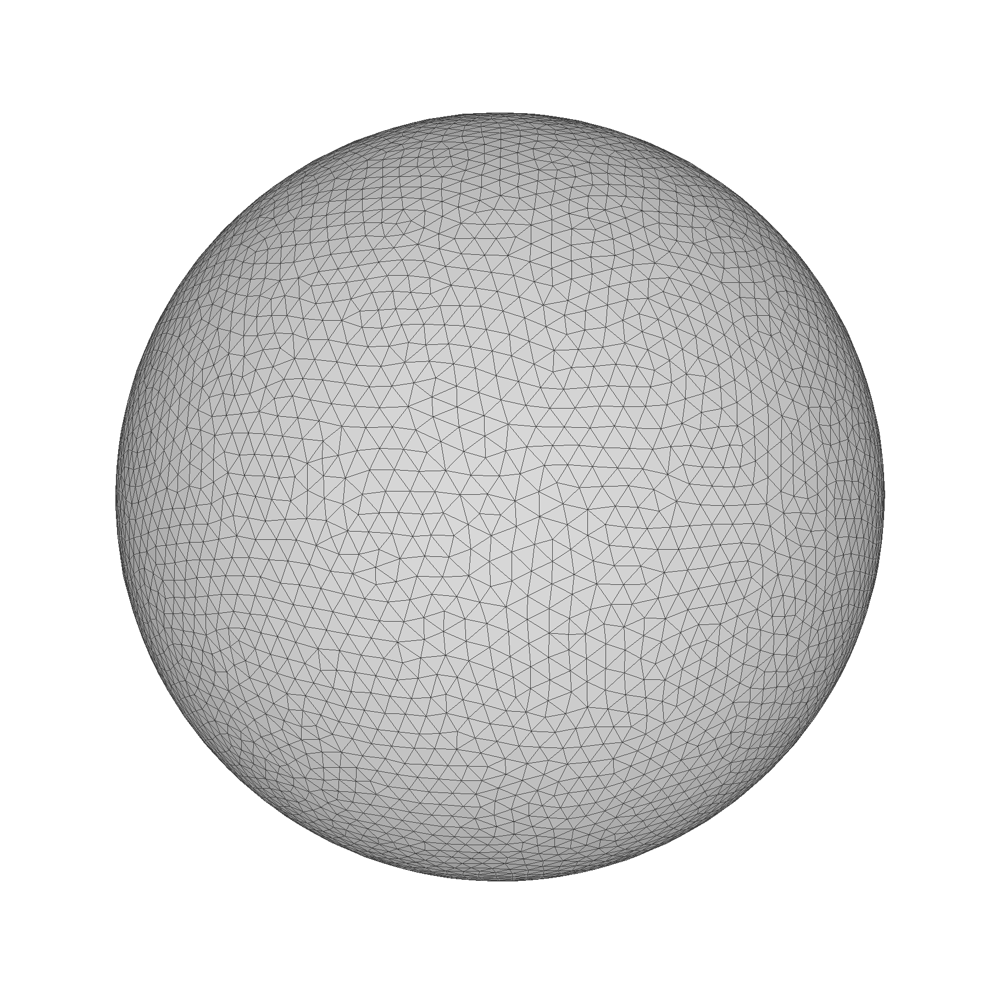 | |
| sphere.mesh</br> 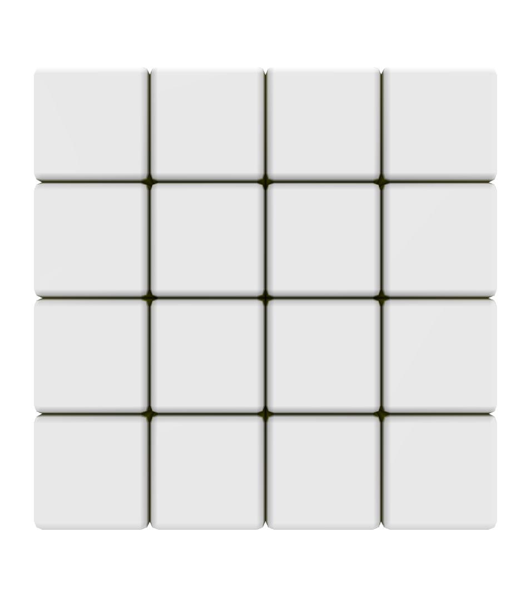 | 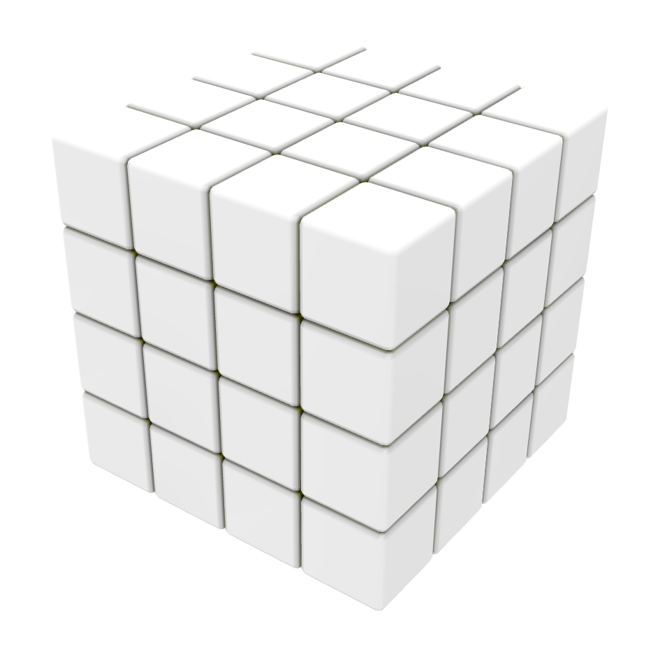 |
| sphere_conforming.mesh</br> 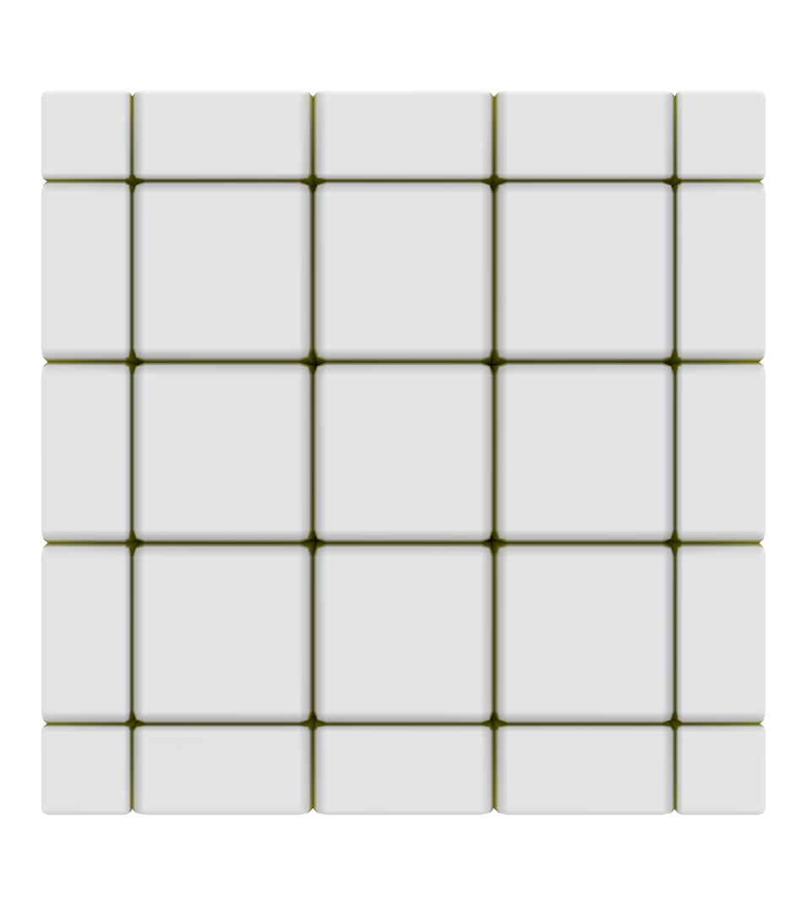 | 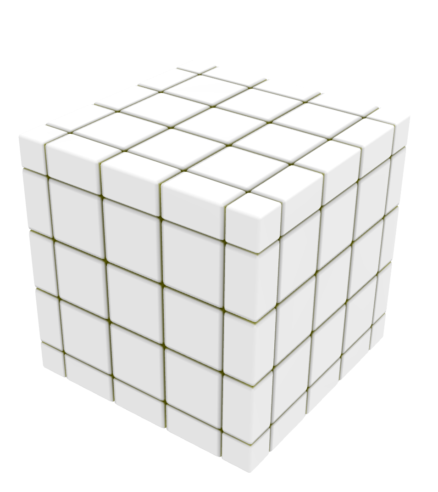 |
| sphere_projected.mesh</br> 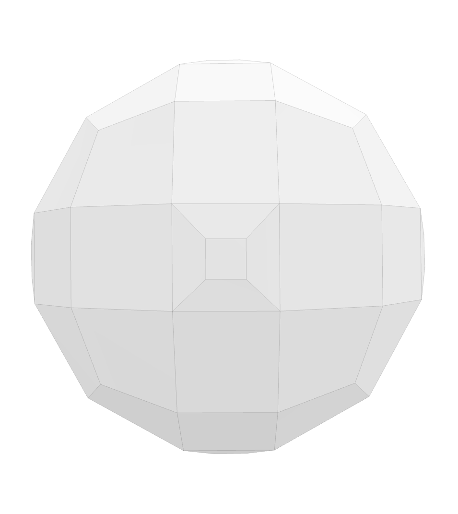 | 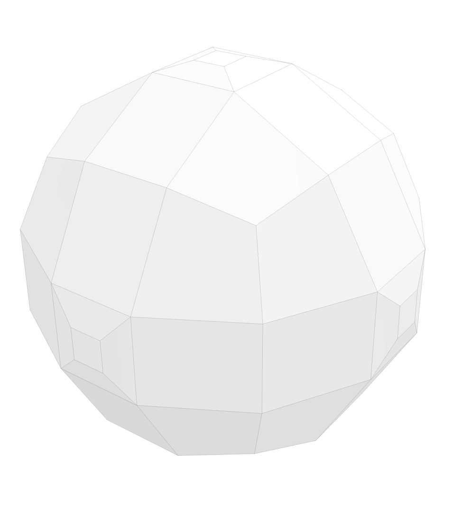 |

### Roundings

* Question 2022-04-20-a: With [`sphere_projected.mesh`](../../data/mesh/sphere_projected.mesh), with `Separation: Roundings` in figure (c) and (d), why to the spikes appear?

| | Irregular nonzero | Irregular zero |
|:--|:--:|:--:|
| Separation: Flat Lines Separation | (a)  | (b) 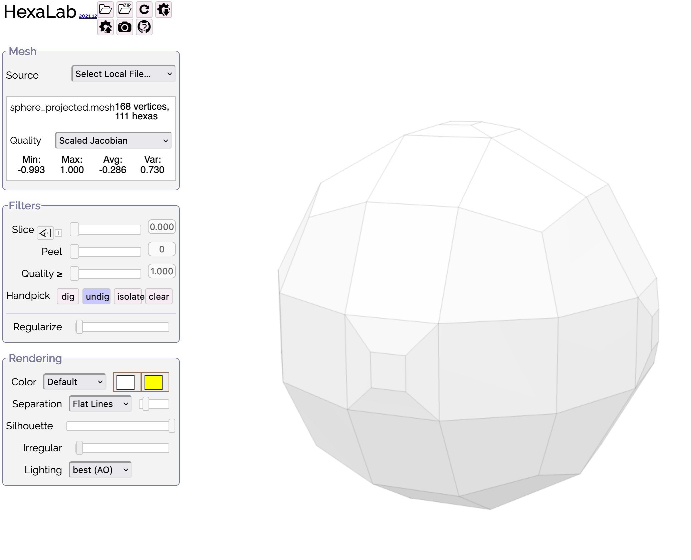 | 
| Separation: Roundings | (c) 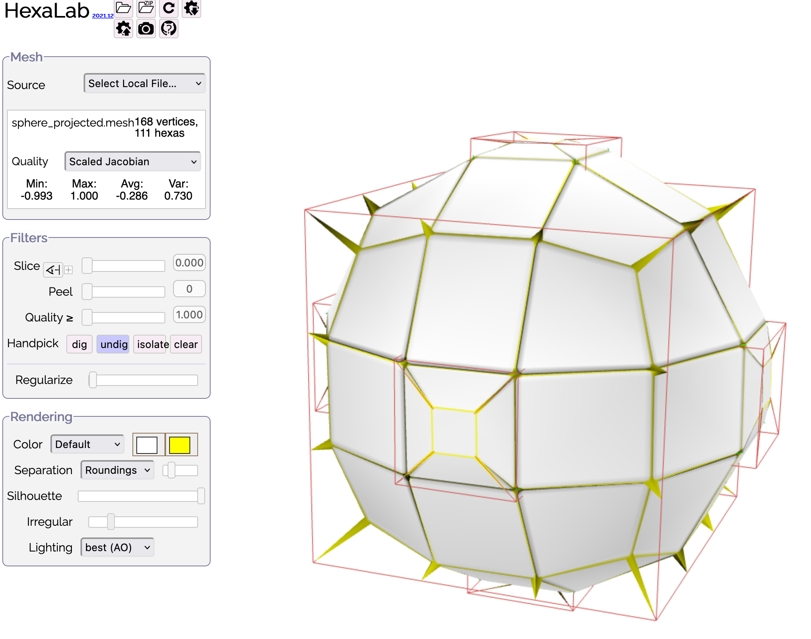 | (d) 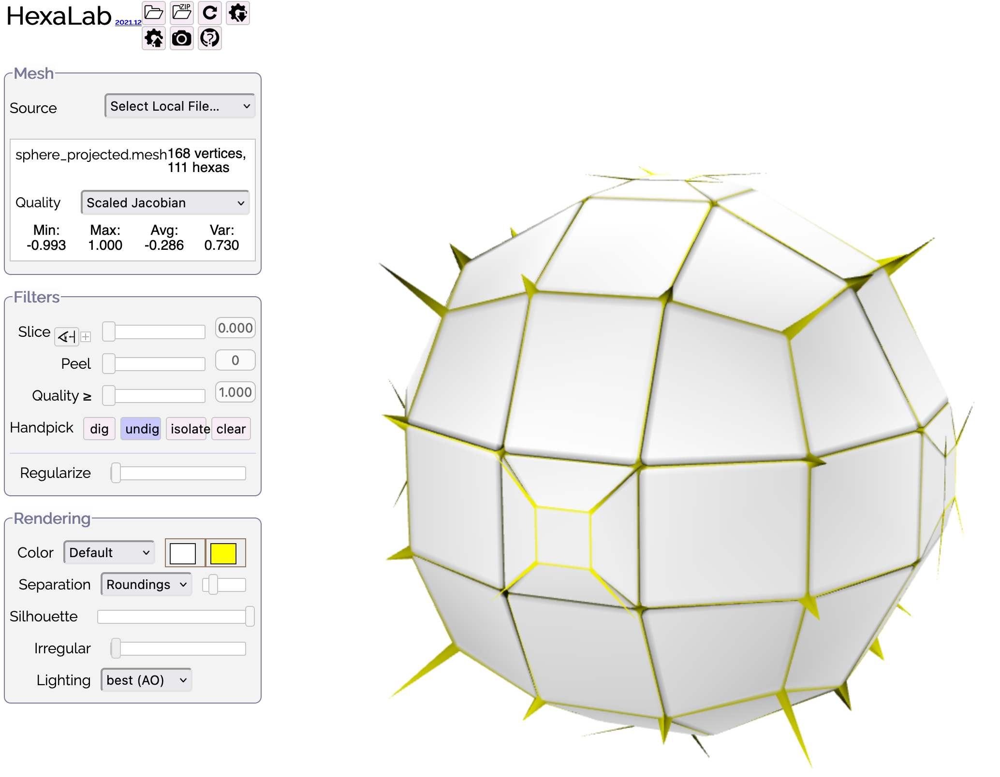 |

### Metrics

* Question 2022-04-20-b: With [`sphere.mesh`](../../data/mesh/sphere.mesh), why does the scaled Jacobian appear correct as 1.0 for all hexes in (a), but reports all zeros in the [`sphere_mesh.csv`](fig/sphere_mesh.csv) file (b).  
  * Why doesn't line `101` report a count of `64` hex elements all with scaled Jacobian of 1.0?  I suppose the reason that the histogram in (a) not show a population bar is because the underlying data as zero for the SJ=1 case (line `101`).  
  * Looking at `83`, `84`, `94` and `95`, I wonder if the SJ calculation is a float of `1.0000000000000001` and needs to be `max(x, 1.0)` filtered in HexaLab, give make line `101` appears as `1.0,64` instead of `1,0`?

| GUI | Tail of the [`sphere_mesh.csv`](fig/sphere_mesh.csv) output |
|:--:|:--:|
| (a) 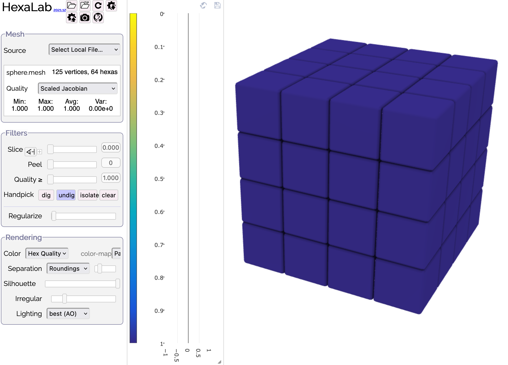  | (b) 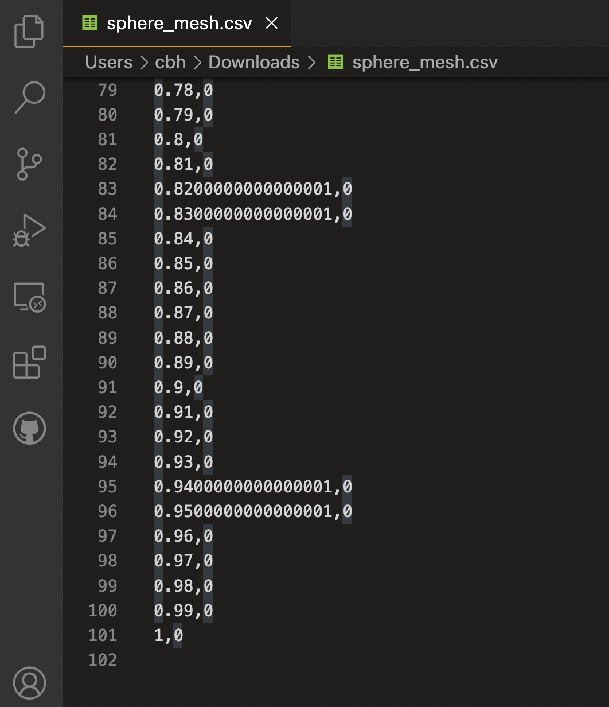 |
