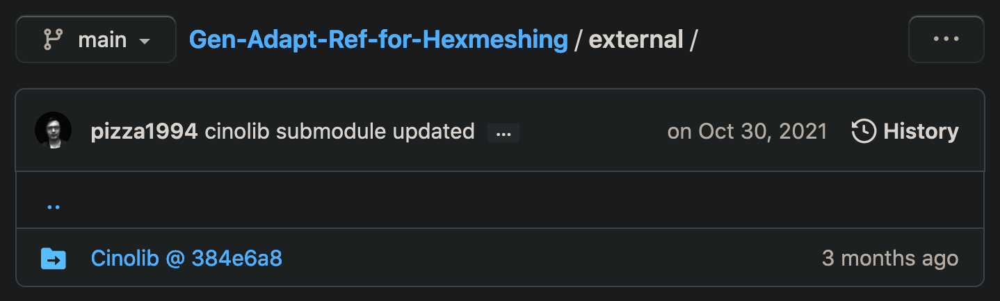

# Step 1: Install [Gen-Adapt-Ref-for-Hexmeshing](https://github.com/cg3hci/Gen-Adapt-Ref-for-Hexmeshing)

Clone the `Gen-Adapt-Ref-for-Hexmeshing` repository as follows:

```bash
> cd ~/  # we use $HOME as the local install location
> git clone git@github.com:cg3hci/Gen-Adapt-Ref-for-Hexmeshing.git
Cloning into 'Gen-Adapt-Ref-for-Hexmeshing'...
remote: Enumerating objects: 97, done.
remote: Counting objects: 100% (97/97), done.
remote: Compressing objects: 100% (62/62), done.
remote: Total 97 (delta 50), reused 56 (delta 28), pack-reused 0
Receiving objects: 100% (97/97), 2.77 MiB | 1.62 MiB/s, done.
Resolving deltas: 100% (50/50), done.
>
```

Confirm the contents on your local machine:

```bash
~/Gen-Adapt-Ref-for-Hexmeshing (main)> ls
CMakeLists.txt    LICENSE           code/             main.cpp
FindGUROBI.cmake  README.md         external/         teaser_HD.png
```

* This repository has the code that allows creation of an adaptive grid with hanging nodes and enforce balancing/pairing relationship.  
* CinoLib already has the schemes to suprress hanging nodes.
* In the future, refactoring will allow the entire hexmeshing pipeline to be moved completely into CinoLib.  As of today, it remains a work in progress.
* The `external/` folder contains the `Cinolib/` subfolder, which is empty.
  * As shown below in the figure below, the `Gen-Adapt-Ref-for-Hexmeshing` repository points to `CinoLib` as a submodule, based on the [Cinolib @ 384e6a8](https://github.com/mlivesu/cinolib/tree/384e6a8fd45fa3a2a5e52cd22ade154f6f0b8d10)
  * 
  * > *Figure 1.0:  GitLab showing submodule link to CinoLib*
  * Ask Marco:  Is/Can this submodule link to be ignored, since we will clone the `cinolib` repository directly?

`<-` Previous: [Step 0](README.md)

`->` Next: [Step 2](step_02.md)
