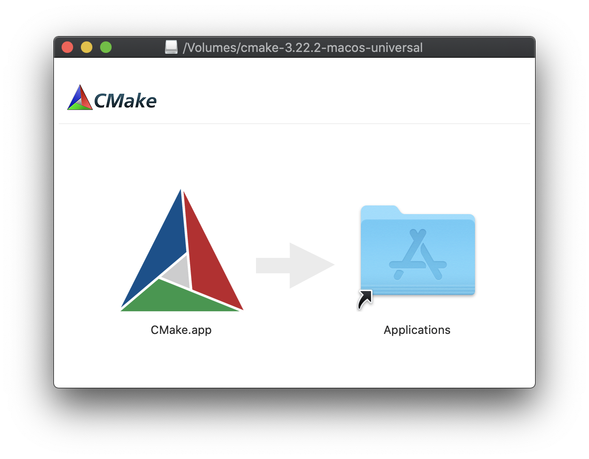
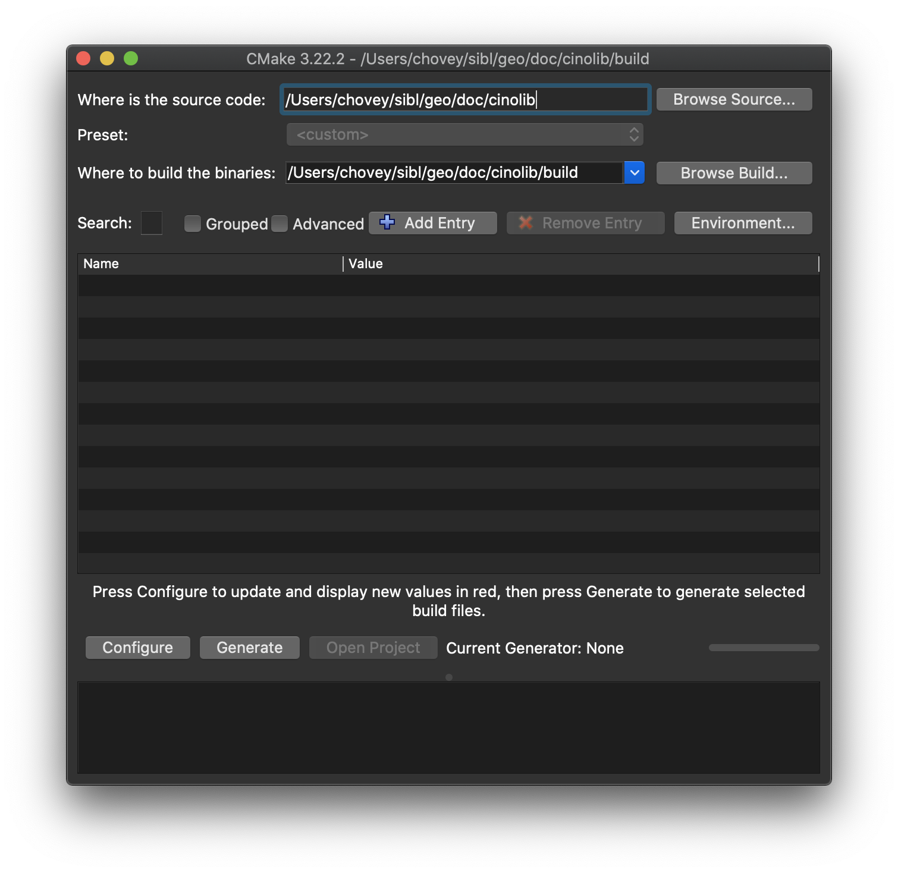

# Step 4: Install [CGAL](https://www.cgal.org/)

To come.

* CGAL is used for the computation of the Shape Diameter Function (SDF).


# Step #: Install `cmake`

From the CMake [installation site](https://cmake.org/install/), install `cmake` for 
your special local operating system:  macOS, Linux, or Windows.

* For example, for macOS, [download](https://cmake.org/download/) the binary distribution for macOS 10.13 or later, titled `cmake-3.22.2-macos-universal.dmg`.
  * Double-click the `.dmg` file.
  * Move the `CMake.app` to the `Applications` folder, as shown in the image below.

 
> *Figure: Installation of CMake on macOS.*

* Double-click the `Applications/CMake.app` file.
* From the `Tools` menu, select the "How to Install For Command Line Use" menu item for instructions to make the command line tools (e.g., `cmake`) available in the `PATH`. 
  * Alternatively, manually add the install directory `/Applications/CMake.app/Contents/bin` to the `PATH`.


* We recommend the installation of symlinks to `/usr/local/bin` option.

```bash
> sudo "/Applications/CMake.app/Contents/bin/cmake-gui" --install
Password:
Linked: '/usr/local/bin/cmake' -> '/Applications/CMake.app/Contents/bin/cmake'
Linked: '/usr/local/bin/ctest' -> '/Applications/CMake.app/Contents/bin/ctest'
Linked: '/usr/local/bin/cpack' -> '/Applications/CMake.app/Contents/bin/cpack'
Linked: '/usr/local/bin/cmake-gui' -> '/Applications/CMake.app/Contents/bin/cmake-gui'
Linked: '/usr/local/bin/ccmake' -> '/Applications/CMake.app/Contents/bin/ccmake'
>
```

Verify `cmake` is shown in `/usr/local/bin`

```bash
> which cmake
/usr/local/bin/cmake
```

Copy the `bunny.obj` to the local directory.

```bash
> cd ~/sibl/geo/doc/cinolib
> cp ~/cinolib/examples/data/bunny.obj .
```

Create `~/sibl/geo/doc/cinolib/CMakeLists.txt` with the following contents:

```bash
cmake_minimum_required(VERSION 3.2)
project(cinolib_demo)
add_executable(${PROJECT_NAME} main.cpp)
set(CINOLIB_USES_OPENGL_GLFW_IMGUI ON)
find_package(cinolib REQUIRED)
target_link_libraries(${PROJECT_NAME} cinolib)
```

Create a `~/sibl/geo/doc/cinolib/main.cpp` with the following contents:

```c
#include <cinolib/meshes/drawable_trimesh.h>
#include <cinolib/gl/glcanvas.h>

int main()
{
    using namespace cinolib;
    DrawableTrimesh<> m("bunny.obj");
    GLcanvas gui;
    gui.push(&m);
    return gui.launch();
}
```

Create a `build` subfolder and make the executable:

```bash
> mkdir build
> cd build/
> cmake .. -DCMAKE_BUILD_TYPE=Release -Dcinolib_DIR=/Users/chovey/cinolib
-- The C compiler identification is AppleClang 12.0.0.12000032
-- The CXX compiler identification is AppleClang 12.0.0.12000032
-- Detecting C compiler ABI info
-- Detecting C compiler ABI info - done
-- Check for working C compiler: /Applications/Xcode.app/Contents/Developer/Toolchains/XcodeDefault.xctoolchain/usr/bin/cc - skipped
-- Detecting C compile features
-- Detecting C compile features - done
-- Detecting CXX compiler ABI info
-- Detecting CXX compiler ABI info - done
-- Check for working CXX compiler: /Applications/Xcode.app/Contents/Developer/Toolchains/XcodeDefault.xctoolchain/usr/bin/c++ - skipped
-- Detecting CXX compile features
-- Detecting CXX compile features - done
CINOLIB OPTIONAL MODULES: OpenGL, GLFW, ImGui
-- Found OpenGL: /Applications/Xcode.app/Contents/Developer/Platforms/MacOSX.platform/Developer/SDKs/MacOSX11.1.sdk/System/Library/Frameworks/OpenGL.framework
-- Looking for pthread.h
-- Looking for pthread.h - found
-- Performing Test CMAKE_HAVE_LIBC_PTHREAD
-- Performing Test CMAKE_HAVE_LIBC_PTHREAD - Success
-- Found Threads: TRUE
-- Using Cocoa for window creation
-- Configuring done
-- Generating done
-- Build files have been written to: /Users/chovey/sibl/geo/doc/cinolib/build
>
```


# Example 01: Trimesh Viewer

```bash
> cd /Users/chovey/cinolib/examples/01_trimesh_viewer
> g++ -O3 -std=c++11 -I/Users/chovey/cinolib/include/ main.cpp -o test.out
In file included from main.cpp:1:
In file included from /Users/chovey/cinolib/include/cinolib/meshes/meshes.h:40:
In file included from /Users/chovey/cinolib/include/cinolib/meshes/trimesh.h:41:
In file included from /Users/chovey/cinolib/include/cinolib/meshes/mesh_attributes.h:39:
In file included from /Users/chovey/cinolib/include/cinolib/geometry/vec_mat.h:40:
In file included from /Users/chovey/cinolib/include/cinolib/geometry/vec_mat_utils.h:136:
/Users/chovey/cinolib/include/cinolib/geometry/vec_mat_utils.cpp:42:10: fatal error: 'Eigen/Dense' file not found
#include <Eigen/Dense>
         ^~~~~~~~~~~~~
1 error generated.
chovey@s1060600 ~/c/e/01_trimesh_viewer (master) [1]>
```

# To be determined

* Locate the source code, e.g., `/Users/chovey/sibl/geo/doc/cinolib`.
* Locate the build directory, e.g., `/Users/chovey/sibl/doc/cinolib/build`.


> *Figure: CMake configuration for toy problem.*


`<-` Previous: [Step 3](step_03.md)

`->` Next: [Step #](step_0#.md)
