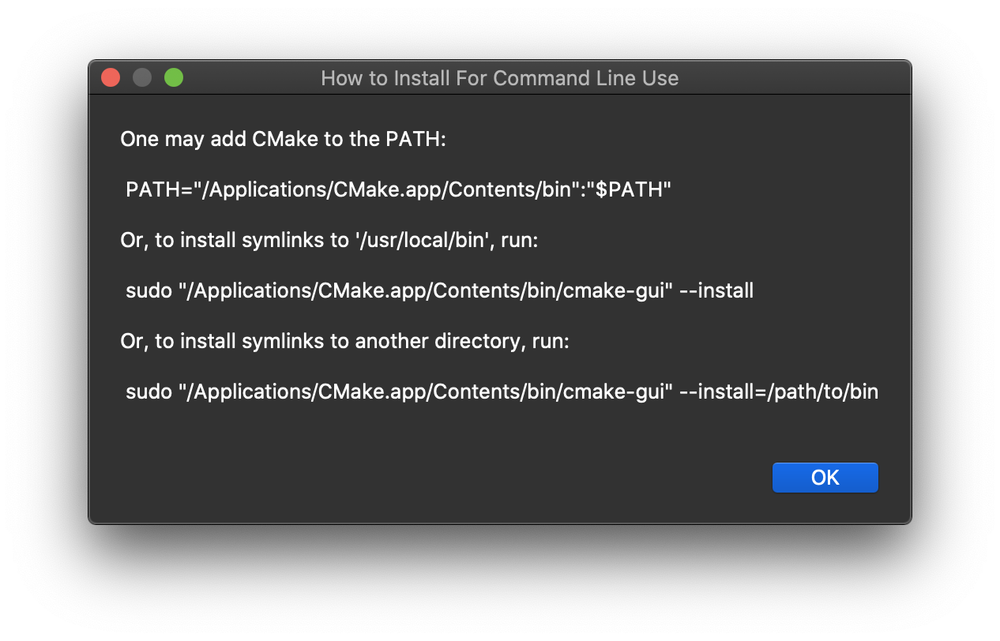

# Getting Started with CMake

## Goal

The goal of this document is to introduce CMake and assist the reader to gain proficiency.

## Installation

Install [CMake](https://cmake.org/install/) using the instructions for your particular operating system: macOS, Linux, or Windows.

For example, for macOS, [download](https://cmake.org/download/) the binary distribution for macOS 10.13 or later, titled `cmake-3.22.2-macos-universal.dmg`.
* Double-click the `.dmg` file.
* Move the `CMake.app` to the `Applications` folder, as shown in the image below


* Double-click the `Applications/CMake.app` file.
* From the `Tools` menu, select the "How to Install For Command Line Use" menu item for instructions to make the command line tools (e.g., `cmake`) available in the `PATH`. 
  * Alternatively, manually add the install directory `/Applications/CMake.app/Contents/bin` to the `PATH`.




* We recommend the installation of symlinks to `/usr/local/bin` option.

```bash
> sudo "/Applications/CMake.app/Contents/bin/cmake-gui" --install
Password:
Linked: '/usr/local/bin/cmake' -> '/Applications/CMake.app/Contents/bin/cmake'
Linked: '/usr/local/bin/ctest' -> '/Applications/CMake.app/Contents/bin/ctest'
Linked: '/usr/local/bin/cpack' -> '/Applications/CMake.app/Contents/bin/cpack'
Linked: '/usr/local/bin/cmake-gui' -> '/Applications/CMake.app/Contents/bin/cmake-gui'
Linked: '/usr/local/bin/ccmake' -> '/Applications/CMake.app/Contents/bin/ccmake'
>
```

Verify `cmake` is shown in the `/usr/local/bin` directory:

```bash
> which cmake
/usr/local/bin/cmake
```

Verify the `cmake` version (for use later): 

```bash
> cmake --version
cmake version 3.21.4
```

## Background

We begin with a `Hello World!` C++ example, compiled on the command line *without* CMake to give context. 

```bash
> mkdir ~/temp  # or `cd ~/temp` if the folder already exists
```

Create a `main.cpp` as follows:

```c
#include <iostream>

int main()
{
    std::cout << "Hello World!\n";
    return 0;
}
```

Compile the program:

```bash
> g++ -o hello main.cpp
```

Run the program

```bash
> ./hello
Hello World!
```

As applications get larger, with more and more source files, a more comprehensive way to build the executables is needed.  CMake satisfies this need.

## Minimum Working Example

### Configure

Within the `~/temp` folder, create a file called `CMakeLists.txt` with the following contents:

```cmake
cmake_minimum_required(VERSION 3.10)

project(hello VERSION 1.0)
add_executable(hello main.cpp)
```

Next, make a `~/temp/build` target folder to hold our binary.  The use of a `build` (or simililarly a `Release` or `Debug`) subdirectory is considered a best practice to separate the binary from code source files.

```bash
> cd ~/temp/build
> cmake ../ # The `../` tells CMake to look for CMakeLists.txt in the parent directory
-- The C compiler identification is AppleClang 12.0.0.12000032
-- The CXX compiler identification is AppleClang 12.0.0.12000032
-- Detecting C compiler ABI info
-- Detecting C compiler ABI info - done
-- Check for working C compiler: /Library/Developer/CommandLineTools/usr/bin/cc - skipped
-- Detecting C compile features
-- Detecting C compile features - done
-- Detecting CXX compiler ABI info
-- Detecting CXX compiler ABI info - done
-- Check for working CXX compiler: /Library/Developer/CommandLineTools/usr/bin/c++ - skipped
-- Detecting CXX compile features
-- Detecting CXX compile features - done
-- Configuring done
-- Generating done
-- Build files have been written to: /Users/sparta/temp/build
> ls
CMakeCache.txt      CMakeFiles          Makefile            cmake_install.cmake
```

### Build

Now that `CMake` has configured make (hence `c` and `make` for `cmake`), make can be run to build the binary:

```bash
> make
[ 50%] Building CXX object CMakeFiles/hello.dir/main.cpp.o
[100%] Linking CXX executable hello
[100%] Built target hello
```

### Run

After the binary is built, it can be run:

```bash
> ./hello
Hello World!
```

## Using Header Files

As the program grows, your code may reference other code header files.  Here, we teach CMake how to locate those header files.  We also use a `Debug` target folder.

```bash
> mkdir ~/temp/include
```

create a header file called `Blah.h` as follows:

```c
#pragma once
#include <iostream>

class Blah
{
public:
    inline void boo() { std::cout << "Boo!\n"; }
}
```

Update the `main.cpp` as follows:

```c
#include <iostream>
#include "Blah.h"

int main()
{
    std::cout << "Hello World!\n";
    Blah().boo();
    return 0;
}
```

### Configure

Modify the `CMakeLists.txt` as follows (note there are three additional lines compared to the previous version):

```cmake
cmake_minimum_required(VERSION 3.10)
set(CMAKE_CXX_STANDARD 17)
set(CMAKE_CXX_STANDARD_REQUIRED ON)

project(hello VERSION 1.0)
add_executable(hello main.cpp)
target_include_directories(hello PUBLIC ${CMAKE_CURRENT_SOURCE_DIR}/include)
```

Finally, make a `~/temp/Debug` folder:

```bash
> cd ~/temp; mkdir Debug
```

Now **configure** make as follows:

```
> cd ~/temp
> cmake -DCMAKE_BUILD_TYPE=Debug -DCMAKE_EXPORT_COMPILE_COMMANDS=ON -S . -B Debug
-- The C compiler identification is AppleClang 12.0.0.12000032
-- The CXX compiler identification is AppleClang 12.0.0.12000032
-- Detecting C compiler ABI info
-- Detecting C compiler ABI info - done
-- Check for working C compiler: /Library/Developer/CommandLineTools/usr/bin/cc - skipped
-- Detecting C compile features
-- Detecting C compile features - done
-- Detecting CXX compiler ABI info
-- Detecting CXX compiler ABI info - done
-- Check for working CXX compiler: /Library/Developer/CommandLineTools/usr/bin/c++ - skipped
-- Detecting CXX compile features
-- Detecting CXX compile features - done
-- Configuring done
-- Generating done
-- Build files have been written to: /Users/sparta/temp/Debug
```

### Build

Now **build** the binary:

```bash
> ~/temp cmake --build Debug
Consolidate compiler generated dependencies of target hello
[ 50%] Building CXX object CMakeFiles/hello.dir/main.cpp.o
[100%] Linking CXX executable hello
[100%] Built target hello
```

### Run

Finally, **run** the binary:

```bash
> cd ~/temp/Debug/
> ls
CMakeCache.txt        CMakeFiles            Makefile              cmake_install.cmake   compile_commands.json hello
> ./hello
Hello World!
Boo!
```

## References

* [Simplified CMake Tutorial](https://www.youtube.com/watch?v=mKZ-i-UfGgQ) by `codevion` 2021-02-07.
