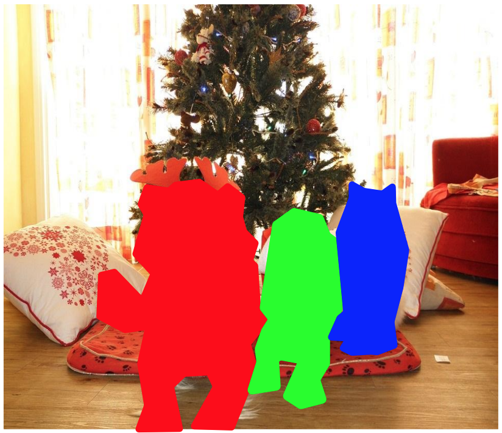

# Definitions

## abstract base class

* An abstract base class (ABC) is a noninstantiable class from which instantiable classes descend.
* The ABC provides clients of the class with the application program interface (API) used to provide class attribution (adjectives) and class states (nouns).  
* If possible, APIs should avoid exposing class actions (verbs) to clients, to support Cheriton's software modeling and simulation principle.

## class

* A class is the code blueprint from which concrete objects are created.
* When possible, a class specifies **default values** for the class attributes, to support the *convention over configuration* principle.

## image assessment

* From [cs231n, Lecture 11 slides, 2017](http://cs231n.stanford.edu/slides/2017/cs231n_2017_lecture11.pdf)

 Classification | Semantic Segmentation | Localization | Object Detection | Instance Segmentation
---|---|---|---|---
 |  |  |  |  
class scores: 0.90 cat 0.05 dog 0.01 car ... *etc*. | pixel classification: [cat, grass, tree, sky] | classification + bounding box | classification + bounding boxes | ---
single object | no objects | single object | multiple objects | multiple objects

## isomorphism

* An isomophism is a mapping between two sets *{A}* and *{B}* that is one-to-one, onto, and invertible.
* From *{A}* to *{B}* is called the *forward map*.
* From *{B}* to *{A}* is called the *inverse map*.
* The mapping from *{A}* to *{B}* is reversible, such that the inverse map from *{B}* to *{A}* recovers the original *{A}* that created *{B}* in the forward map.
* It is one of the morphisms of [category theory](https://en.wikipedia.org/wiki/Category_theory)
  * It is a homomorphism that admits and inverse.
  * It is a monomorphism as it is injective (one-to-one) and surjective (onto).

## object

  * An object is an instance of a class.

## slice and solid

  * A slice is a two-dimensional subset taken from a three-dimensional solid.
  * When the 3D solid is projected (aka volexized) into a regular 3D grid, the positions of the solid can be accessed with through **lattice index** in 3D with indices `(i, j, k)`.  
  * For a Bezier solid, `(i, j, k)` index values of pseudo-time in `[0, 1]` of parameters `(t, u, v)`, respectively.
  * When a slice exists as a regular 2D grid, the positions of the slice can be accessed through the **grid index** `(j, k)`.  
    * A sub-dimension of the lattice index is the grid index.  
    * Given an elevation (or *flow time*) within the lattice index `(i)`, the grid index is accessed through `(j, k)`. 
  * Finally, a sub-dimension of the grid index is simply called the **index** `(k)`.
  * A slice is composed `n_rows` rows and `n_cols` colunms, the major and minor axes, respectively.
  * A stack of `n_slices` compose a solid.
  * For a given a slice 
    * with index `(i)` with `i = [0, 1, 2, ... n_slices)`,
    * the (row, column) index `(j, k)`, with
      * `j = [0, 1, 2, ... n_rows)` and 
      * `k = [0, 1, 2, ... n_cols)`,
    * there is a class integer `c = [0, ... n_classes)` that identifies which solid, out of all possible solids, resides at that `(i, j, k)` index.

## template

  * A template is the fundamental default instance of a class.  It is the an object that is a canonical object among all objects.
  * The template contains sufficient default *convention*, freeing the implementor from specifying a *configuration*.  
  * Thus a template requires clients to specify exactly zero attributions (adjectives) and zero states (nouns) prior to instantiation.
  * All client class implementations are an [isomophism](#isomorphism) of a class template.
  * Words with concepts similar to *template* are *atlas*, *parent*, *primitive*, *progenitor*, and *prototype*.
  * Example:  for class `ice cream` and objects `vanilla`, `chocolate`, and `strawberry`, should clients create an object without specification as to the `flavor` attribute, then `vanilla`, the default, would be the object that is created.
