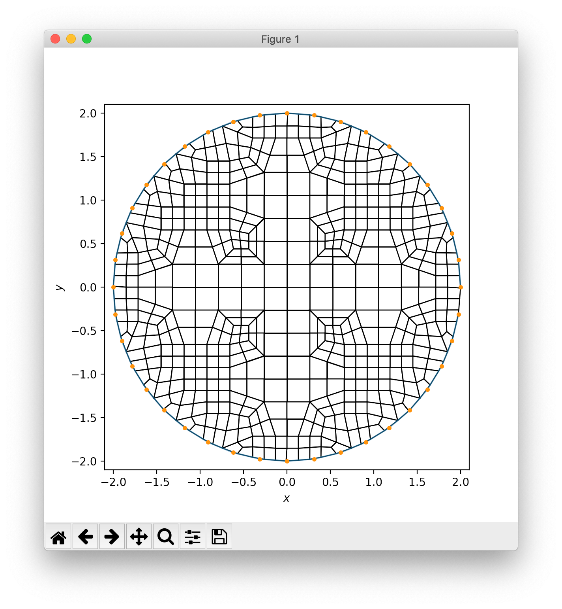
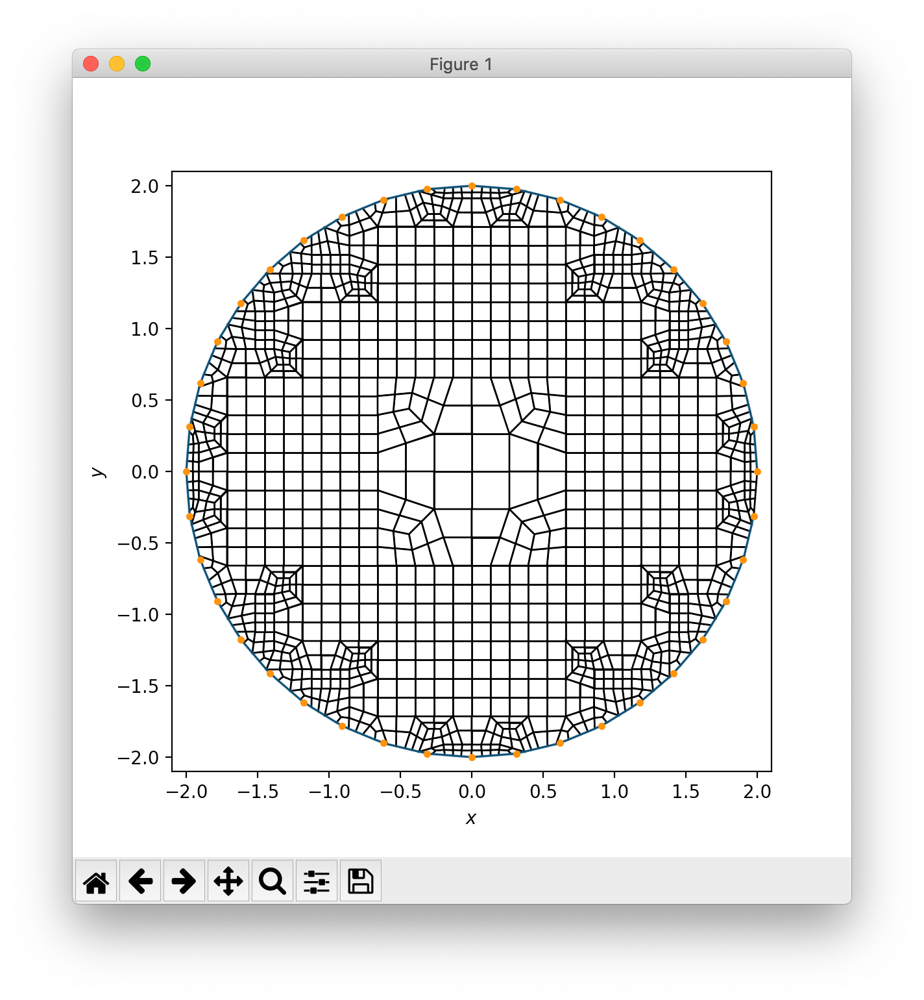

# Lesson 03: Plot a boundary and the dual mesh

Building on the [previous lesson](lesson_02.md), we now plot a mesh inside the boundary.

## Goal

Extend the Python script from the previous lesson to generate and plot a 2D dualized mesh generated from the `xybind` library.

## Step

From the command line:

```bash
> conda activate siblenv
> cd ~/sibl/geo/doc/dual
> python lesson_03.py
```

The same boundary from the previous lessons should appear, but now with a 2D quadrilateral finite element mesh:


Review [`lesson_03.py`](lesson_03.py) and modify as necessary, such as changing the `resolution` parameter by uncommenting lines for `res` to get refined variations:

```python
res = 1.0  # the first resolution attempt
# res = 0.5  # the second resolution attempt
# res = 0.2  # the third resolution attemp
```




[Index](README.md)

Previous: [Lesson 02](lesson_02.md)

Next: [Lesson 04](lesson_04.md)
