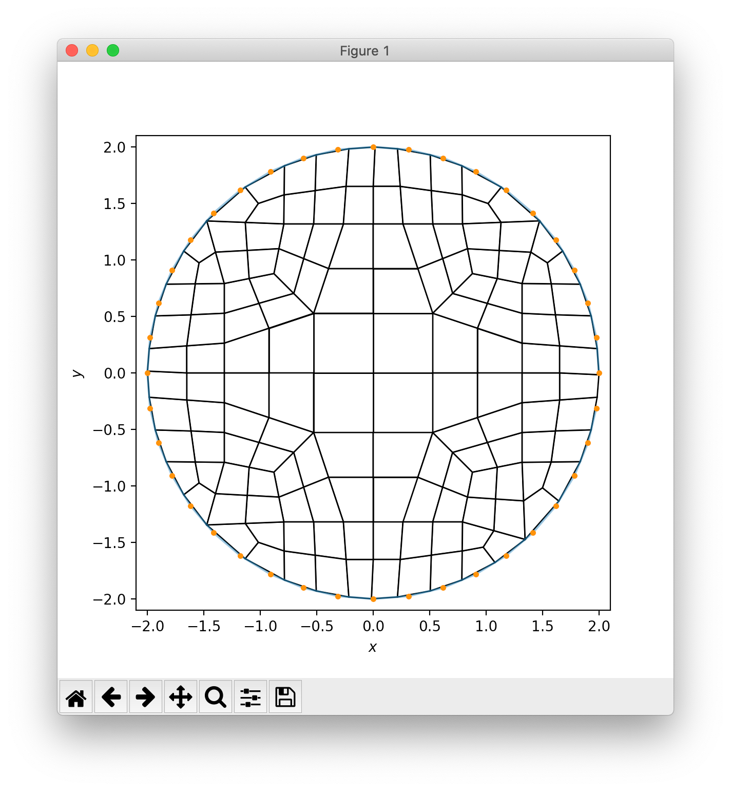

# Lesson 03: Plot a boundary and the dual mesh

Prerequisite: [Lesson 02](lesson_02.md)

The **goal** of this less is to extend the python script from the previous lesson to 
generate and plot a 2D dualized mesh generated from the `xybind` library.

From the command line:

```bash
> conda activate siblenv
> cd ~/sibl/geo/doc/dual
> python lesson_03.py
```

The same boundary from the previous lessons should appear, but now with a 2D quadrilateral finite element mesh:



Review [`lesson_03.py`](lesson_03.py) and modify as necessary.
