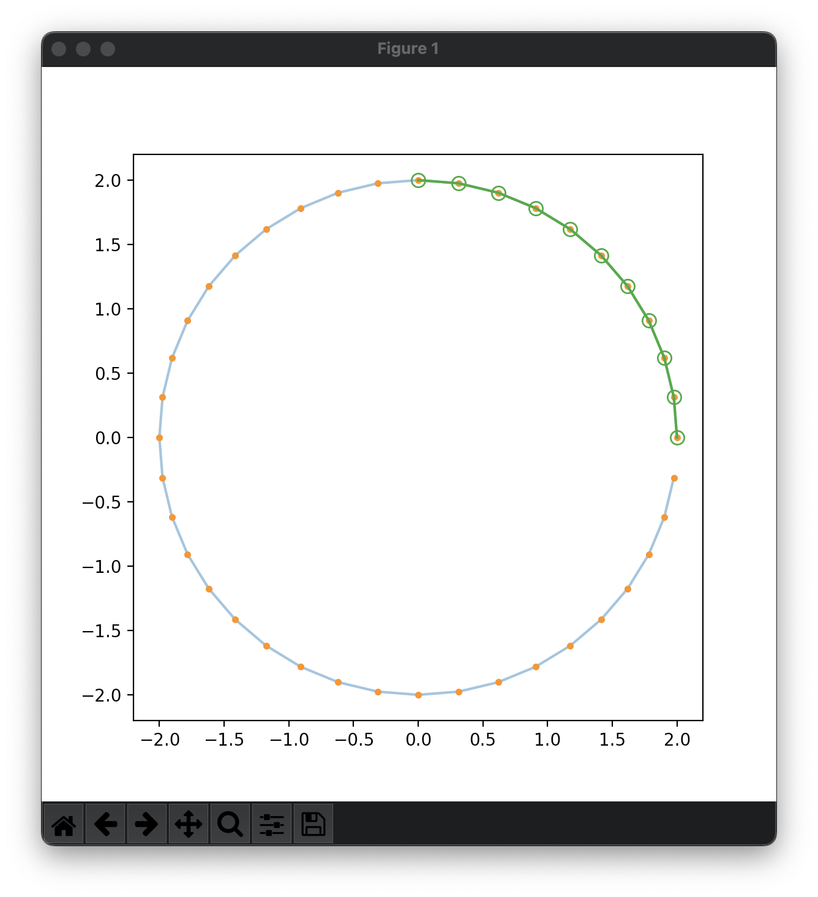
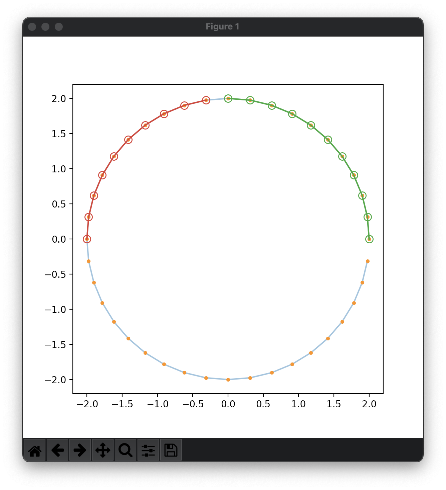
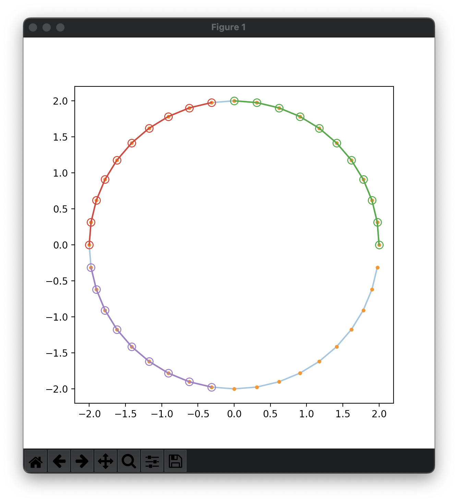
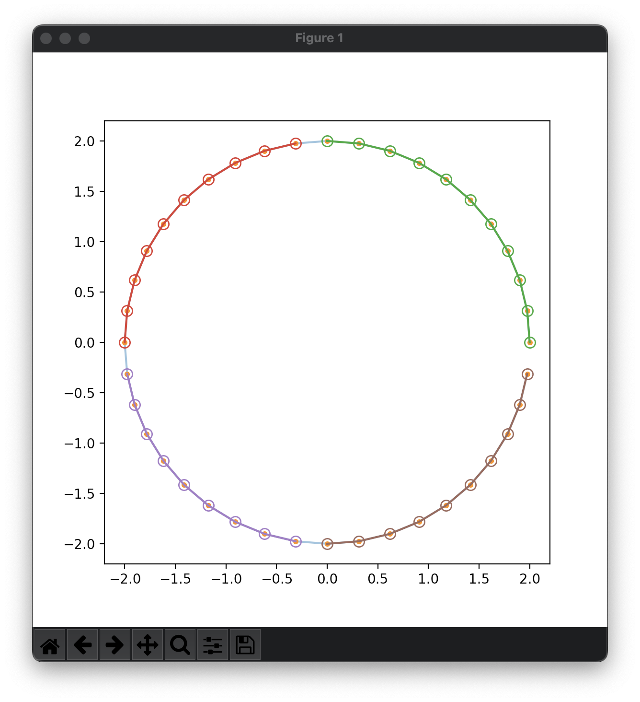
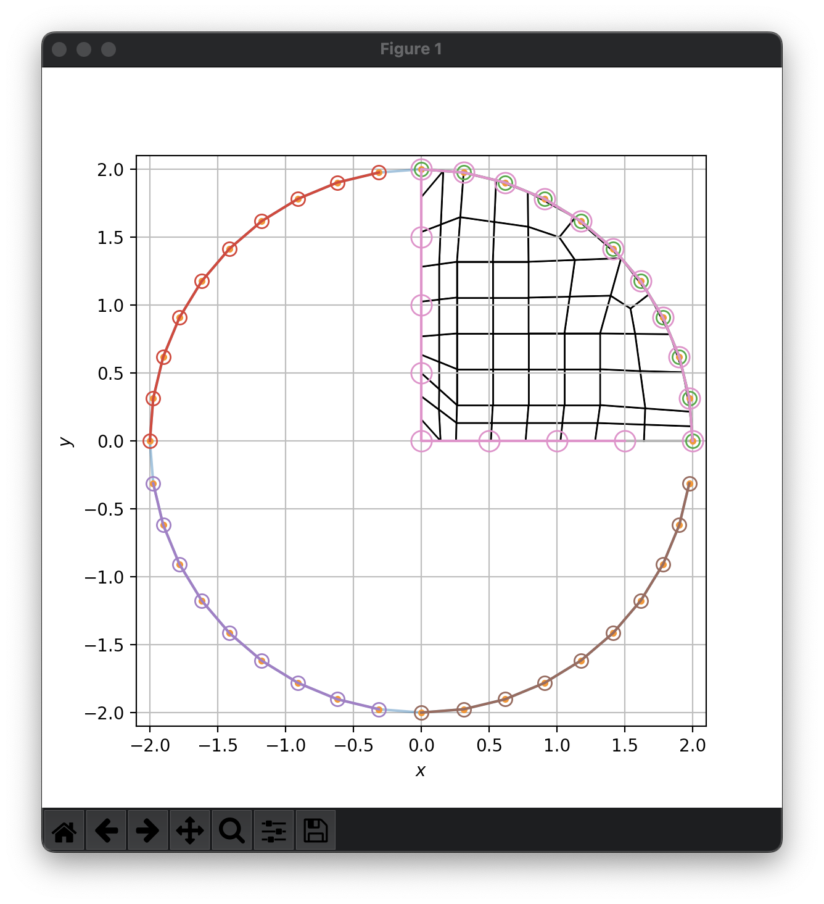

# Lesson 03: Quarter Symmetry Version

Building on the [previous lesson](lesson_03.md), we now explore a quarter symmetry model.

|| 1 | 2 | 3 | 
|--|--|--|--|
a |  |  | 
b |  |  | 

[Index](README.md)

Previous: [Lesson 03](lesson_03.md)

Next: [Lesson 04](lesson_04.md)
