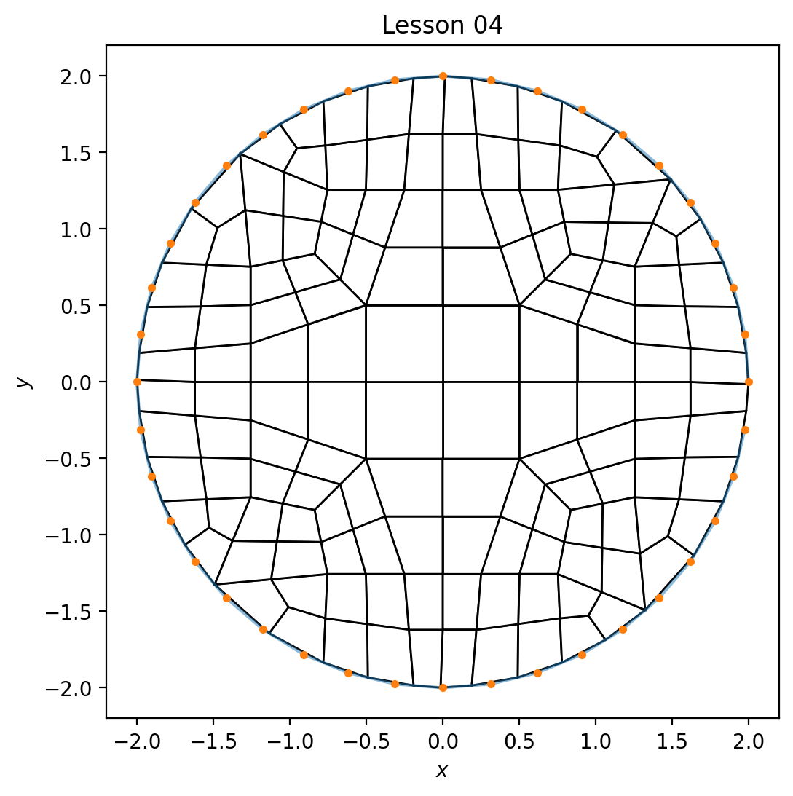

# Lesson 04: Use Input Files

To create meshes that can be built through parameterization, the use of an input file will be required.

## Goal

Using an input file, demonstrate how to reproduce the result from the [previous lesson](lesson_03.md).

## Steps

Verify the following files exist:

* [circle_radius_2.txt](../../data/boundary/circle_radius_2.txt) - the boundary `x y` discrete point definition
* [lesson_04.yml](../../data/mesh/lesson_04.yml) - the YAML input file specification

From the command line:

```bash
> conda activate siblenv
> cd ~/sibl
> python geo/src/ptg/main.py -i geo/data/mesh/lesson_04.yml
SIBL Mesh Engine initialized.
driver: /Users/chovey/sibl/geo/src/ptg/main.py
Dualization initiated.
input: /Users/chovey/sibl/geo/data/mesh/lesson_04.yml
The database is {'version': 1.3, 'boundary': 'geo/data/boundary/circle_radius_2.txt', 'bounding_box': [[-2.0, -2.0], [2.0, 2.0]], 'resolution': 1.0, 'output_file': '~/sibl/geo/data/mesh/lesson_04.inp', 'boundary_refine': True, 'developer_output': True, 'figure': {'boundary_shown': True, 'dpi': 200, 'elements_shown': True, 'filename': 'lesson_04', 'format': 'png', 'frame': True, 'grid': False, 'label_x': '$x$', 'label_y': '$y$', 'latex': False, 'save': True, 'show': False, 'size': [8.0, 6.0], 'title': 'Lesson 04'}}
Reading in boundary file: geo/data/boundary/circle_radius_2.txt
deciding this loop is : in
inCurve with 40 points
Determining derivative...
Setting tangent and angle...
Finding corners...
Finding features...
Done with features.
QuadMesh constructor complete
Computing Mesh
Size of my nodes: 0
Size of my Primal nodes: 73
Size of my Primal Polys: 56
Unique loop size: 41
  Saved figure to lesson_04.png
SIBL Mesh Engine completed.
Dualization is complete.
SIBL Mesh Engine completed.
>
```

and the image `lesson_04.png`, shown here, should appear in the local `~/sibl` folder.



[Index](README.md)

Previous: [Lesson 03](lesson_03.md)

Next: [Lesson 05](lesson_05.md)
