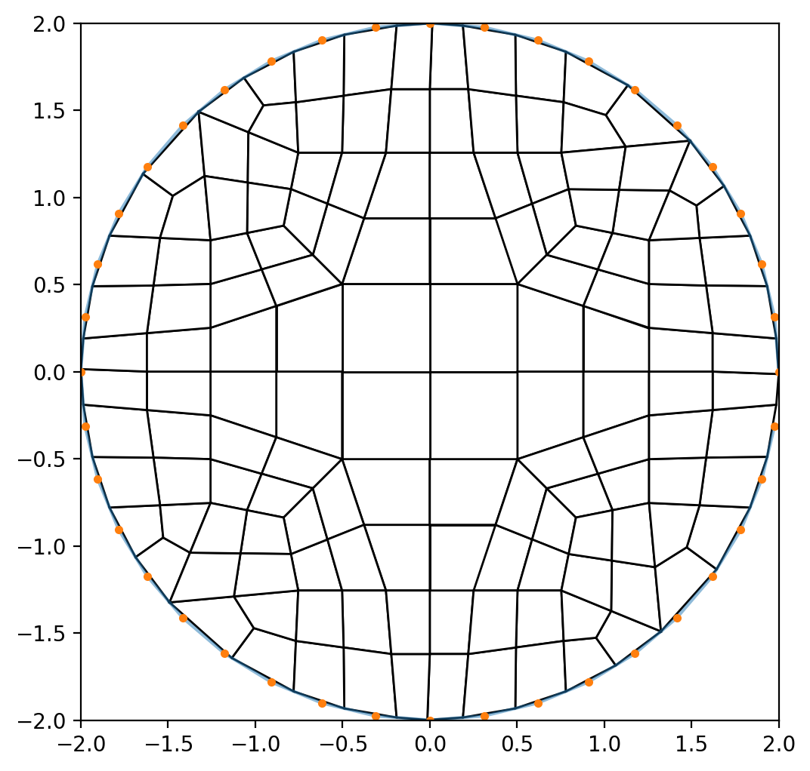

# Lesson 04: Using Input Files

To create meshes that can be built through parameterization, the use of an input file will be required.

## Goal

Using an input file, demonstrate how to reproduce the result from the [previous lesson](lesson_03.md).

## Steps

Verify the following files exist:

* [circle_radius_2.txt](lesson_04/circle_radius_2.txt) - the boundary `x y` discrete point definition
* [lesson_04.yml](lesson_04/lesson_04.yml) - the input file specification

From the command line, first verify that `version` reports the *SIBL Mesh Engine* and the version number of the *ptg* package:

```bash
> conda activate siblenv
> version
SIBL Mesh Engine, ptg package version:
0.0.4
```

Then run `pydual` from the command line on the `lesson_04.yml` configuration file:

```bash
> cd ~/sibl/geo/doc/dual/lesson_04
> pydual -i lesson_04.yml
SIBL Mesh Engine initialized.
driver: /Users/chovey/sibl/geo/src/ptg/main.py
Dualization initiated.
input: lesson_04.yml
The database is {'version': 1.4, 'io_path': '~/sibl/geo/doc/dual/lesson_04/', 'boundary': 'circle_radius_2.txt', 'bounding_box': [[-2.0, -2.0], [2.0, 2.0]], 'resolution': 1.0, 'output_file': 'lesson_04_mesh', 'boundary_refine': True, 'developer_output': False, 'figure': {'boundary_shown': False, 'dpi': 200, 'elements_shown': True, 'filename': 'lesson_04_figure', 'format': 'png', 'frame': True, 'grid': False, 'label_x': '', 'label_y': '', 'latex': False, 'save': True, 'show': False, 'size': [8.0, 6.0], 'title': ''}}
This input file has version 1.4
io_path: /Users/chovey/sibl/geo/doc/dual/lesson_04
Current working directory changed to /Users/chovey/sibl/geo/doc/dual/lesson_04
yml specified boundary file: circle_radius_2.txt
  located boundary file at:
  circle_radius_2.txt
deciding this loop is : in
inCurve with 40 points
Determining derivative...
Setting tangent and angle...
Finding corners...
Finding features...
Done with features.
QuadMesh constructor complete
Computing Mesh
Size of my nodes: 0
Size of my Primal nodes: 73
Size of my Primal Polys: 56
Unique loop size: 41
  Saved figure to lesson_04_figure.png
SIBL Mesh Engine completed.
Dualization is complete.
SIBL Mesh Engine completed.
```

### Outputs

The following will appear in the specified `io_path` folder:

* Mesh file [`lesson_04_mesh.inp`](lesson_04/lesson_04_mesh.inp)
* Image file [`lesson_04_figure.png`](lesson_04/lesson_04_figure.png), also shown here:



[Index](README.md)

Previous: [Lesson 03](lesson_03.md)

Next: [Lesson 05](lesson_05.md)
