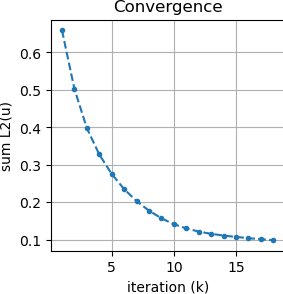
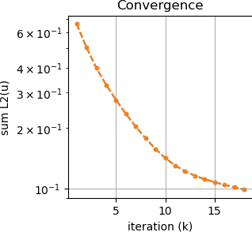

# Lesson 04b: Mesh Smoothing

## Goal

Given the mesh developed in the previous less, using Laplacian iterations to smooth the mesh.

## Steps

```bash
> conda activate siblenv
> cd ~/sibl/geo/doc/dual/lesson_04
> python lesson_04b.py
```

## Results

* Animation of smoothing


Linear Scale | Log Scale
--|--
 | 

* Convergence tolerance: `0.1`
* Number of iterations: `18`