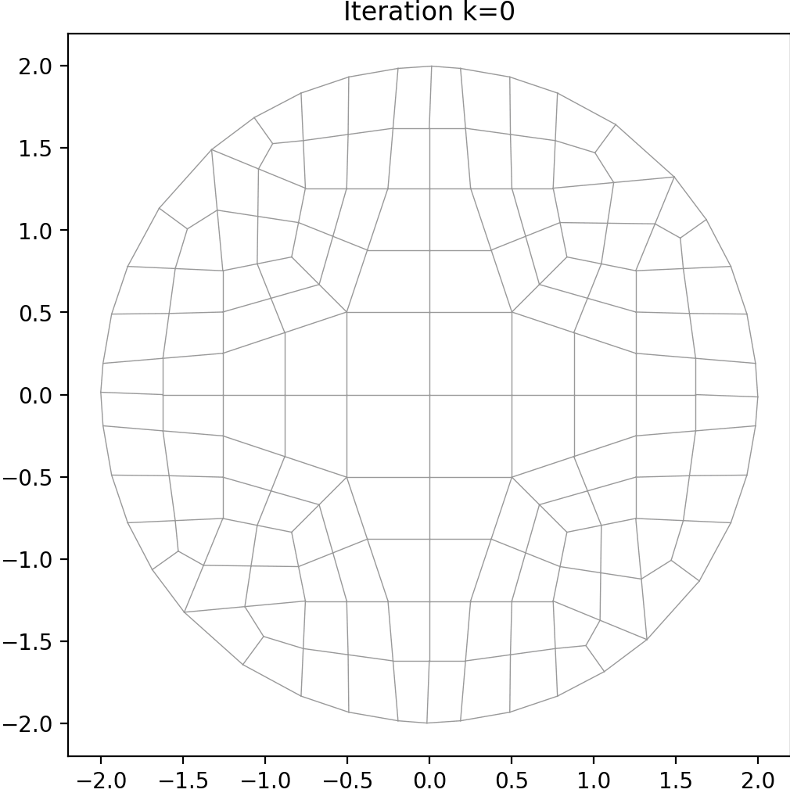
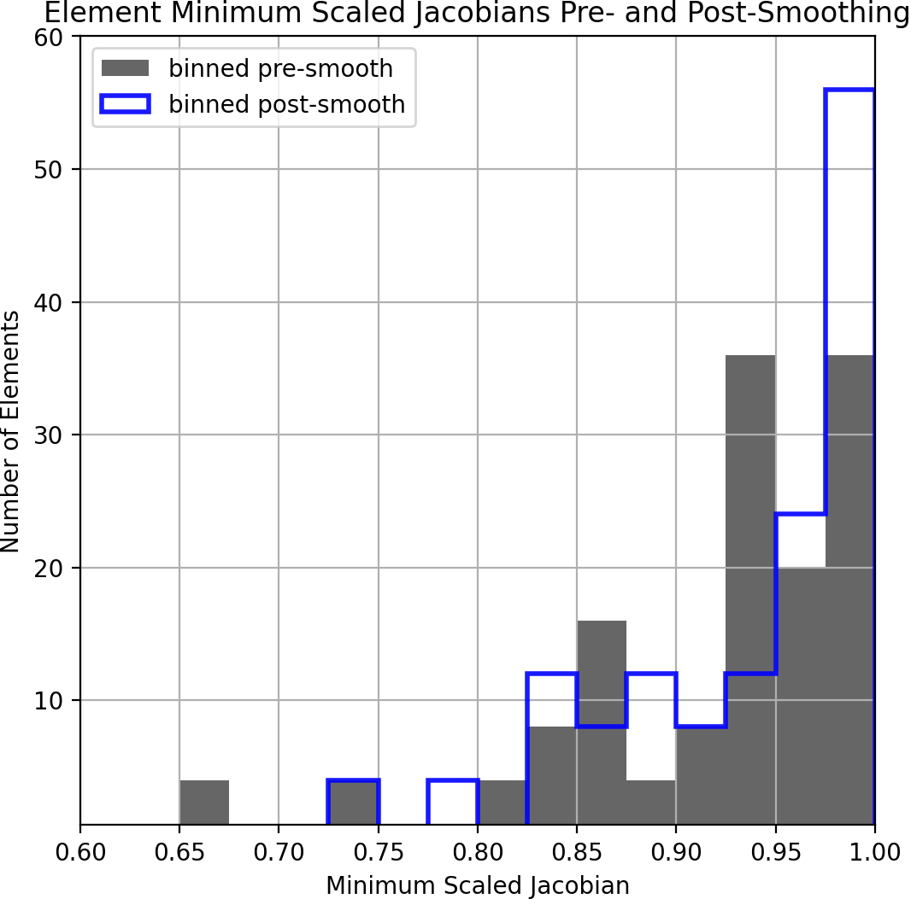

# Lesson 04c: Mesh Smoothing

## Goal

Quantify what effect mesh smoothing has on mesh quality.

## Methods

Compare the minimum scaled Jacobian quality metric for the mesh in the previous lesson
*before* and *after* smoothing.

## Steps

```bash
> conda activate siblenv
> cd ~/sibl/geo/doc/dual/lesson_04
> python lesson_04c.py
```

## Results

Animation Pre- to Post-Smoothed | Histogram of minimum scaled Jacobian
--|--
 | 
