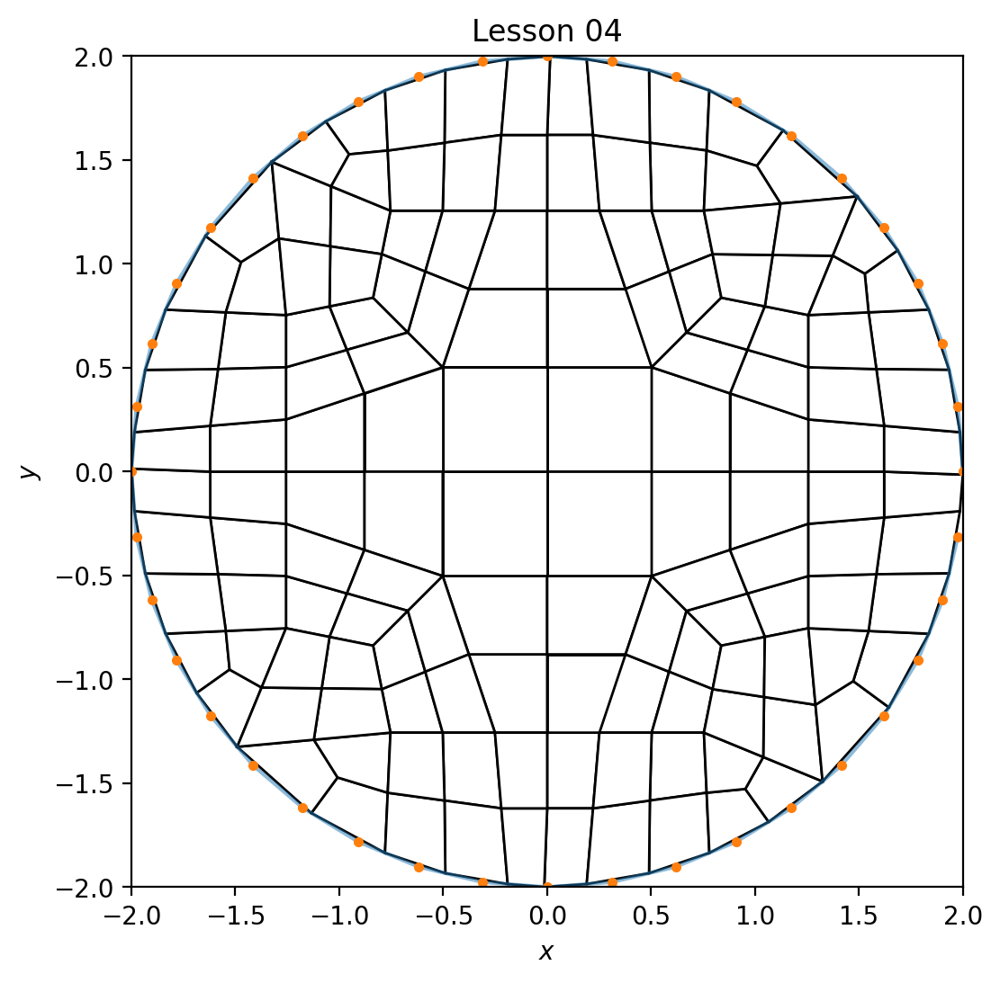
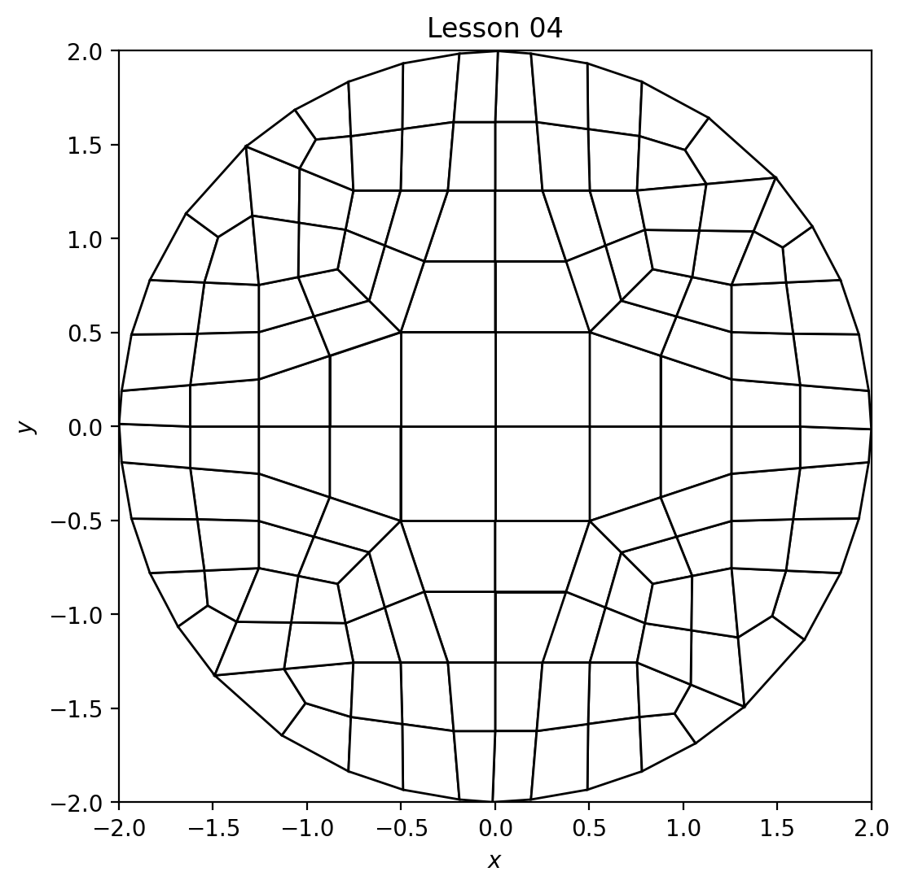
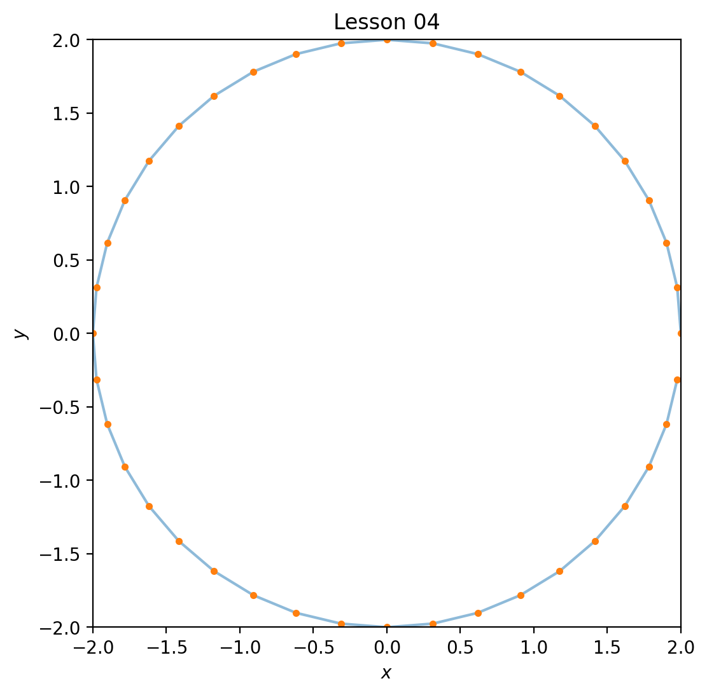
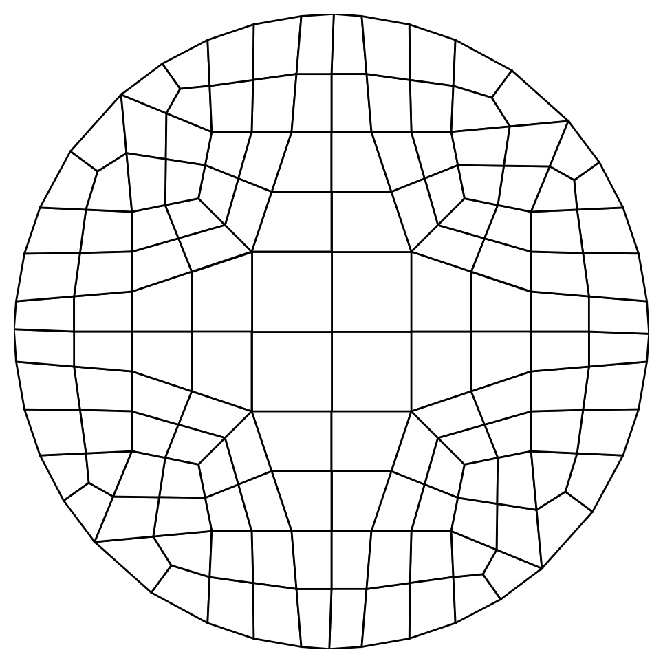
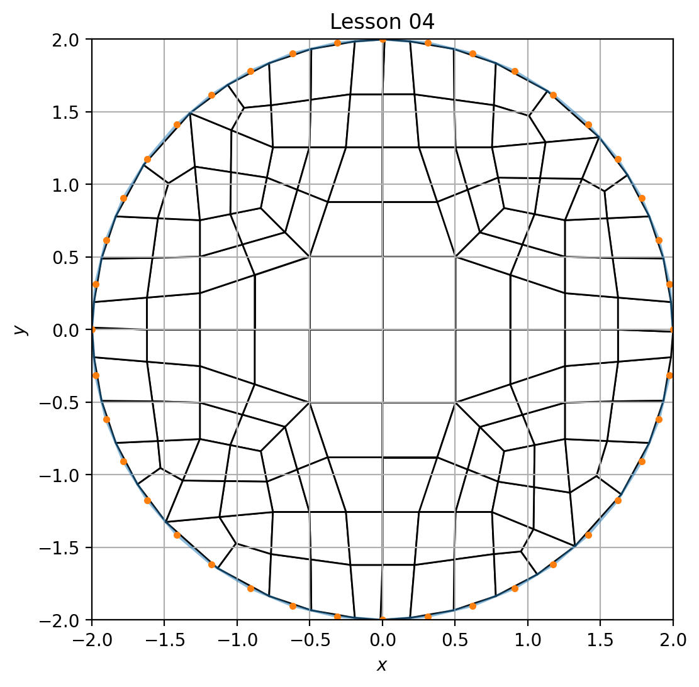
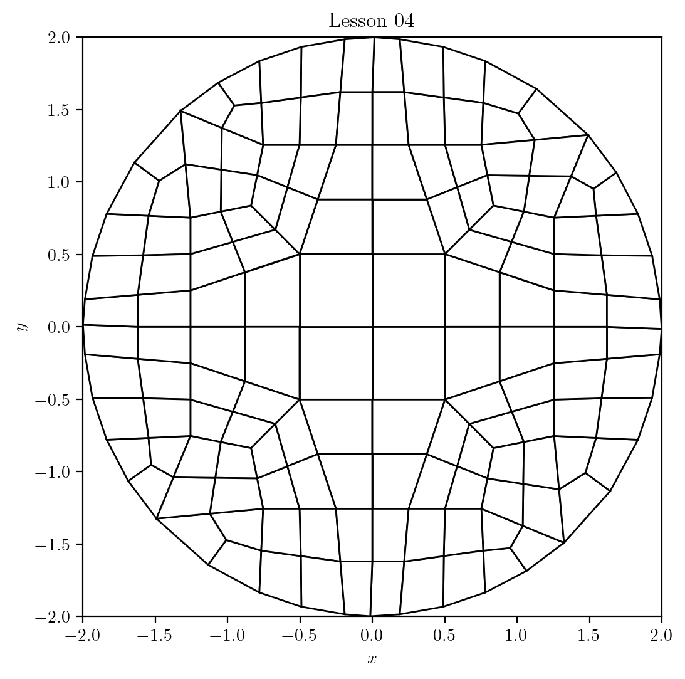

# Lesson 05: The `.yml` configuration file options

## Goal

Learn the options available for the `.yml` configuration file.

## Structure

```yml
# An example .yml file
#   comments can be anywhere, followed by `#`
#   empty lines are allowed
#   quotation marks `"` 
#     are optional for strings, and
#     sometimes useful for clarity

version: 1.3

boundary: geo/data/boundary/circle_radius_2.txt
boundary_refine: True 

resolution: 1.0
bounding_box: [[-2.0, -2.0], [2.0, 2.0]] 

developer_output: False 
output_file: geo/data/mesh/lesson_04_mesh

figure:
  boundary_shown: True
  dpi: 200
  elements_shown: True
  filename: lesson_04_figure
  format: png
  frame: True
  grid: False
  label_x: "$x$"
  label_y: "$y$"
  latex: False
  save: True
  show: False
  size: [8.0, 6.0]
  title: "Lesson 04"
```

## Description

Following are the keys in alphabetical order.  Any order may be used for the actual `.yml` configuration file as it is order-independent. For each key, the value type and description are listed.

| key | type | value and description |
|:--|:--:|:--|
| `boundary` | `(string)` | Relative to the `~/sibl` directory, the full path and file name of the boundary file definition.</br>Example: `~/sibl/geo/data/boundary/circle_radius_2.txt` is specified as</br>` boundary: "geo/data/boundary/circle_radius_2.txt"`|
| `boundary_refine` | `(bool)` | `True` does boundary refinement, which is based on the quad tree density.</br>`False` does a feature refinement, is based on the local boundary curvature and not the quad tree density.|
| `bounding_box` | `[[float, float], [float, float]]` | The `[[lower_left_x, lower_left_y], [upper_right_x, upper_right_y]]` of the quad tree domain.
| `developer_output` | `(bool)` | `True` writes the intermediate entities (such as quad tree, primal mesh, projected dual mesh) used to create the final mesh.  Files are written with a `.dev` file extension.
| `figure` | `(dict)` | *currently used for Python but not MATLAB* |
| | | `boundary_shown: (bool)`</br>`True` shows the boundary or boundaries used to define the mesh, for example:</br></br>`False` hides the boundary or boundaries used to define the mesh, for example:</br> |
| | | `dpi: (int)`</br>The dots per inch resolution on figure.|
| | | `elements_shown: (bool)`</br>`False` hides the elements, useful to highlight the boundary with `boundary_shown: True`, for example:</br>
| | | `filename: (string)`</br>The name for the resultant figure output file. |
| | | `format: (string)`</br>The figure output file type: `png` or `pdf` or `svg` |
| | | `frame: (bool)`</br>`False` hides the figure frame, useful for figures when the axes are unwanted, with `frame: False` for example:</br>
| | | `grid: (bool)`</br>`True` shows the grid, `False` hides the grid.  With `grid: True` for example:</br></br>*Note:* `frame: True` must be set for the grid to show.
| | | `label_x: (str)` and `label_y: (str)` are the axes labels.  Use dollar signs, e.g., `label_x: "$x$"` and `label_y: "$y$"` for LaTeX-ready variables and formulae. For no label, use an empty string: `""`.
| | | `latex: (bool)`</br>`False` uses default *matplotlib*</br>`True` typesets the figure in LaTeX format, for example:</br>
| | | `save: (bool)` Typically `True` to save the figure to a file, but `False` if useful to suppress writing to disk when iterating to get a figure to appear a certain way.
| | | `show: (bool)` Use `True` for interactive viewing of the figure.  Use `False` to suppress showing of the figure window, often useful for creating large numbers of figures written to disk without the need to show the figures while they are being created.
| | | `size: [float, float]`</br>The `[width, height]` of the figure, in inches.
| | | `title: (str)`</br>The figure title string.  For no title, use an empty string: `""`.
| `output_file` | `(string)` | The path and filename (without extension) of the generated mesh file, e.g.,  `output_file: geo/data/mesh/lesson_04` will create the `lesson_04.inp` mesh file.
| `resolution` | `(float)` | The smallest edge length target for the resultant refined mesh in the length scale of the `bounding_box`.
| `version` | `(float)` | The version of the `.yml` input file.  This value is checked when running</br>`> python geo/src/ptg/main.py -i geo/data/mesh/some_file.yml` to assure all the necessary key value pairs are present in the input configuration file.</br>Example:</br>`version: 1.3`|

[Index](README.md)

Previous: [Lesson 04](lesson_04.md)

Next: [Lesson 06](lesson_06.md)
