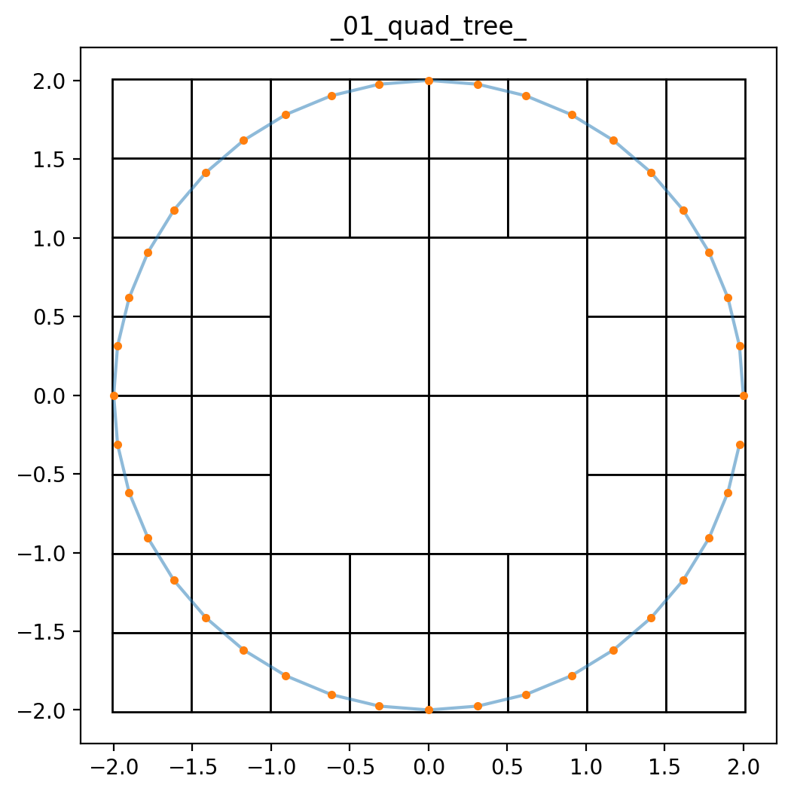
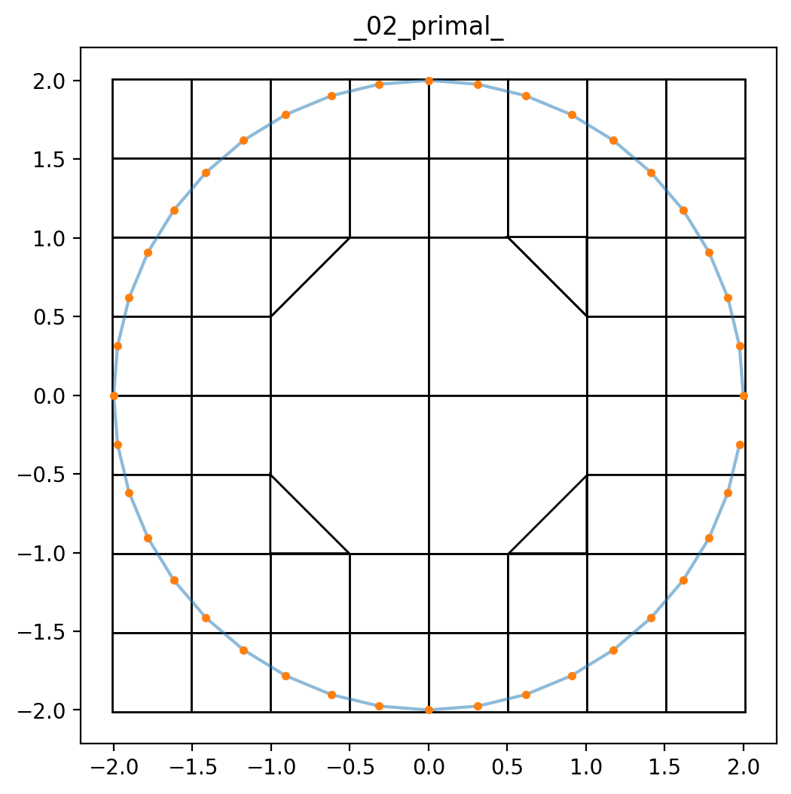
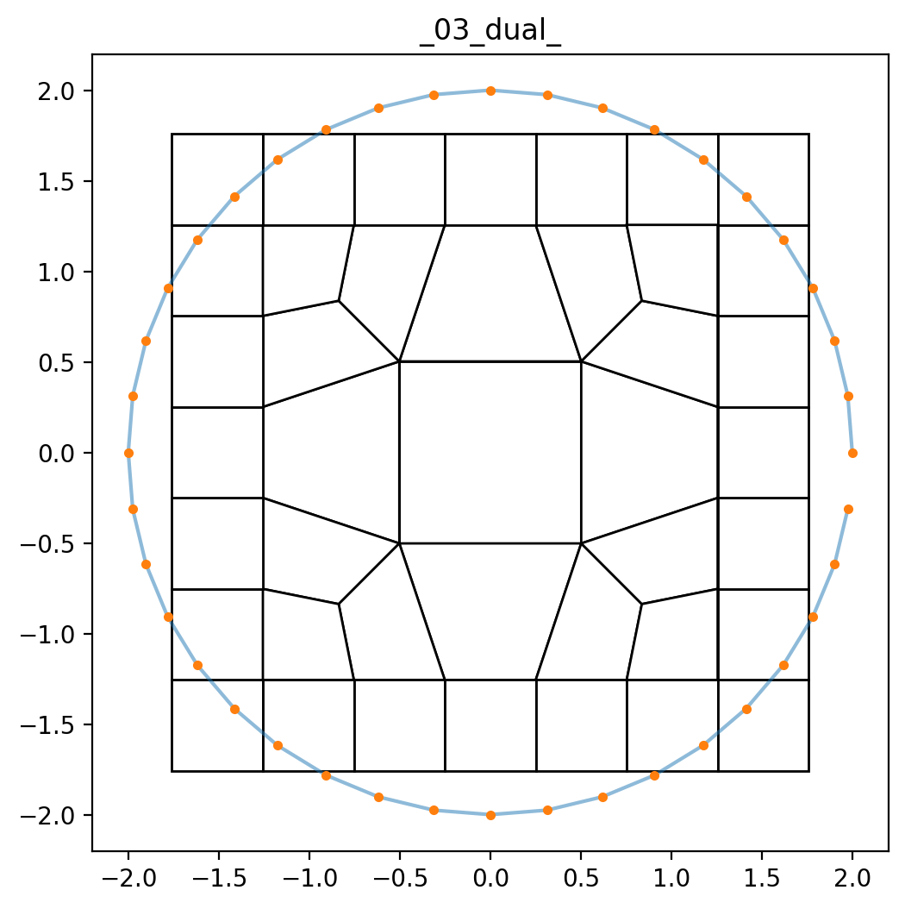
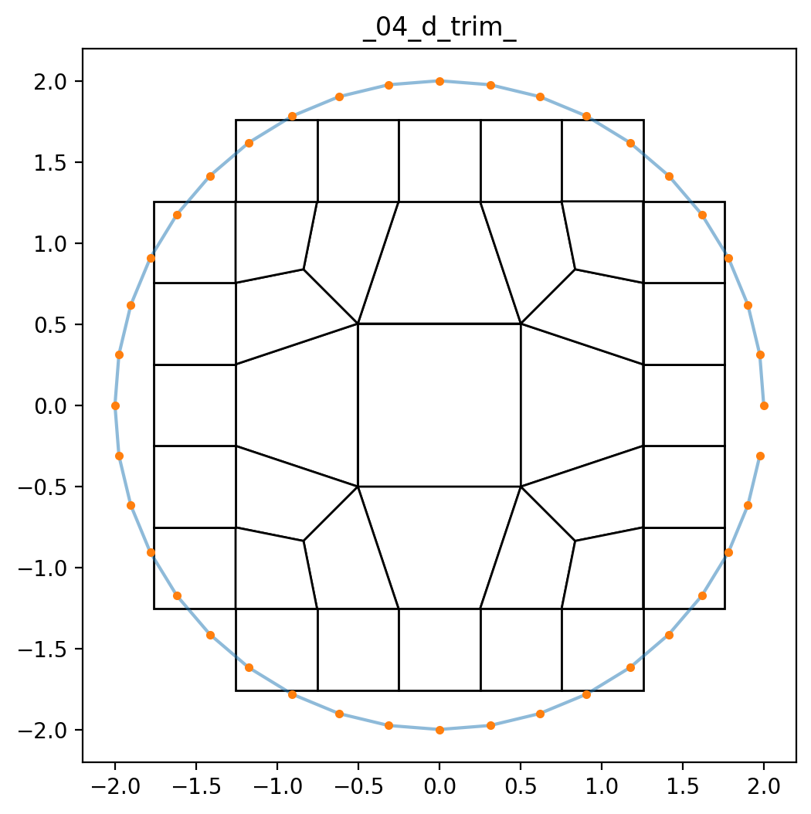
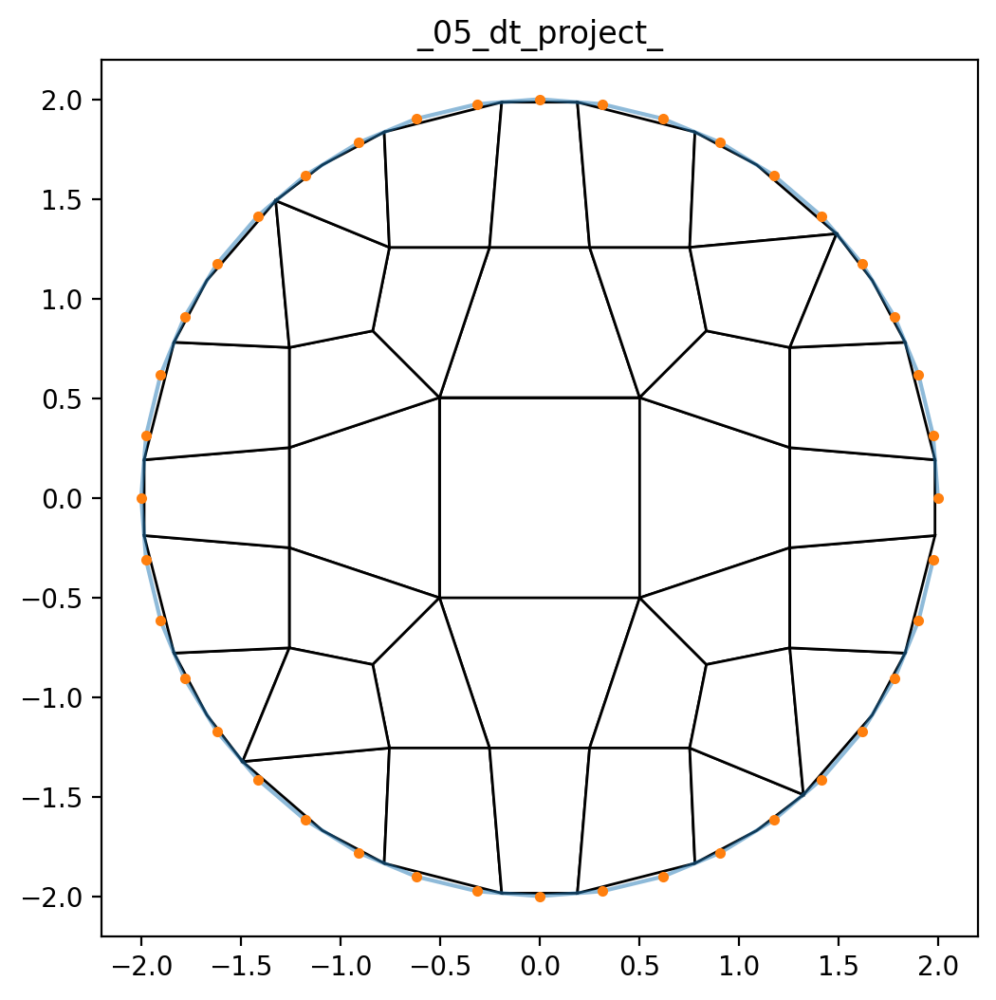
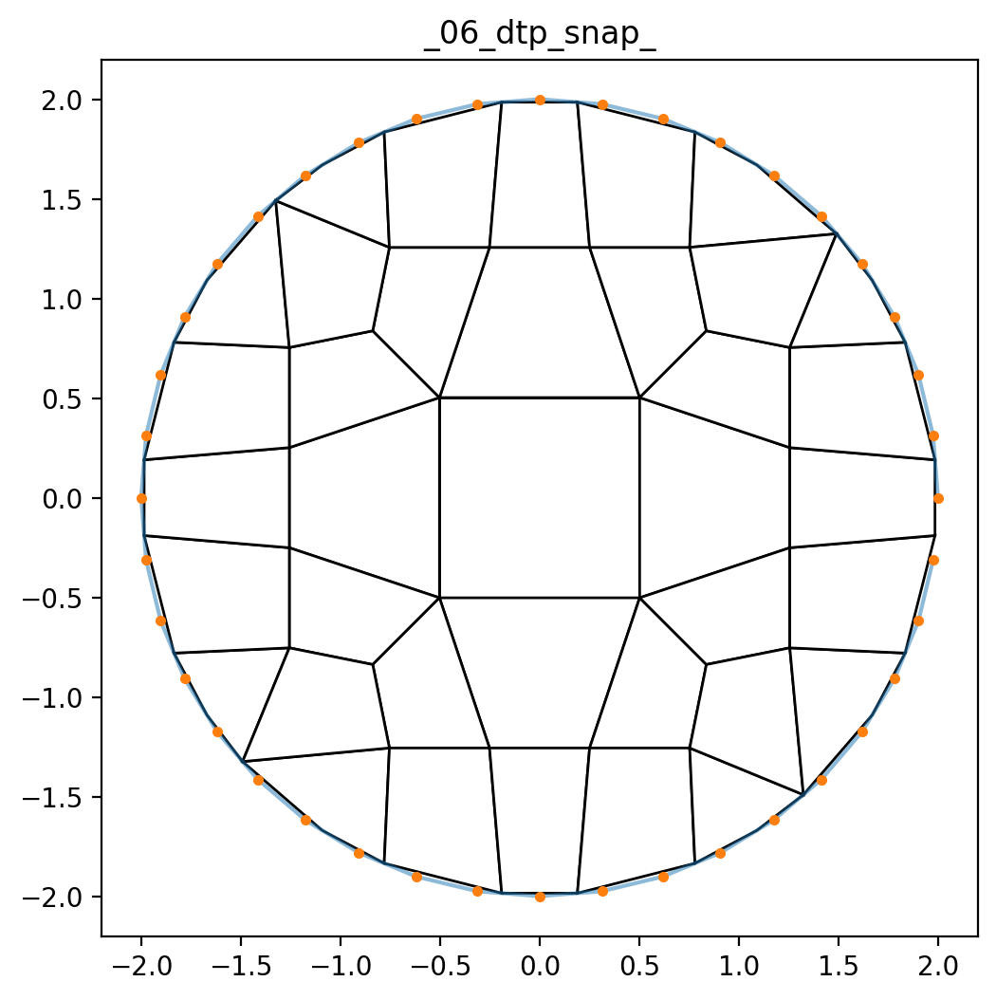
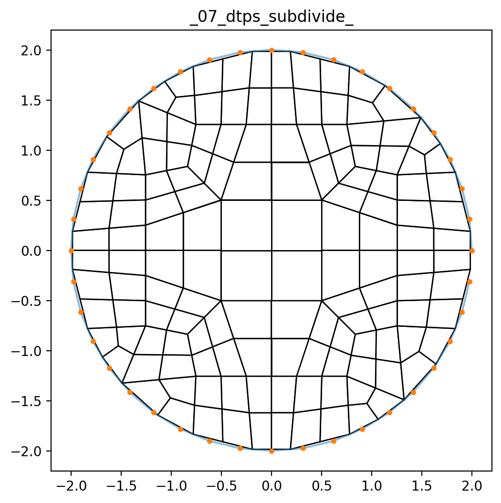
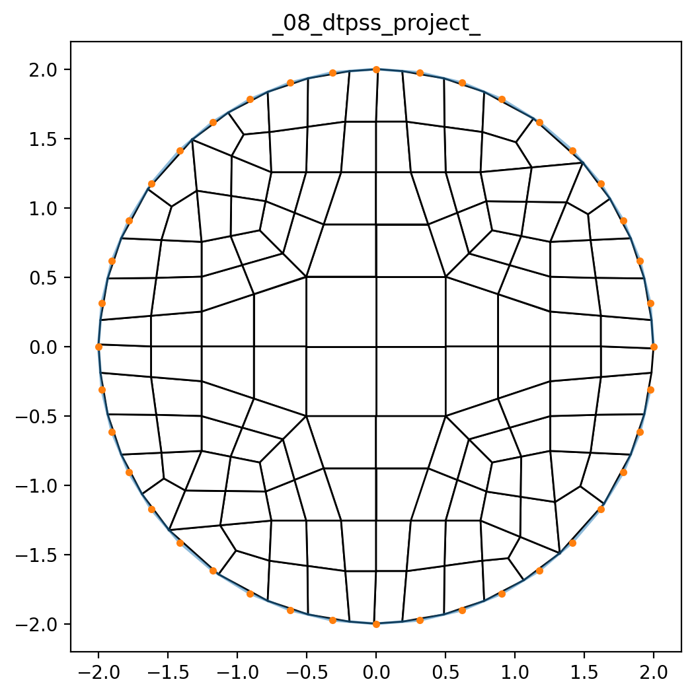
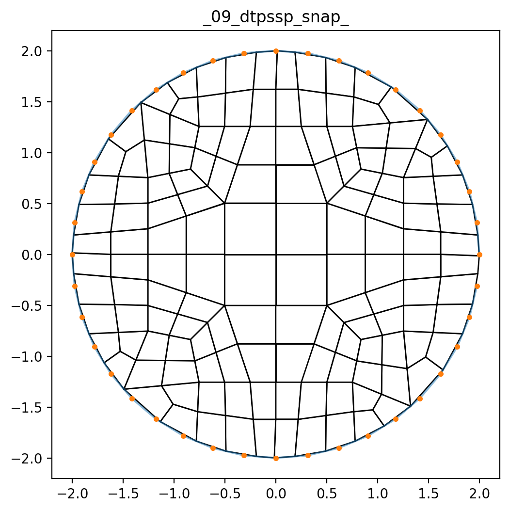

# Lesson 06: Developer output and `.dev` files

## Goals

* Modify the configuration to produce intermediate developer output files.

## Steps

From the `lesson_04` folder, copy the following files:

* [circle_radius_2.csv](lesson_06/circle_radius_2.csv)
* [circle_radius_2.txt](lesson_06/circle_radius_2.txt)
* [lesson_06.yml](lesson_06/lesson_06.yml)

into the `lesson_06` folder.

Note:  The modifications between the two `.yml` files follows:

| `lesson_04.yml` excerpt | `lesson_06.yml` excerpt
|:--|:--|
| `io_path: ~/sibl/geo/doc/dual/lesson_04/` | `io_path: ~/sibl/geo/doc/dual/lesson_06/` |
| `output_file: lesson_04_mesh` | `output_file: lesson_06_mesh` |
| `developer_output: False` | `developer_output: True` |
| `filename: lesson_04_figure` | `filename: lesson_06_figure` |

From the command line, run the engine:

```bash
> conda activate siblenv
> cd ~/sibl/geo/doc/dual/lesson_06
> pydual -i lesson_06.yml
```

### Outputs

In addition to the final mesh `lesson_06_mesh.inp` and its figure `lesson_06_figure.png`, the following `.dev` files and their `.png` figures are produced:

* lesson_06_mesh_01_quad_tree_nodes.dev
* lesson_06_mesh_01_quad_tree_quads.dev
  * lesson_06_figure_01_quad_tree_.png
* lesson_06_mesh_02_primal_nodes.dev
* lesson_06_mesh_02_primal_quads.dev
  * lesson_06_figure_02_primal_.png
* lesson_06_mesh_03_dual_nodes.dev
* lesson_06_mesh_03_dual_quads.dev
  * lesson_06_figure_03_dual_.png
* lesson_06_mesh_04_d_trim_nodes.dev
* lesson_06_mesh_04_d_trim_quads.dev
  * lesson_06_figure_04_d_trim_.png
* lesson_06_mesh_05_dt_project_nodes.dev
* lesson_06_mesh_05_dt_project_quads.dev
  * lesson_06_figure_05_dt_project_.png
* lesson_06_mesh_06_dtp_snap_nodes.dev
* lesson_06_mesh_06_dtp_snap_quads.dev
  * lesson_06_figure_06_dtp_snap_.png
* lesson_06_mesh_07_dtps_subdivide_nodes.dev
* lesson_06_mesh_07_dtps_subdivide_quads.dev
  * lesson_06_figure_07_dtps_subdivide_.png
* lesson_06_mesh_08_dtpss_project_nodes.dev
* lesson_06_mesh_08_dtpss_project_quads.dev
  * lesson_06_figure_08_dtpss_project_.png
* lesson_06_mesh_09_dtpssp_snap_nodes.dev
* lesson_06_mesh_09_dtpssp_snap_quads.dev
  * lesson_06_figure_09_dtpssp_snap_.png

The figures are shown below:

### Quad Tree



### Primal



### Primal + Dual



### Dual + Trim + Project



### Dual + Trim + Project 



### Dual + Trim + Project + Snap 



### Dual + Trim + Project + Snap + Subdivide 



### Dual + Trim + Project + Snap + Subdivide + Project



### Dual + Trim + Project + Snap + Subdivide + Project + Snap




[Index](README.md)

Previous: [Lesson 06](lesson_05.md)

Next: [Lesson 07](lesson_07.md)
