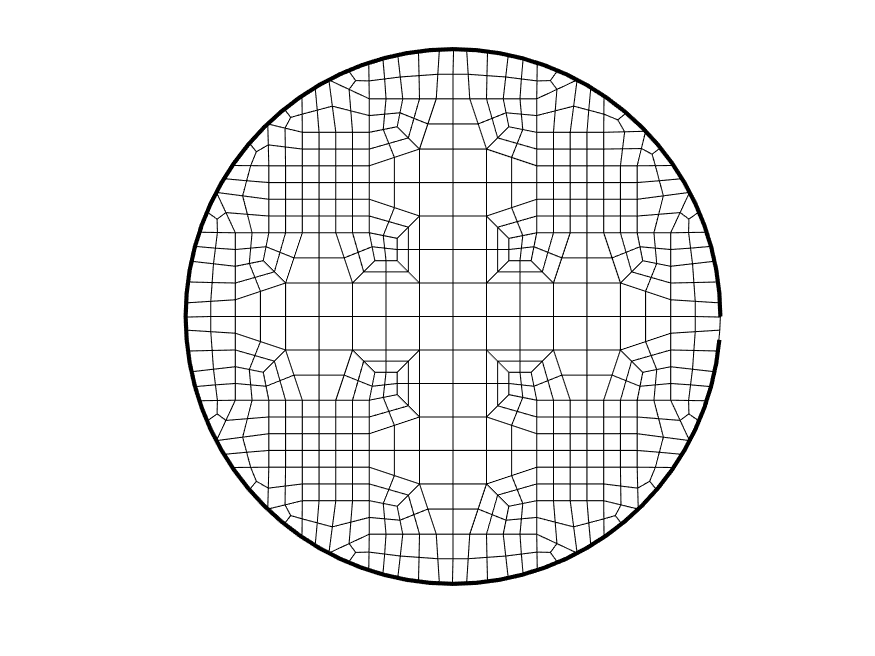

# Lesson 07: Dualization Code-Only Workflow

## Goals

* Compile the *SIBL Mesh Engine* source code to an executable. This procedure uses neither Python nor the `sibl` conda environment.
* Run the executable with a `.yml` input file
  * without MATLAB, and
  * with MATLAB.

## Obtain Source Files

The C++ source code resides at `~/sibl/geo/src/dual/`.  For this workflow:

* Only `*.h` and `*.cpp` files in this directory are required;
* The entire repository is not needed.

## Compile Dualization Code

Compile the C++ code to generate an executable. 

Linux and Mac operating systems come with a C++ compiler; Windows does not. On a Windows machine you will need to *install* a C++ compiler. The minimilist approach is to get MinGW (https://osdn.net/projects/mingw/). Once this is installed and you have added the bin folder to your path, you can compile by opening a command prompt in the folder that contains the source and header files.

On a Windows machine, compile at the command prompt.  Note, the first option after
`g++` is `-O3` with a capital `O` and *not* `-03` with a zero `0`.

```bash 
> g++ -O3 -std=c++11 *.cpp -o dual.exe
```  

On a Mac or Linux machine, compile at the command line.

```bash 
> g++ -O3 -std=c++11 *.cpp -o dual.out
```  

Verify it compiled properly by running the executable with no inputs. 

* On a Windows machine, double click the executable file or run at the command 
prompt by typing `dual.exe`. It should generate an example `.yml` file with 
the inputs you will need to specify to mesh a surface.
* On a Mac or Linux, the file `dual.out` will be present.

## Steps without MATLAB

Generate an input `.yml` file to specify to the engine what procedures 
to undertake. For this example, use [`circle.yml`](lesson_07/circle.yml), 
which uses the boundary definition file [`circle.txt`](lesson_07/circle.txt).
Running the executable without any arguments will automatically generate a 
template `.yml` file that you can modify.

```yml
boundary: circle.txt
boundary_refine: true
bounding_box: [[0,0],[0,0]]
developer_output: true # false gives a mesh .inp file produced without intermediate meshes
output_file: circle
resolution: 0.5
version: 1.1
```

On a Windows machine, drag the `.yml` input file on top of the 
executable - make sure the boundary file has the path specified or exits in 
the same folder as the executable. This will generate an `.INP` file, which 
can be imported into many meshing and FEA applications such 
as [Cubit](https://cubit.sandia.gov/) or Abaqus.

## Steps with MATLAB

We are using MATLAB as a wrapper to generate the boundary file and then run 
the dualization. However, you can simply use the `.yml` file and the executable 
to generate the output mesh file. We are also assuming a Windows machine in 
the following example. If you are on a Mac or Linux, update the paths and 
executable call.

* Open [`plotCircleEx.m`](lesson_07/plotCircleEx.m) in the MATLAB editor.  
* Update the `binpath` as necessary for your local folder configuration.
* Run the `.m` file from the editor or command line.

```Matlab
clear all
close all

%Set path to executable if not working in the same directory
binpath = 'C:\Users\acsokol\sibl\geo\src\dual\bin\';%%%<<<< windows path, modify as needed

%Create circle geometry for this example
th = [0:5:355];
pts = [5*cosd(th)' 5*sind(th)']';
%Write circle geometry to file
fid = fopen(['circle.txt'],'w');
fprintf(fid,'%12.16f  %12.16f\n',pts);
fclose(fid);

%Run executable through Matlab dos command / Can also just drag YML file onto executable or run from command prompt
dos([binpath,'dual.exe circle.yml']); %%%<<<< windows executable extension .exe, modify as needed

n = load('dualnodes');
q = load('dualquads');

figure;
plot(pts(1,:),pts(2,:),'k-','LineWidth',2);hold on;
for qq=1:size(q,1)
   seq = [q(qq,:) q(qq,1)]; %close the loops
   plot(n(seq,2),n(seq,3),'k-')
end
axis equal;
axis off
print(gcf,'-dpng',['circle.png']);
```

Running the MATLAB script will generate this figure:



[Index](README.md)

Previous: [Lesson 06](lesson_06.md)

Next: [Lesson 08](lesson_08.md)
