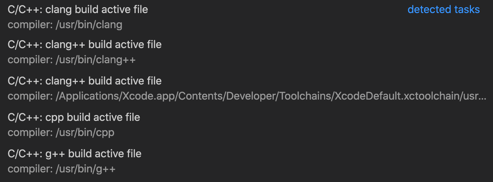

# Lesson 09: Build and Debug `dual.out` on macOS

## Goals

Using VS Code

* Build `dual.out`
* Debug `dual.out`

## Steps

The following steps are based on the VS Code [instructions](https://code.visualstudio.com/docs/cpp/config-clang-mac).

* From VS Code, open the folder `~/sibl/geo/src/dual`.
* Open the file `main.cpp` and keep it in focus.
* From the `Terminal` menu, select the item `Configure Default Build Task...` and the `clang++ build active file`
  * select `C/C++: clang++ build active file` from the list


> *Figure 1: Menu showing `Configure Default Build Task...` options.*

Assure that the `~/sibl/geo/src/dual/.vscode/tasks.json` file appears as follows:

```json
{
    "version": "2.0.0",
    "tasks": [
        {
            "type": "shell",
            "label": "clang++ build active file",
            "command": "/usr/bin/clang++",
            "args": [
                "-std=c++11",
                "-stdlib=libc++",
                "-g",
                "${workspaceFolder}/*.cpp",
                "-o",
                "${workspaceFolder}/dual.out"
            ],
            "options": {
                "cwd": "${workspaceFolder}"
            },
            "problemMatcher": [
                "$gcc"
            ],
            "group": {
                "kind": "build",
                "isDefault": true
            }
        }
    ]
}
```

### Build Tasks

* From the `Terminal` menu, select `Run Build Task...`

This will produce output in the VS Code Terminal window, which will be equivalent to running the following on the command line:

```bash
> pwd
/Users/chovey/sibl/geo/src/dual

> /usr/bin/clang++ -std=c++11 -stdlib=libc++ -g /Users/chovey/sibl/geo/src/dual/*.cpp -o /Users/chovey/sibl/geo/src/dual/dual.out
/Users/chovey/sibl/geo/src/dual/Surface.cpp:197:1: warning: non-void function does not return a value [-Wreturn-type]
}
^
1 warning generated.
```

and creates the following:

* `dual.out`  the executable
* `dual.out.dSYM/`  the debug symbols folder

On the command line, confirm the executable runs with an exemplar configuration file 
called `circle.yml`.  
Note: both [`circle.yml`](../../src/dual/circle.yml) and [`circle.txt`](../../src/dual/circle.txt) must be present in the same folder, `~/sibl/geo/src/dual/`, as `dual.out`.

```bash
> ./dual.out circle.yml                                                         (siblenv)
Build Date : Feb 22 2022
Filename : circle.txt
Resolution: 0.5
Bnds: 0
Refine on the feature only: 0
Reading in curve from file circle.txt
deciding this loop is : in
inCurve with 72 points
Determining derivative...
Setting tangent and angle...
Finding corners...
Finding features...
Done with features.
Done loading and processing curve.
Using parser bounds
Lower bounds: 0, 0
Upper bounds: 0, 0
Nodes size: 605
Dual
Size of my nodes: 0
Size of my Primal nodes: 637
Size of my Primal Polys: 584
Unique loop size: 533
traverse done
projection done
snap done
subdivide done
execution done
```

The following output files will be created:

* `circle.inp`
* `circle.txt`
* `circle.yml`
* `circle_01_quad_tree_nodes.dev`
* `circle_01_quad_tree_quads.dev`
* `circle_02_primal_nodes.dev`
* `circle_02_primal_quads.dev`
* `circle_03_dual_nodes.dev`
* `circle_03_dual_quads.dev`
* `circle_04_d_trim_nodes.dev`
* `circle_04_d_trim_quads.dev`
* `circle_05_dt_project_nodes.dev`
* `circle_05_dt_project_quads.dev`
* `circle_06_dtp_snap_nodes.dev`
* `circle_06_dtp_snap_quads.dev`
* `circle_07_dtps_subdivide_nodes.dev`
* `circle_07_dtps_subdivide_quads.dev`
* `circle_08_dtpss_project_nodes.dev`
* `circle_08_dtpss_project_quads.dev`
* `circle_09_dtpssp_snap_nodes.dev`
* `circle_09_dtpssp_snap_quads.dev`
* `circle_10_mesh_nodes.dev`
* `circle_10_mesh_quads.dev`

### Debug

In VS Code, from the `Run` menu, select `Open Configurations` and assure the
`~/sibl/geo/src/dual/.vscode/launch.json` file
has the `"clang++ - Build and debug active file"` listing as follows:

```json
{
    "version": "0.2.0",
    "configurations": [
        {
            "name": "clang++ - Build and debug active file",
            "type": "cppdbg",
            "request": "launch",
            "program": "${workspaceFolder}/dual.out",
            "args": [],
            "stopAtEntry": true,
            "cwd": "${workspaceFolder}",
            "environment": [],
            "externalConsole": false,
            "MIMode": "lldb",
            "preLaunchTask": "clang++ build active file"
        }
    ]
```

* Put the `main.cpp` file into focus, and set a breakpoint, then
* From the `Run` menu, select `Start Debugging` and you should hit the breakpoint, similar to what is shown below:


> *Figure 2: Start of the debug session in VS Code.*

[Index](README.md)

Previous: [Lesson 08](lesson_08.md)

Next: [Lesson 10](lesson_10.md)
