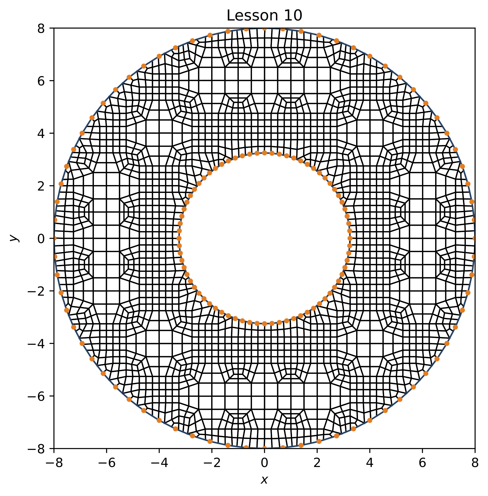

# Lesson 10: Donut

## Goals

Demonstrate mesh creation for a domain with a circular outer and inner boundaries.

## Steps

### Create the boundaries

The [`donut.py`](../../data/boundary/donut.py) file is used to create the `x y` 
boundary pair file [`donut.txt`](../../data/boundary/donut.txt).

* The the outer boundary:
  * is shown in orange discrete points connected with a light blue line, and
  * proceeds in a counter-clockwise manner.
* The inner boundary:
  * is shown in red discrete points connected with a light green line, and 
  * proceeds in a clockwise manner.

The left image shows a full view of the boundaries.
The right image shows a zoomed in view of the beginning and end of each boundary.

| Full view | Zoomed view |
|:--:|:--:|
|  |  |

### Create the `.yml` input file

The [`lesson_10.yml`](../../data/mesh/lesson_10.yml) is used to run the *SIBL Mesh Engine* as follows:

```bash
> cd ~/sibl
> conda activate siblenv
> python geo/src/ptg/main.py -i geo/data/mesh/lesson_10.yml

SIBL Mesh Engine initialized.
driver: /Users/sparta/sibl/geo/src/ptg/main.py
Dualization initiated.
input: /Users/sparta/sibl/geo/data/mesh/lesson_10.yml
The database is {'version': 1.3, 'boundary': 'geo/data/boundary/donut.txt', 'bounding_box': [[-8.1, -8.1], [8.1, 8.1]], 'resolution': 1.0, 'output_file': 'geo/data/mesh/lesson_10', 'boundary_refine': True, 'developer_output': True, 'figure': {'boundary_shown': True, 'dpi': 200, 'elements_shown': True, 'filename': 'lesson_10', 'format': 'pdf', 'frame': True, 'grid': False, 'label_x': '$x$', 'label_y': '$y$', 'latex': False, 'save': True, 'show': False, 'size': [6.0, 6.0], 'title': 'Lesson 10'}}
This input file has version 1.3
Reading in boundary file: geo/data/boundary/donut.txt
deciding this loop is : in
deciding this loop is : out
inCurve with 72 points
outCurve with 72 points
Determining derivative...
Determining derivative...
Setting tangent and angle...
Setting tangent and angle...
Finding corners...
Finding corners...
Finding features...
Done with features.
Finding features...
Done with features.
QuadMesh constructor complete
Computing Mesh
Size of my nodes: 0
Size of my Primal nodes: 869
Size of my Primal Polys: 816
Unique loop size: 765
  Saved figure to lesson_10.pdf
SIBL Mesh Engine completed.
Dualization is complete.
SIBL Mesh Engine completed.
```

Image `lesson_10.png`, shown here, should appear in the local `~/sibl` folder.   Also, we have output a [`lesson_1.pdf`](fig/lesson_10.pdf).



## Developer Output

### Quad Tree


### Primal


### Primal + Dual


### Dual + Trim + Project


### Dual + Trim + Project + Snap


### Dual + Trim + Project + Snap + Smooth


[Index](README.md)
