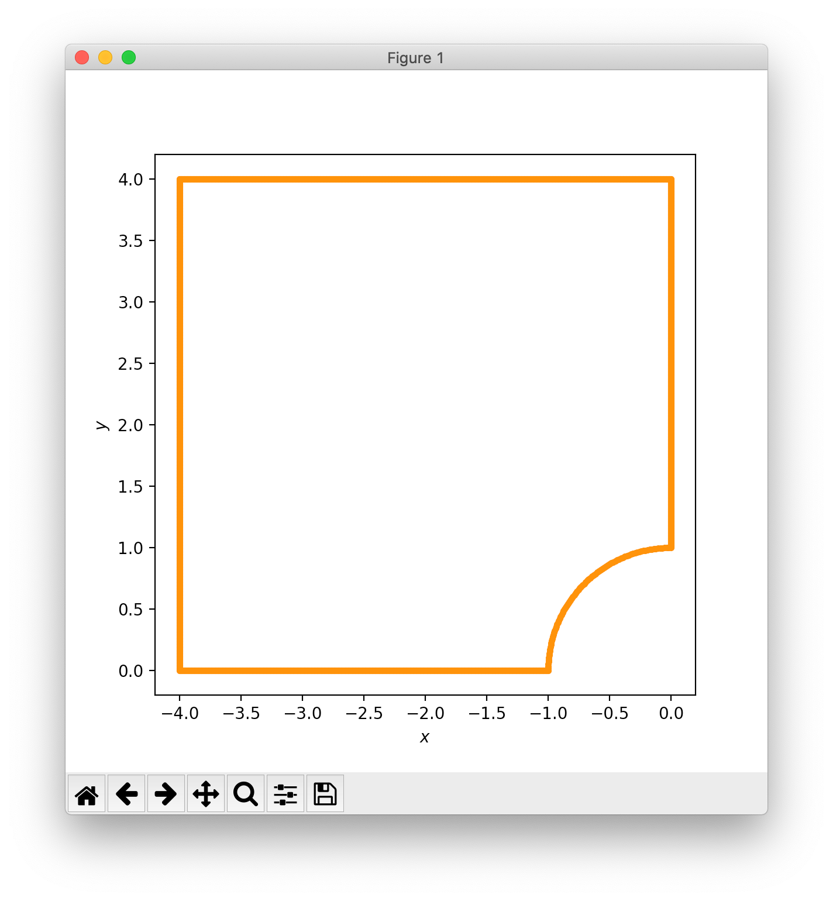
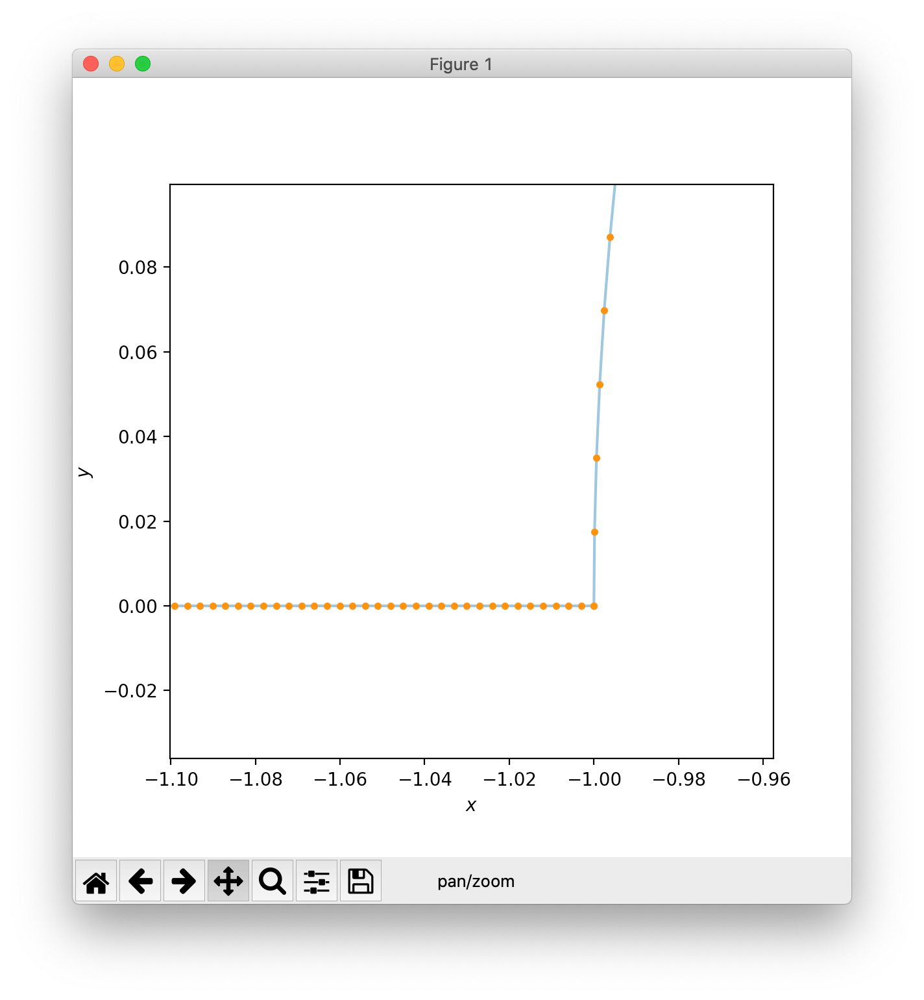
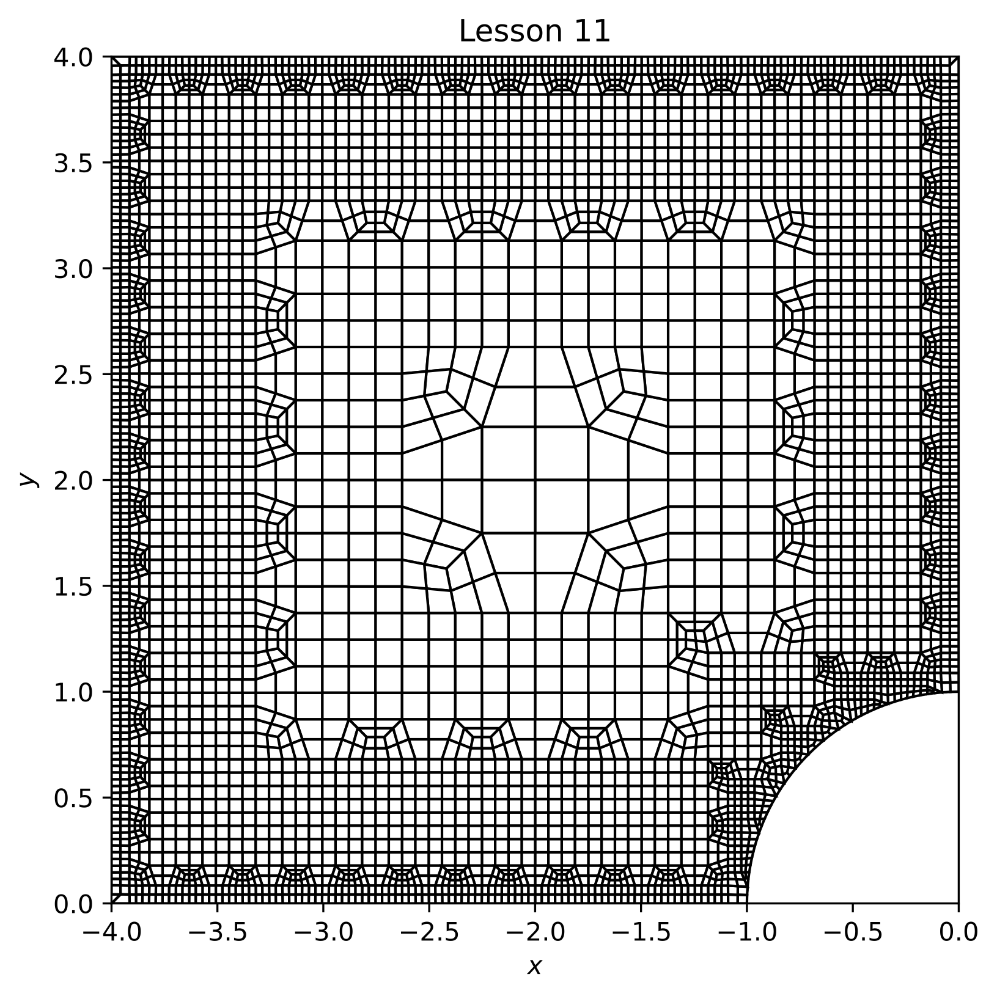
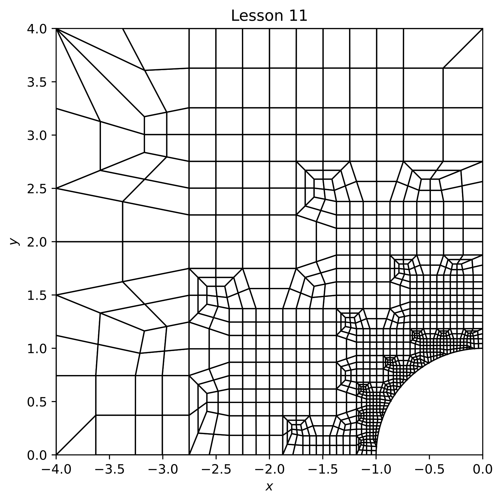
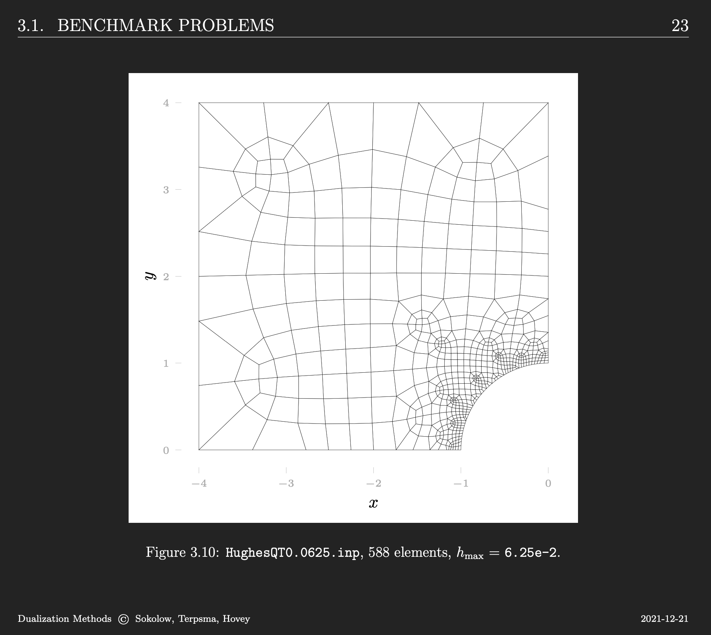
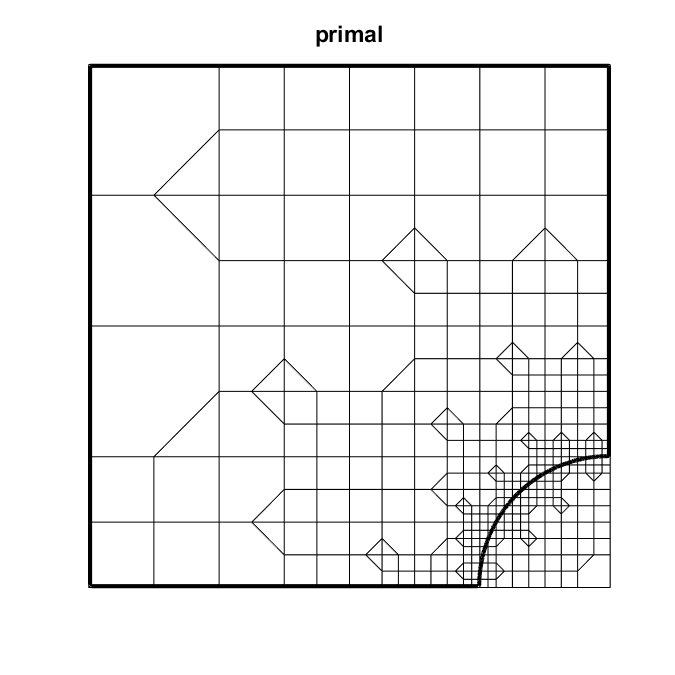
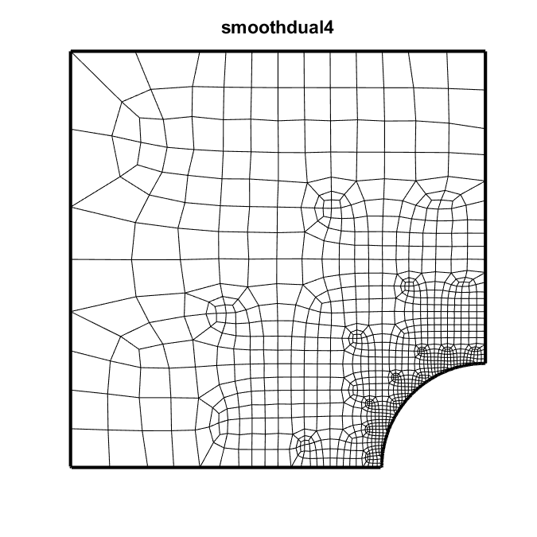

# Lesson 11: Quarter Plate

## Goals

Demonstrate mesh creation for an infinite plate with hole, quarter symmetry model.

## Steps

### Create the boundary

The [`quarter_plate.py`](lesson_11/quarter_plate.py) file is used to create
the `x y` boundary pair 
file [`quarter_plate.txt`](lesson_11/quarter_plate.txt).

The boundary starts at `(-1, 0)`, and proceeds in a counter-clockwise fashion
through `(0, 1), (0, 4), (-4, 4), (-4, 0)` until
point `(-1, 0)` again, the boundary termination.

The left image shows a full view of the boundary.  The right image shows a zoomed in 
view of the circular arc section.

| Full view | Zoomed view |
|:--:|:--:|
|  |  

### Create the `.yml` input file

The [`lesson_11.yml`](lesson_11/lesson_11.yml) is used as follows:

```bash
> cd ~/sibl
> conda activate siblenv
> python geo/src/ptg/main.py -i geo/doc/dual/lesson_11/lesson_11.yml
```

With `resolution: 0.125`, and with `boundary_refine` as either `True` or `False`:

| `boundary_refine: True`| `boundary_refine: False` |
|:--:|:--:|
| (`feature_refine: False)` | (`feature_refine: True`) |
|  |  |



### Quad Tree

*Quadtree mesh to come.*

### Primal



### Primal + Dual + Trim


### Dual + Trim + Project


### Dual + Trim + Project + Refine


### Dual + Trim + Project + Refine + Smooth



[Index](README.md)
