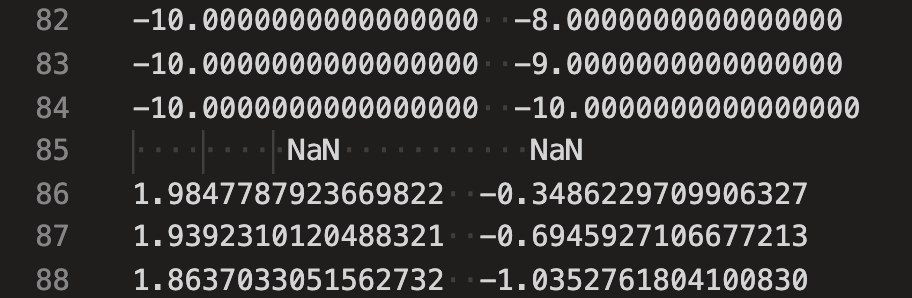
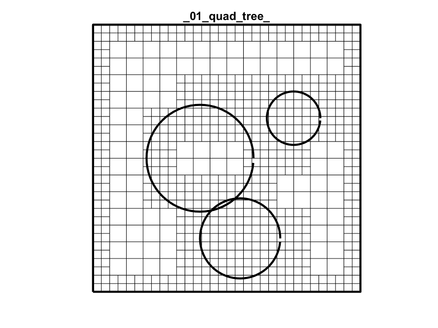
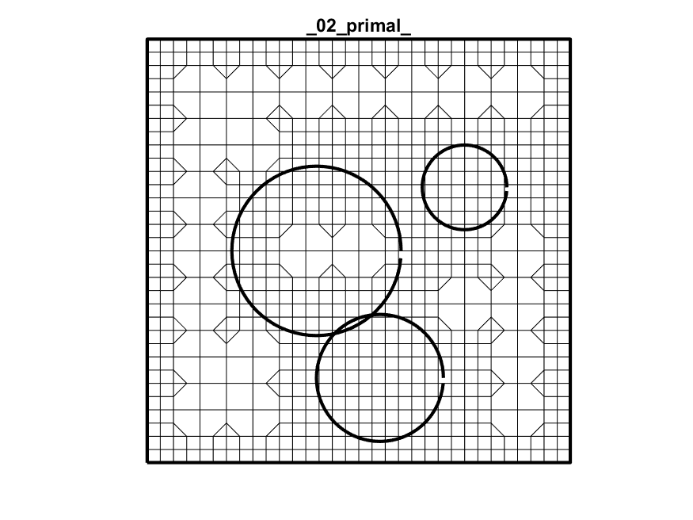
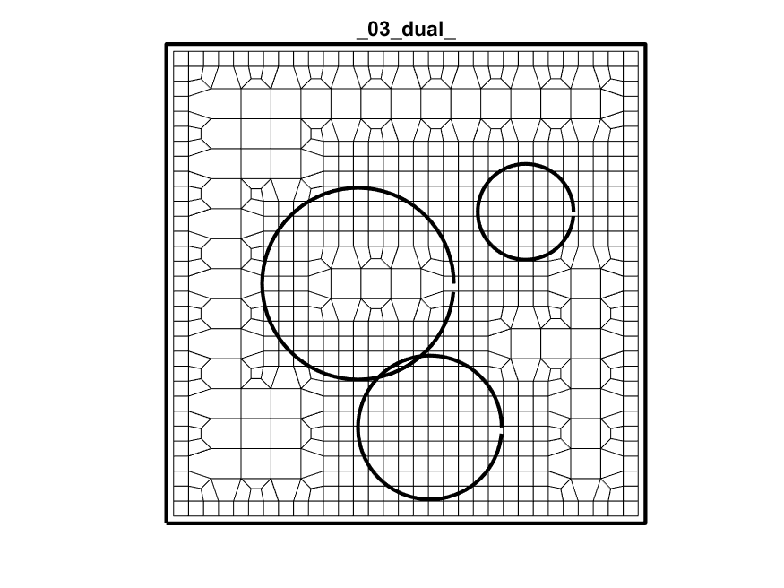
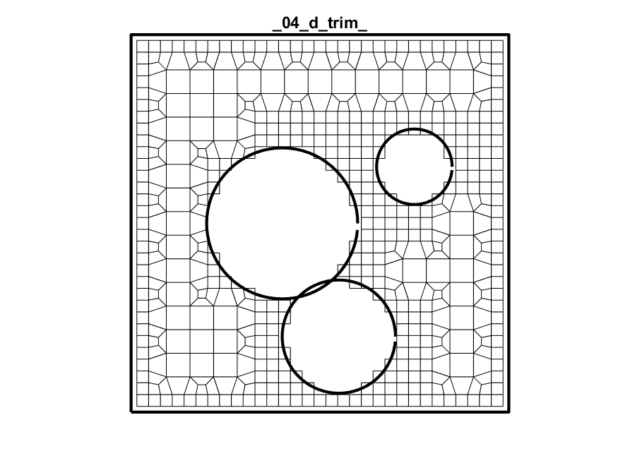
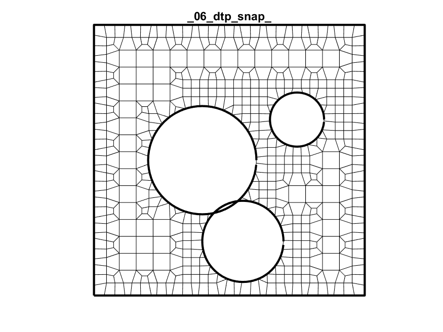
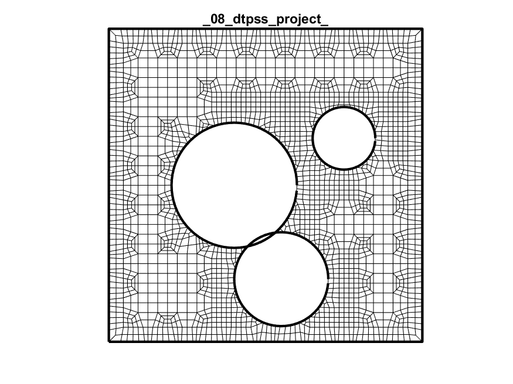

# Lesson 12: Swiss cheese

The *SIBL Mesh Engine* can be used with multiple curve definitions.

## Goals

Demonstrate mesh creation for a domain with an inner and outer boundary definitions.

## Steps

SIBL Mesh engine can import boundary files with *multiple* loops specified. 

* It assumes that distinct loops are separted by `NaN` values for `x` and `y` values. 
* It also uses the convention that a counter clockwise loop defines a region that is "IN" and should be meshed, while a clockwise loop specifies a region that is "OUT" and should not be meshed.  For example, the `NaN` appears in line `85` of [`swisscheese.txt`](swisscheese.txt), used in the example below, as shown in this screenshot:


> *Figure 12.1: Illustration of the use of `NaN` to incidate termination of a curve and start of a new curve.*

## Boundary File Generation

This boundary specification is create with the MATLAB [`plotSwissCheeseEx.m`](plotSwissCheeseEx.m) file. The important distinction for this file versus other plot commands is that this handles the tris and pents that appear in the Primal mesh. The dev files just pad the poly specification with -1s. So there is a line in the Matlab code that strips out the -1 indices before plotting.

```Matlab
clear all
close all

%Set path to executable if not working in the same directory
binpath = 'C:\Users\acsokol\sibl\geo\src\dual\bin\';

%Create the geometry for this example    
%Make a box 
edge1 = [-10:1:10];
edge2 = edge1*0+1;
xp = [edge1 edge2*10 edge1(end:-1:1) -edge2*10];
yp = [-edge2*10 edge1 edge2*10 edge1(end:-1:1)];

%Make some cutout circles
th = [0:5:355];
xp2 = 4*cosd(th)-2;
yp2 = 4*sind(th);
xp =[xp NaN xp2(end:-1:1)];
yp =[yp NaN yp2(end:-1:1)];

xp2 = 2*cosd(th)+5;
yp2 = 2*sind(th)+3;
xp =[xp NaN xp2(end:-1:1)];
yp =[yp NaN yp2(end:-1:1)];

xp2 = 3*cosd(th)+1;
yp2 = 3*sind(th)-6;
xp =[xp NaN xp2(end:-1:1)];
yp =[yp NaN yp2(end:-1:1)];
pts = [xp' yp']';

%Write geometry to file
fid = fopen(['swisscheese.txt'],'w');
fprintf(fid,'%12.16f  %12.16f\n',pts);
fclose(fid);

% Create a text file named swisscheese.yml, that contains the following lines or run executable with no args to get a template yml file
% boundary:swisscheese.txt
% boundary_refine:true
% bounding_box:-10,-10,10,10
% developer_output:true
% output_file:swiss
% resolution:1
% version:1.1

%Run executable through Matlab dos command / Can also just drag YML file onto executable or run from command prompt
dos([binpath,'dual.exe swisscheese.yml']);

plotNames = {'_01_quad_tree_','_02_primal_','_03_dual_','_04_d_trim_','_05_dt_project_','_06_dtp_snap_','_07_dtps_subdivide_','_08_dtpss_project_','_09_dtpssp_snap_','_10_mesh_'};

for ff=1:length(plotNames)
    n = load(['swisscheese',char(plotNames{ff}),'nodes.dev']);
    q = load(['swisscheese',char(plotNames{ff}),'quads.dev']);

    figure;
    plot(pts(1,:),pts(2,:),'k-','LineWidth',2);hold on;
    for qq=1:size(q,1)
        seq = q(qq,:);
        seq = seq(seq~=-1);
        seq = [seq seq(1)]; %close the loops
        plot(n(seq,2),n(seq,3),'k-')
    end
    axis equal;
    axis off
    title(char(plotNames{ff}))
    print(gcf,'-dpng',['swiss',char(plotNames{ff}),'.png']);
end
```


### Quad Tree



### Primal



### Primal + Dual



### Dual + Trim + Project



### Dual + Trim + Project 


### Dual + Trim + Project + Snap 



### Dual + Trim + Project + Snap + Subdivide 


### Dual + Trim + Project + Snap + Subdivide + Project



### Dual + Trim + Project + Snap + Subdivide + Project + Snap


### Final Mesh


[Index](README.md)
