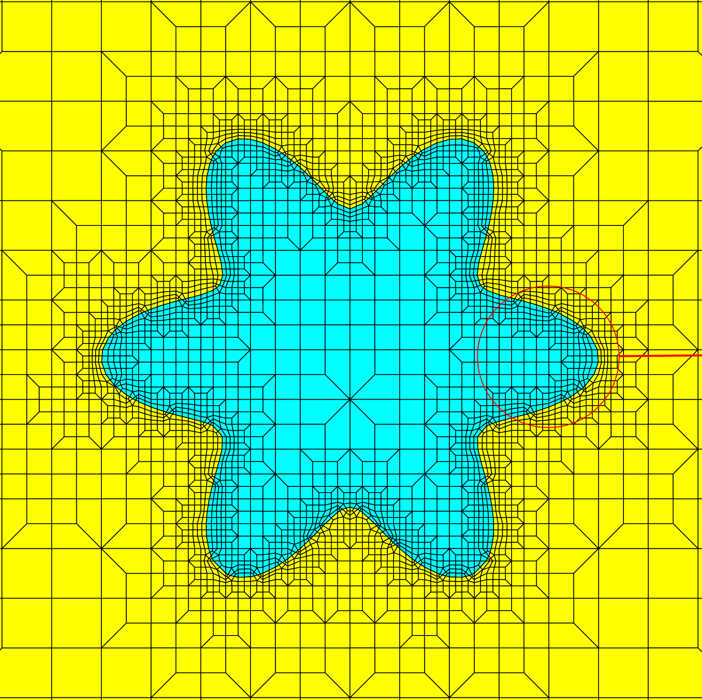
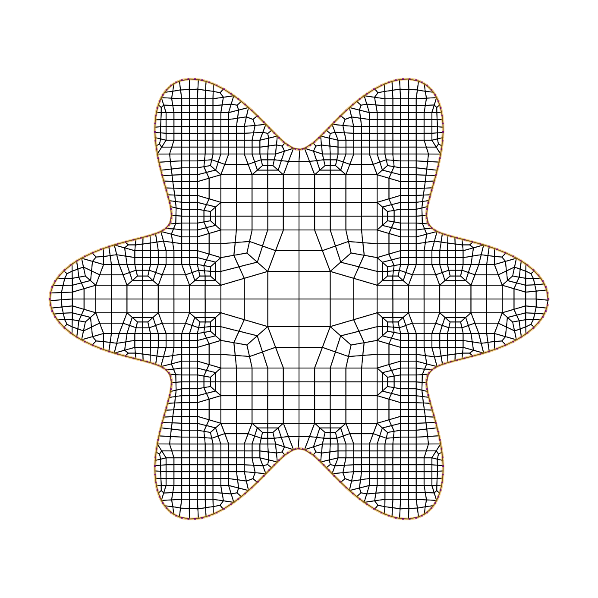
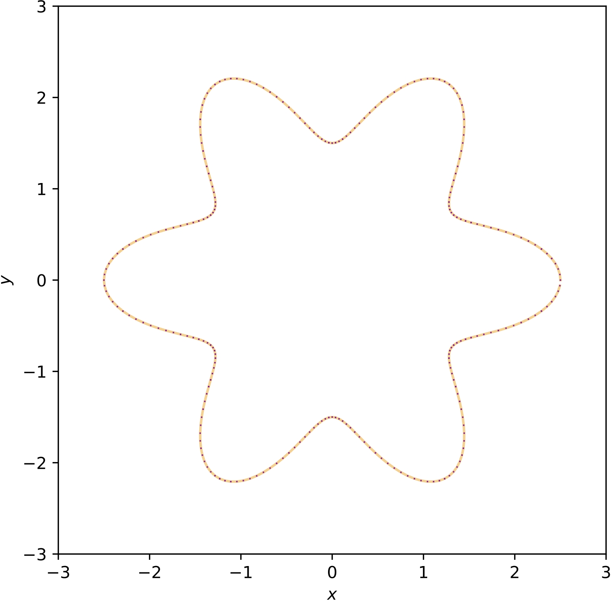

# Lesson 21: Mesh the `flower` domain

## Goals

Mesh the `flower` domain using dualization, and compare the result to an alternative method and result published in [Rushdi 2017](#rushdi-2017), Figure 15.

## Steps

Run this python script, [`lesson_21.py`](lesson_21.py) from the command line:

```bash
> conda activate siblenv
> cd ~/sibl/geo/doc/dual
> python lesson_21.py
```

| Rushdi Fig. 15 | Dual method |
|:---:|:---:|
|  |  |

[Index](README.md)

## References

### Rushdi 2017

* Rushdi AA, Mitchell SA, Mahmoud AH, Bajaj CC, Ebeida MS. All-quad meshing without cleanup. Computer-Aided Design. 2017 Apr 1;85:83-98.

| | boundary for SHT method |
|:---:|:---:|
|  |  |
