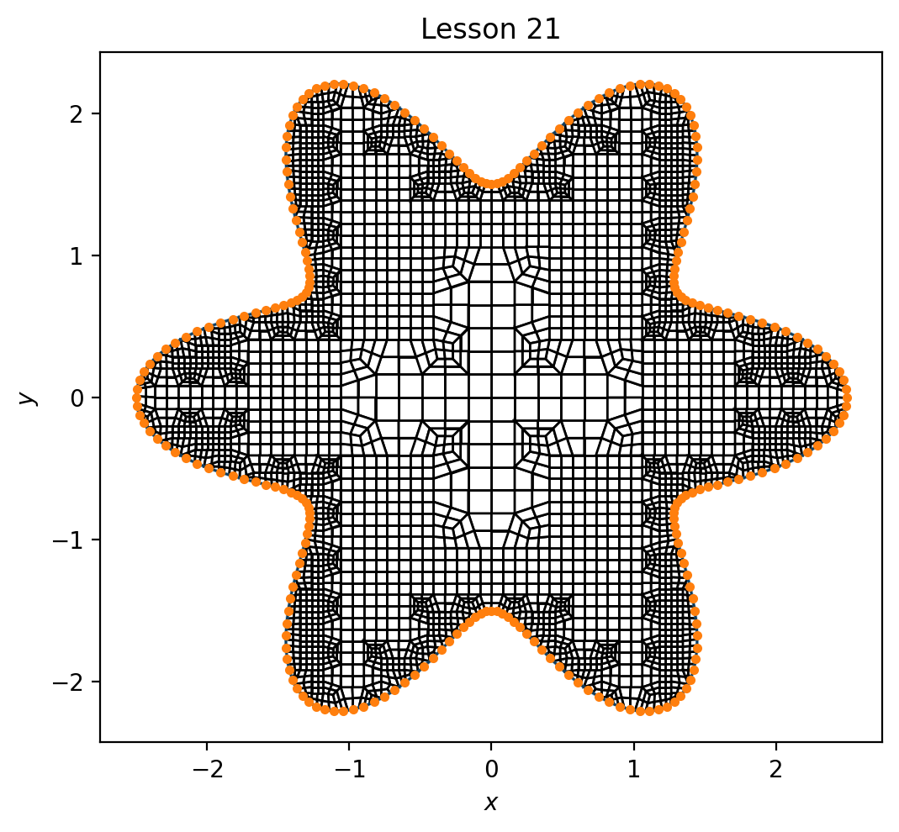

# Lesson 21: Flower

## Goals

Mesh the `flower` domain using dualization, and compare the result to an alternative method and result published in [Rushdi 2017](#rushdi-2017), Figure 15.

## Steps

Verify the following files exist:

* [star.txt](../../data/boundary/star.txt) - the boundary `x y` discrete point definition
* [lesson_21.yml](../../data/mesh/lesson_21.yml) - the YAML input file specification

From the command line:

```bash
> conda activate siblenv
> cd ~/sibl
> python geo/src/ptg/main.py -i geo/data/mesh/lesson_21.yml
SIBL Mesh Engine initialized.
driver: /Users/chovey/sibl/geo/src/ptg/main.py
Dualization initiated.
input: /Users/chovey/sibl/geo/data/mesh/lesson_21.yml
The database is {'version': 1.3, 'boundary': 'geo/data/boundary/star.txt', 'bounding_box': [[-2.6, -2.6], [2.6, 2.6]], 'resolution': 0.09, 'output_file': 'geo/data/mesh/lesson_21', 'boundary_refine': True, 'developer_output': True, 'figure': {'boundary_shown': True, 'dpi': 200, 'elements_shown': True, 'filename': 'lesson_21', 'format': 'png', 'frame': True, 'grid': False, 'label_x': '$x$', 'label_y': '$y$', 'latex': False, 'save': True, 'show': False, 'size': [6.0, 6.0], 'title': 'Lesson 21'}}
Reading in boundary file: geo/data/boundary/star.txt
deciding this loop is : in
inCurve with 256 points
Determining derivative...
Setting tangent and angle...
Finding corners...
 Adding corner point at -2.49384	0.0612203 delAngle 168.603 lcv: 127
Finding features...
Done with features.
QuadMesh constructor complete
Computing Mesh
Size of my nodes: 0
Size of my Primal nodes: 1937
Size of my Primal Polys: 1888
Unique loop size: 1841
  Saved figure to lesson_21.png
SIBL Mesh Engine completed.
Dualization is complete.
SIBL Mesh Engine completed.
>
```

### Outputs

* Mesh file [`lesson_1.inp`](../../data/mesh/lesson_r1.inp) will appear in the `~/sibl/geo/data/mesh` folder.
* Image `lesson_21.png`, shown here, should appear in the local `~/sibl` folder. 



| | boundary for SHT method |
|:---:|:---:|
|  |  |


| Rushdi Fig. 15 | Dual method |
|:---:|:---:|
|  |  |

[Index](README.md)

Previous: [Lesson 03](lesson_03.md)

Next: [Lesson 05](lesson_05.md)

## References

### Rushdi 2017

* Rushdi AA, Mitchell SA, Mahmoud AH, Bajaj CC, Ebeida MS. All-quad meshing without cleanup. Computer-Aided Design. 2017 Apr 1;85:83-98.
