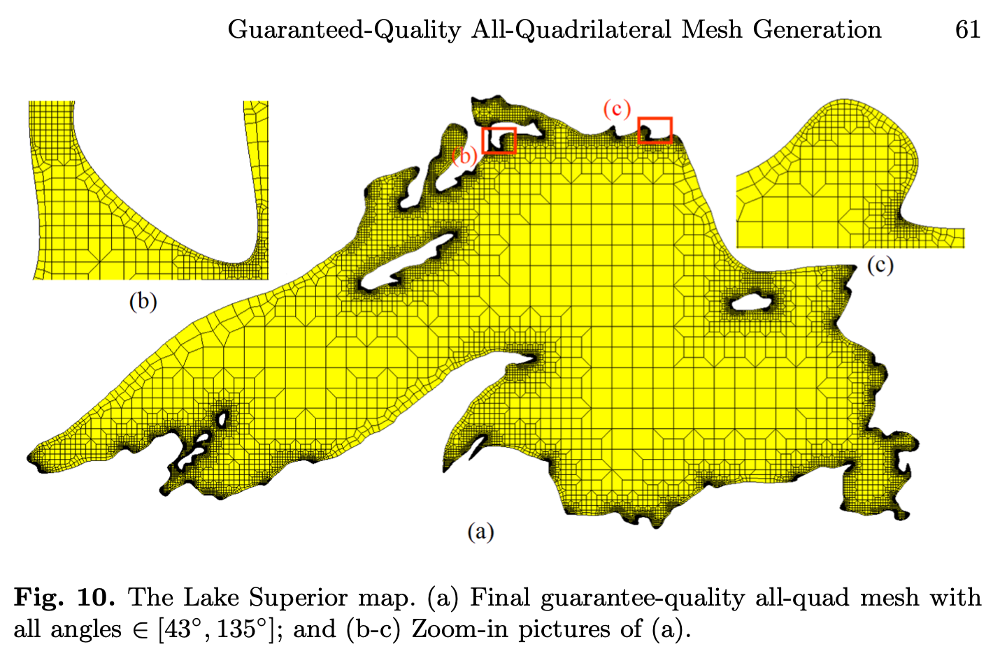

# Lesson 22: Lake Superior

## Goals

The **goal** of this lesson is to mesh the `Lake Superior` domain using dualization, and compare the result to an alternative method and result published in [Liang 2010](#liang-2010), Figure 10.

## Steps

*To come.*

| Rushdi Fig. 15 | Dual method |
|:---:|:---:|
|  | To come. |

[Index](README.md)

## References

### Liang 2010

* Liang X, Ebeida MS, Zhang Y. Guaranteed-quality all-quadrilateral mesh generation with feature preservation. Computer Methods in Applied Mechanics and Engineering. 2010 Jun 1;199(29-32):2072-83.
