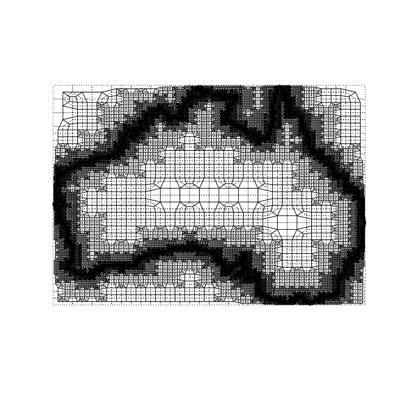
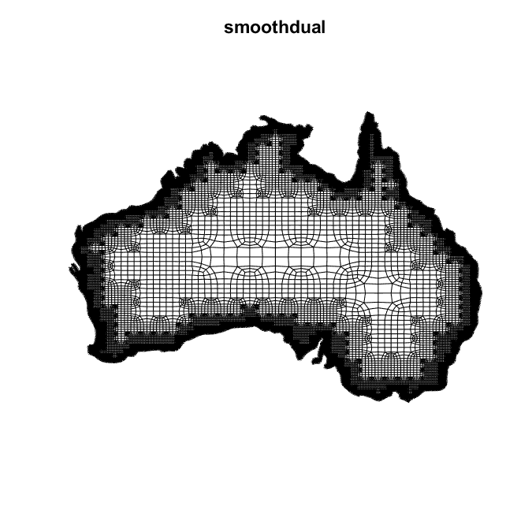

# Lesson 23: Australia

The *SIBL Mesh Engine* ...

## Goals

Demonstrate mesh creation for a domain with the boundary of Australia.

## Steps

### Quad Tree

### Primal

### Dual

### Dual + Trim + Project

### Dual + Trim + Project + Snap

### Dual + Trim + Project + Snap + Smooth

[Index](README.md)

Previous: [Lesson ##-1](lesson_##-1.md)

Next: [Lesson ##+1](lesson_##+1.md)
