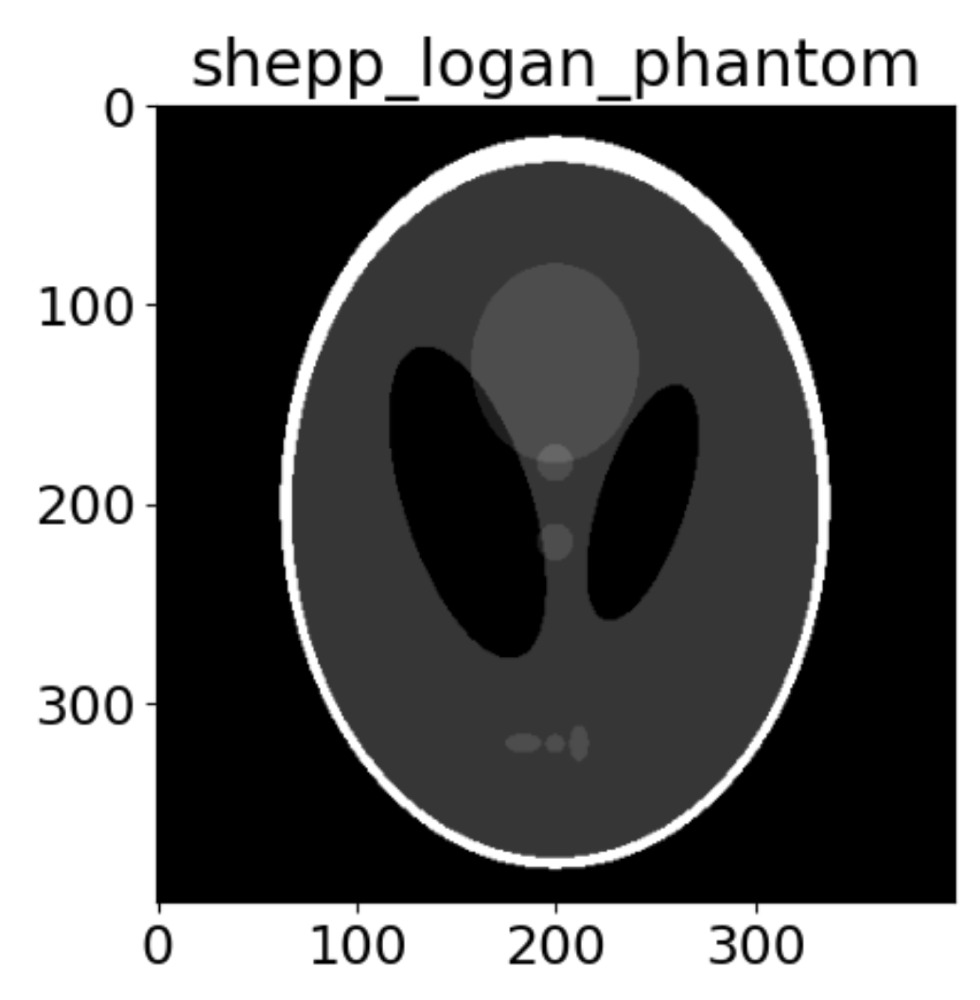

# Lesson 41: Shepp-Logan Phantom

The *SIBL Mesh Engine* ...

## Goals

## Steps

[Index](README.md)

## References

### scikit-image 2022

* [https://github.com/scikit-image/scikit-image/blob/v0.18.0/skimage/data/__init__.py#L994-L1008](https://github.com/scikit-image/scikit-image/blob/v0.18.0/skimage/data/__init__.py#L994-L1008)

### Shepp 1974

* Shepp LA, Logan BF. The Fourier reconstruction of a head section. IEEE Transactions on nuclear science. 1974 Jun;21(3):21-43. [Download](https://ieeexplore.ieee.org/iel7/23/6457203/06499235.pdf) (7.5 MB)
