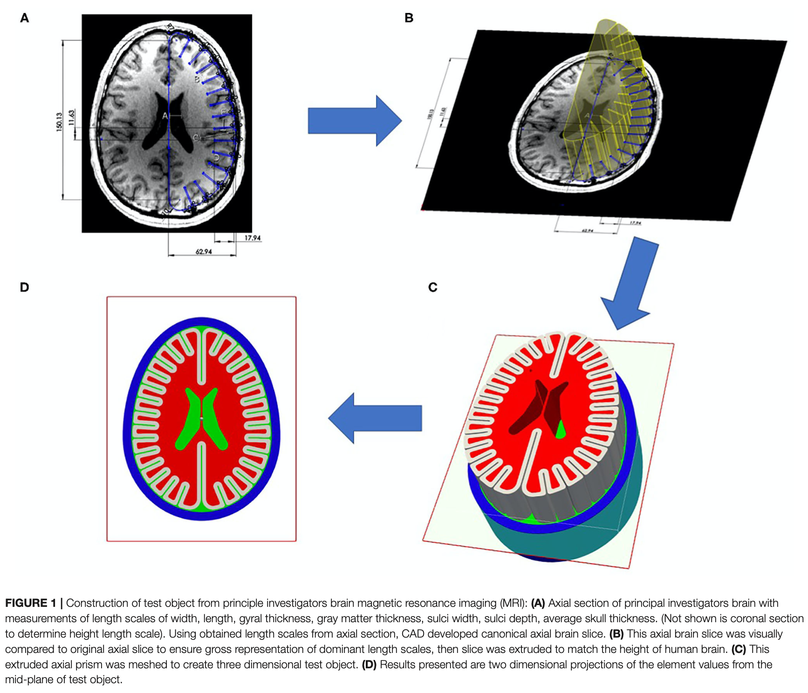

# Lesson 42: Miller phantom

## Goals

The **goal** of this lesson is to mesh a 2D version of the phantom used in [Miller et al. 2021](#miller-2021).

## Steps

*To come.*

### Comparison

| Miller Fig. 1 | Dual method |
|:---:|:---:|
|  | *To come.* |

[Index](README.md)

## References

### Miller 2021

* Miller ST, Cooper CF, Elsbernd P, Kerwin J, Mejia-Alvarez R, Willis AM. Localizing Clinical Patterns of Blast Traumatic Brain Injury Through Computational Modeling and Simulation. Frontiers in Neurology. 2021;12. [Link to Miller 2021](https://www.ncbi.nlm.nih.gov/pmc/articles/PMC8173077/) and [Download](https://www.sandia.gov/app/uploads/sites/147/2022/01/Miller_2021_001.pdf) (4.2 MB).
