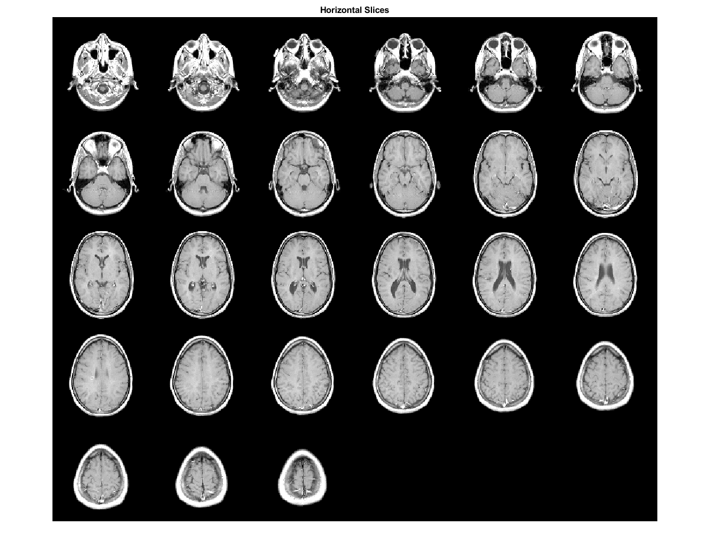

# Lesson 43: MATLAB 3D MRI data set

## Goals

The **goal** of this lesson is to mesh slice of the MATLAB 3D MRI data set in [Matlab 2021](#matlab-2021).

## Steps

*To come.*

### Comparison

| MATLAB | Dual method |
|:---:|:---:|
|  | *To come.* |

[Index](README.md)

## References

### MATLAB 2021

* MATLAB [Exploring Slices from a 3-Dimensional MRI Data Set](https://www.mathworks.com/help/images/exploring-slices-from-a-3-dimensional-mri-data-set.html)
