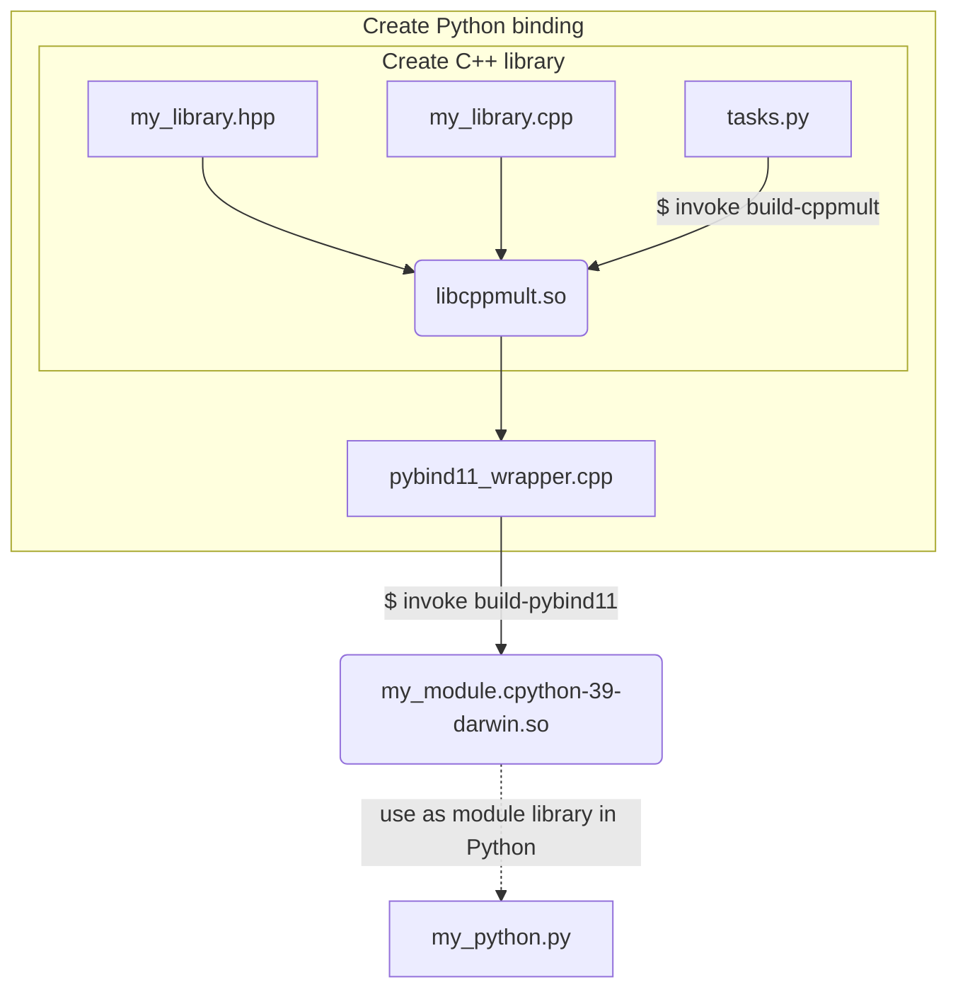

# pybind11 example

## Introduction

* We focus on pybind11 because it focuses on C++ (not C), and is restricted to C++11.
* pybind11 allows C++ to be used in Python 
  * (and it also allows Python to be used in C++, a use case not covered here).
* pybind11 uses C++ as the wrapper to the C++ code to be exposed in Python.
* pybind11 can expose date types that Python likes to use, such as tuples.

## Workflow

*See [Mermaid cheat sheet](https://jojozhuang.github.io/tutorial/mermaid-cheat-sheet/) for flow diagram examples.*




```Python
#!/usr/bin/env python
# my_python.py
from . import my_module as mm
```

## Configuration

```bash
> conda activate siblenv
> python -m pip install invoke
> python -m pip install pybind11
```

## Source Files

* [`cppmult.cpp`](../src/ptg/cppmult.cpp)
* [`cppmult.hpp`](../src/ptg/cppmult.hpp)
* [`tasks.py`](../src/ptg/tasks.py)
* [`pybind11_wrapper`](../src/ptg/pybind11_wrapper.cpp)

## Output Files 

*Tested on macOS 2021-10-25*

```bash
⋊> ~/s/g/s/ptg on master ◦ invoke build-cppmult                   (siblenv)  Mon Oct 25 18:48:52 2021
==================================================
= Building C++ Library
* Complete (Chad says hi!)
⋊> ~/s/g/s/ptg on master ◦
```

created `libcppmult.so` and

```bash
⋊> ~/s/g/s/ptg on master ◦ invoke build-pybind11             (siblenv) 665ms Mon Oct 25 18:50:11 2021
==================================================
= Building C++ Library
* Complete (Chad says hi!)
==================================================
= Building PyBind11 Module
* Complete
⋊> ~/s/g/s/ptg on master ◦
```

created `pybind11_example.cpython-39-darwin.so`.

## Testing File

*Dot not use the original name, `pybind11_test.py`, since this interferes with the `pytest -v` auto discovery used with continuous integration on this repository.*

* [`pybind11_testing.py`](../src/ptg/pybind11_testing.py)

```bash
⋊> ~/s/g/s/ptg on master ◦ python pybind11_testing.py                (siblenv)  Mon Oct 25 18:56:39 2021
    In cppmult: int 6 float 2.3 returning 13.8
    In Python: int: 6 float 2.3 return val 13.8
⋊> ~/s/g/s/ptg on master ◦
```

```bash
⋊> ~/s/g/s/ptg on master ◦ pwd
/Users/sparta/sibl/geo/src/ptg

⋊> ~/s/g/s/ptg on master ◦ python                                 (siblenv)  Mon Oct 25 19:01:32 2021

Python 3.9.5 (default, May 18 2021, 12:31:01)
[Clang 10.0.0 ] :: Anaconda, Inc. on darwin
Type "help", "copyright", "credits" or "license" for more information.

>>> import ptg.pybind11_example as pp
>>> dir(pp)
['__doc__', '__file__', '__loader__', '__name__', '__package__', '__spec__', 'cpp_function']
>>> pp.__doc__
'pybind11 example plugin'
>>>
```

## References

* [Real Python](https://realpython.com/python-bindings-overview/#pybind11)
* [Real Python GitHub repo](https://github.com/realpython/materials/tree/master/python-bindings)