# Qt

## Install

### *2021-07-10*

* Install the *Qt Open Source* version of [Qt](https://www.qt.io/download) via the [Qt Online Installer](https://www.qt.io/download-qt-installer).
  * Downloads to `~/Downloads/qt-unified-macOS-x64-4.1.1-online.dmg` (13.2 MB).
    * Installation dialog box: "You need to install Xcode and set up Xcode command line tools. Download Xcode from https://developer.apple.com".
    * Qt install directory: `/Users/sparta/Qt` (installs approximately 2.28 GB).

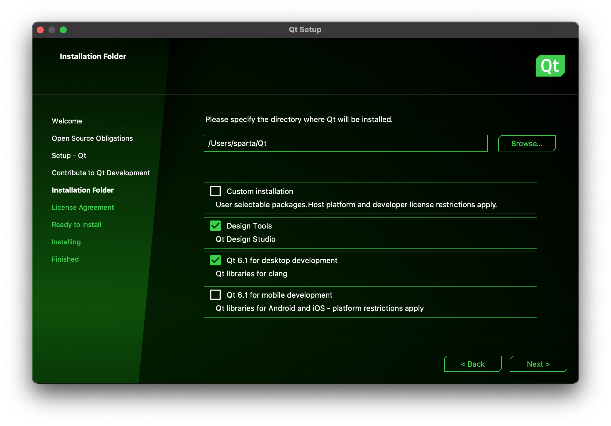
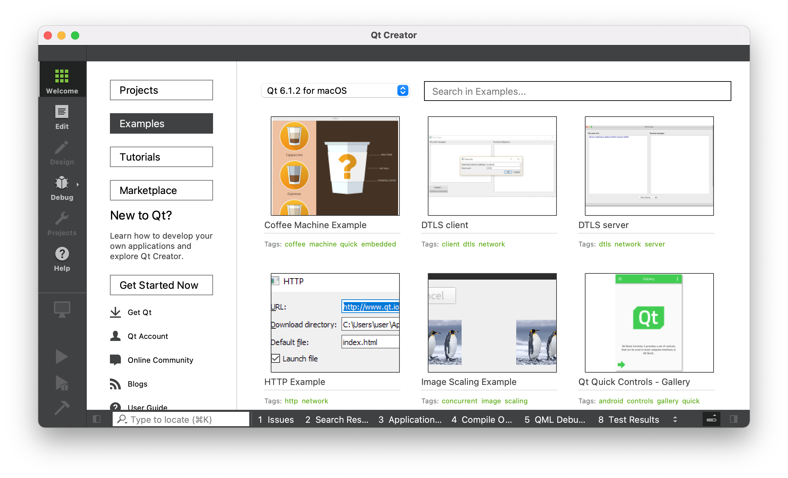
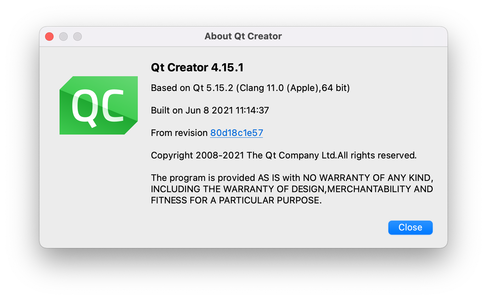
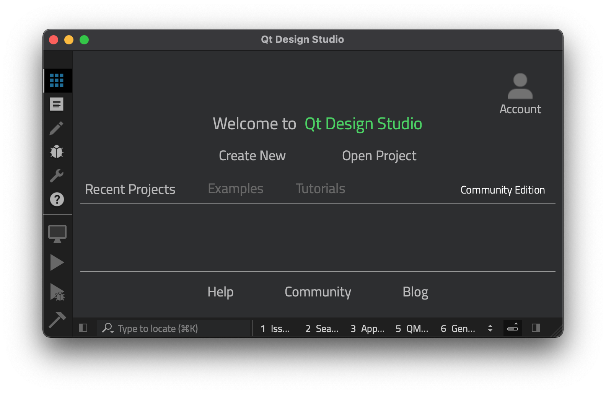

* [Getting Started](https://doc.qt.io/qt-6/gettingstarted.html) with Qt.

```bash
> /u/bin pwd                                   (base)  Sat Jul 10 12:24:34 2021
/usr/bin
> /u/bin clang --version                       (base)  Sat Jul 10 12:24:48 2021
Apple clang version 12.0.0 (clang-1200.0.32.27)
Target: x86_64-apple-darwin20.5.0
Thread model: posix
InstalledDir: /Library/Developer/CommandLineTools/usr/bin
> /u/bin
```

## Run

Reference [video](https://youtu.be/R6zWLfHIYJw) - *Introduction to Qt - Qt Creator IDE Overview and Examples {tutorial}*

In Qt Creator, chooses `Welcome > Projects > New > Application (Qt) > Qt Widgets Application > Choose`

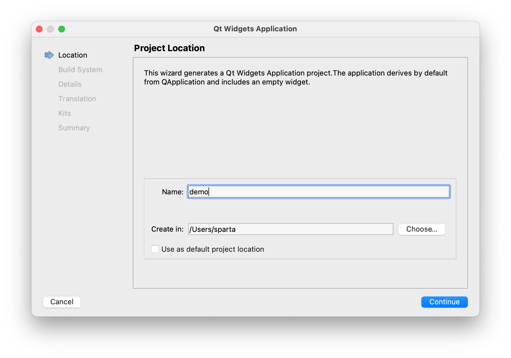
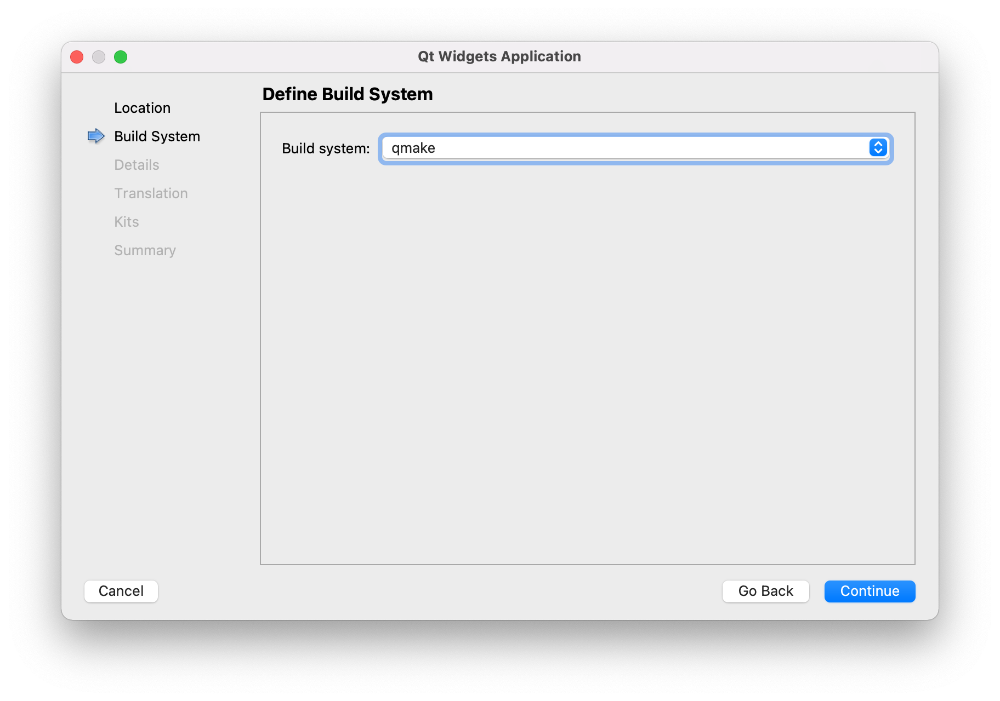
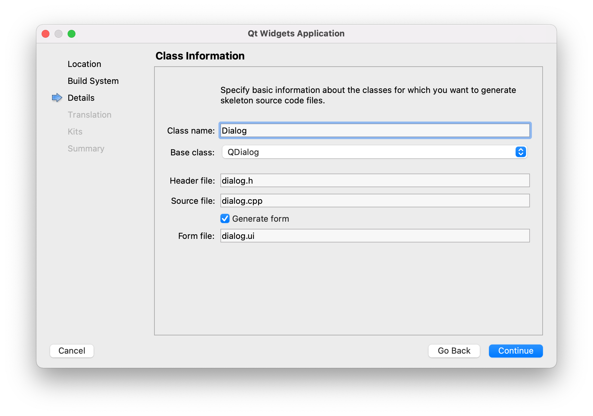
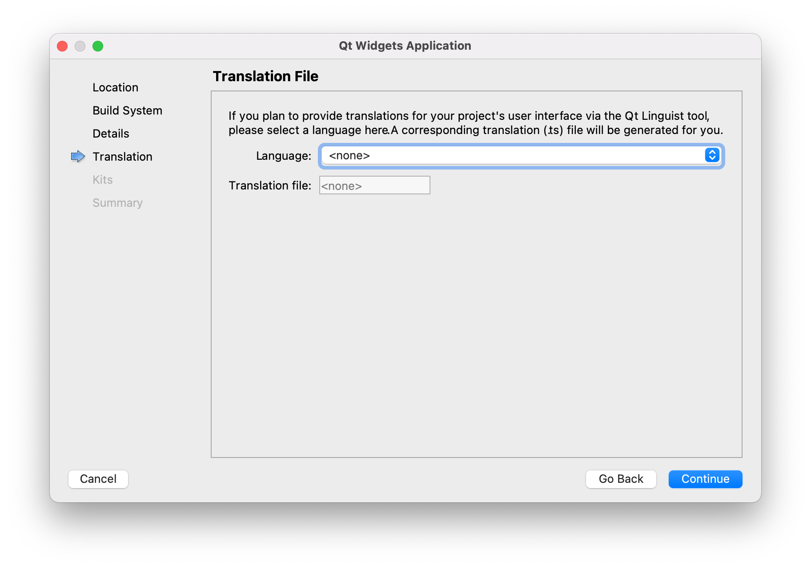
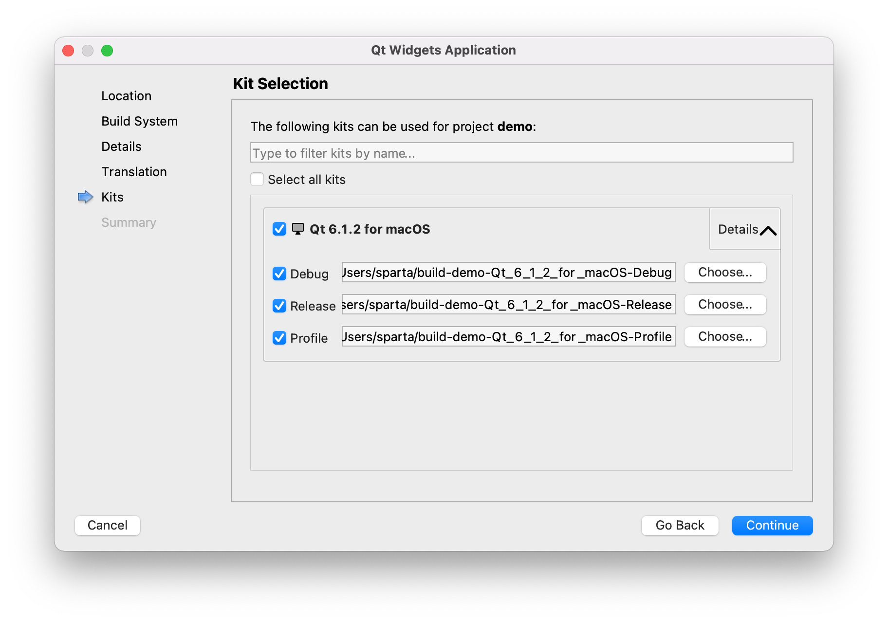
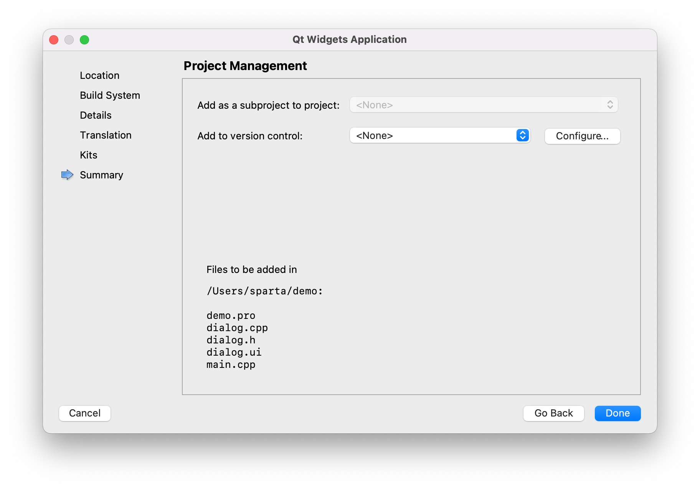
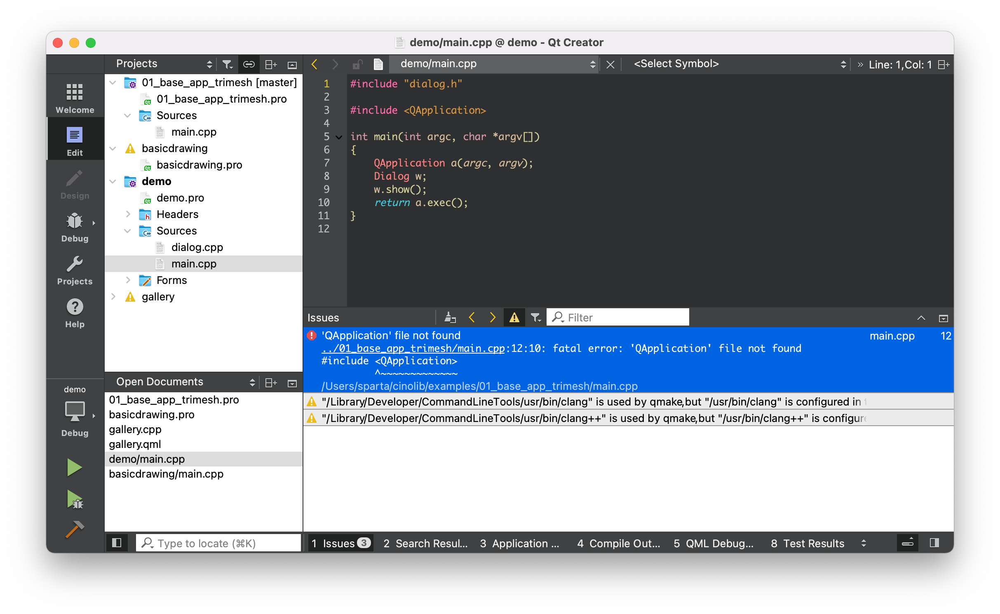
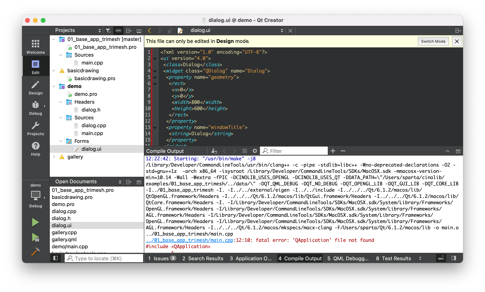
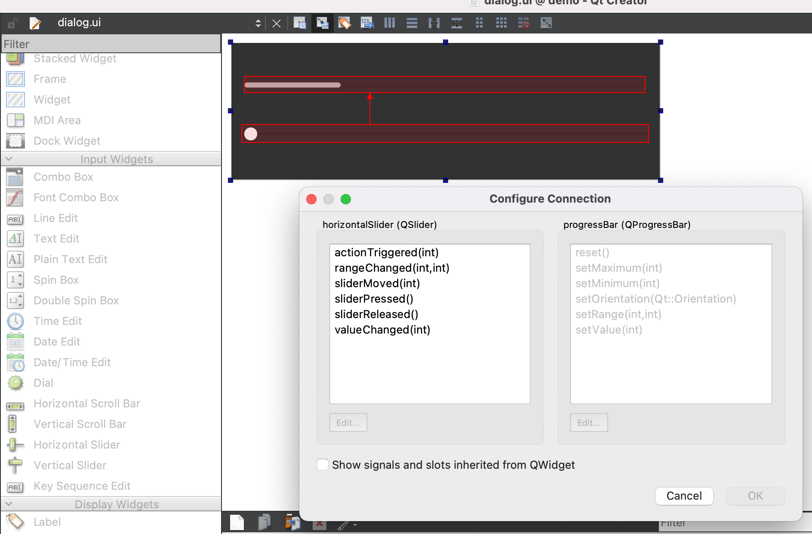

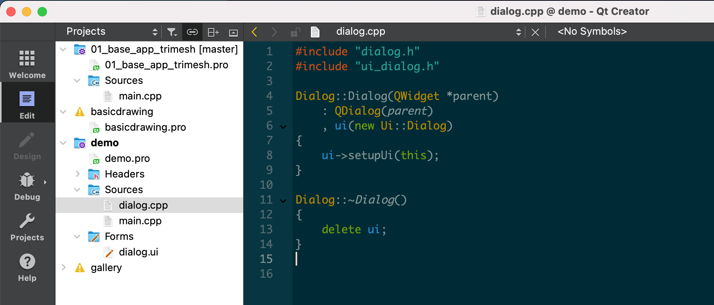

The `demo.pro` file contains:

```bash
QT       += core gui

greaterThan(QT_MAJOR_VERSION, 4): QT += widgets

CONFIG += c++11

# You can make your code fail to compile if it uses deprecated APIs.
# In order to do so, uncomment the following line.
#DEFINES += QT_DISABLE_DEPRECATED_BEFORE=0x060000    # disables all the APIs deprecated before Qt 6.0.0

SOURCES += \
    main.cpp \
    dialog.cpp

HEADERS += \
    dialog.h

FORMS += \
    dialog.ui

# Default rules for deployment.
qnx: target.path = /tmp/$${TARGET}/bin
else: unix:!android: target.path = /opt/$${TARGET}/bin
!isEmpty(target.path): INSTALLS += target
```


Then menu item `Build > Run`

```bash
13:06:28: Running steps for project demo...
13:06:28: Starting: "/Users/sparta/Qt/6.1.2/macos/bin/qmake" /Users/sparta/demo/demo.pro -spec macx-clang CONFIG+=debug CONFIG+=x86_64 CONFIG+=qml_debug
Info: creating stash file /Users/sparta/build-demo-Qt_6_1_2_for_macOS-Debug/.qmake.stash
13:06:28: The process "/Users/sparta/Qt/6.1.2/macos/bin/qmake" exited normally.
13:06:28: Starting: "/usr/bin/make" -f /Users/sparta/build-demo-Qt_6_1_2_for_macOS-Debug/Makefile qmake_all
make: Nothing to be done for `qmake_all'.
13:06:28: The process "/usr/bin/make" exited normally.
13:06:28: Starting: "/usr/bin/make" -j8
/Users/sparta/Qt/6.1.2/macos/libexec/uic ../demo/dialog.ui -o ui_dialog.h
/Library/Developer/CommandLineTools/usr/bin/clang++ -c -pipe -stdlib=libc++ -g -std=gnu++1z  -arch x86_64 -isysroot /Library/Developer/CommandLineTools/SDKs/MacOSX.sdk -mmacosx-version-min=10.14 -Wall -Wextra -fPIC -DQT_QML_DEBUG -DQT_WIDGETS_LIB -DQT_GUI_LIB -DQT_CORE_LIB -I../demo -I. -I../Qt/6.1.2/macos/lib/QtWidgets.framework/Headers -I../Qt/6.1.2/macos/lib/QtGui.framework/Headers -I../Qt/6.1.2/macos/lib/QtCore.framework/Headers -I. -I/Library/Developer/CommandLineTools/SDKs/MacOSX.sdk/System/Library/Frameworks/OpenGL.framework/Headers -I/Library/Developer/CommandLineTools/SDKs/MacOSX.sdk/System/Library/Frameworks/AGL.framework/Headers -I. -I/Library/Developer/CommandLineTools/SDKs/MacOSX.sdk/System/Library/Frameworks/OpenGL.framework/Headers -I/Library/Developer/CommandLineTools/SDKs/MacOSX.sdk/System/Library/Frameworks/AGL.framework/Headers -I../Qt/6.1.2/macos/mkspecs/macx-clang -F/Users/sparta/Qt/6.1.2/macos/lib -o main.o ../demo/main.cpp
/Library/Developer/CommandLineTools/usr/bin/clang++ -pipe -stdlib=libc++ -g -std=gnu++1z  -arch x86_64 -isysroot /Library/Developer/CommandLineTools/SDKs/MacOSX.sdk -mmacosx-version-min=10.14 -Wall -Wextra -dM -E -o moc_predefs.h ../Qt/6.1.2/macos/mkspecs/features/data/dummy.cpp
/Library/Developer/CommandLineTools/usr/bin/clang++ -c -pipe -stdlib=libc++ -g -std=gnu++1z  -arch x86_64 -isysroot /Library/Developer/CommandLineTools/SDKs/MacOSX.sdk -mmacosx-version-min=10.14 -Wall -Wextra -fPIC -DQT_QML_DEBUG -DQT_WIDGETS_LIB -DQT_GUI_LIB -DQT_CORE_LIB -I../demo -I. -I../Qt/6.1.2/macos/lib/QtWidgets.framework/Headers -I../Qt/6.1.2/macos/lib/QtGui.framework/Headers -I../Qt/6.1.2/macos/lib/QtCore.framework/Headers -I. -I/Library/Developer/CommandLineTools/SDKs/MacOSX.sdk/System/Library/Frameworks/OpenGL.framework/Headers -I/Library/Developer/CommandLineTools/SDKs/MacOSX.sdk/System/Library/Frameworks/AGL.framework/Headers -I. -I/Library/Developer/CommandLineTools/SDKs/MacOSX.sdk/System/Library/Frameworks/OpenGL.framework/Headers -I/Library/Developer/CommandLineTools/SDKs/MacOSX.sdk/System/Library/Frameworks/AGL.framework/Headers -I../Qt/6.1.2/macos/mkspecs/macx-clang -F/Users/sparta/Qt/6.1.2/macos/lib -o dialog.o ../demo/dialog.cpp
/Users/sparta/Qt/6.1.2/macos/libexec/moc -DQT_QML_DEBUG -DQT_WIDGETS_LIB -DQT_GUI_LIB -DQT_CORE_LIB --include /Users/sparta/build-demo-Qt_6_1_2_for_macOS-Debug/moc_predefs.h -I/Users/sparta/Qt/6.1.2/macos/mkspecs/macx-clang -I/Users/sparta/demo -I/Users/sparta/Qt/6.1.2/macos/lib/QtWidgets.framework/Headers -I/Users/sparta/Qt/6.1.2/macos/lib/QtGui.framework/Headers -I/Users/sparta/Qt/6.1.2/macos/lib/QtCore.framework/Headers -I. -I/Library/Developer/CommandLineTools/usr/include/c++/v1 -I/Library/Developer/CommandLineTools/usr/lib/clang/12.0.0/include -I/Library/Developer/CommandLineTools/SDKs/MacOSX.sdk/usr/include -I/Library/Developer/CommandLineTools/usr/include -F/Users/sparta/Qt/6.1.2/macos/lib ../demo/dialog.h -o moc_dialog.cpp
/Library/Developer/CommandLineTools/usr/bin/clang++ -c -pipe -stdlib=libc++ -g -std=gnu++1z  -arch x86_64 -isysroot /Library/Developer/CommandLineTools/SDKs/MacOSX.sdk -mmacosx-version-min=10.14 -Wall -Wextra -fPIC -DQT_QML_DEBUG -DQT_WIDGETS_LIB -DQT_GUI_LIB -DQT_CORE_LIB -I../demo -I. -I../Qt/6.1.2/macos/lib/QtWidgets.framework/Headers -I../Qt/6.1.2/macos/lib/QtGui.framework/Headers -I../Qt/6.1.2/macos/lib/QtCore.framework/Headers -I. -I/Library/Developer/CommandLineTools/SDKs/MacOSX.sdk/System/Library/Frameworks/OpenGL.framework/Headers -I/Library/Developer/CommandLineTools/SDKs/MacOSX.sdk/System/Library/Frameworks/AGL.framework/Headers -I. -I/Library/Developer/CommandLineTools/SDKs/MacOSX.sdk/System/Library/Frameworks/OpenGL.framework/Headers -I/Library/Developer/CommandLineTools/SDKs/MacOSX.sdk/System/Library/Frameworks/AGL.framework/Headers -I../Qt/6.1.2/macos/mkspecs/macx-clang -F/Users/sparta/Qt/6.1.2/macos/lib -o moc_dialog.o moc_dialog.cpp
/Library/Developer/CommandLineTools/usr/bin/clang++ -stdlib=libc++ -headerpad_max_install_names  -arch x86_64 -isysroot /Library/Developer/CommandLineTools/SDKs/MacOSX.sdk -mmacosx-version-min=10.14 -Wl,-rpath,@executable_path/../Frameworks -Wl,-rpath,/Users/sparta/Qt/6.1.2/macos/lib -o demo.app/Contents/MacOS/demo main.o dialog.o moc_dialog.o   -F/Users/sparta/Qt/6.1.2/macos/lib -framework QtWidgets -framework QtGui -framework AppKit -framework ImageIO -framework Metal -framework QtCore -framework DiskArbitration -framework IOKit -framework AGL -framework OpenGL   
13:06:30: The process "/usr/bin/make" exited normally.
13:06:30: Elapsed time: 00:03.
```

### *2021-07-11*

For compatibility with **Cinolib**, uninstall Qt version 6 and install 5 instead.

From `/Users/sparta/Qt/` launch the `MaintenanceTool.app`, select `Uninstall only`.  Confirmed once uninstalled finished, the `/Users/sparta/Qt` folder is non-existent.

Again, launch `~/Downloads/qt-unified-macOS-x64-4.1.1-online.dmg` and select verion 5.15.2.  [Instal notes](https://doc.qt.io/qt-5/build-sources.html).

Qt install directory: `/Users/sparta/Qt` (installs approximately 3.63 GB).


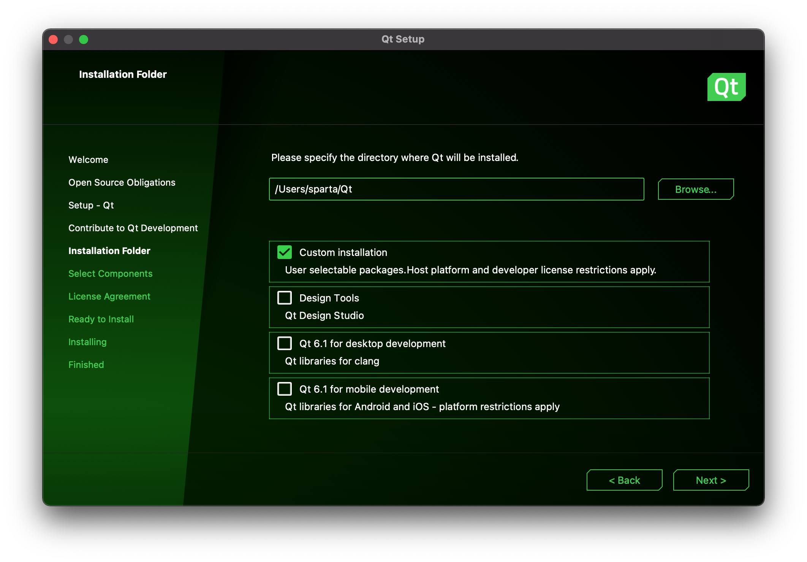
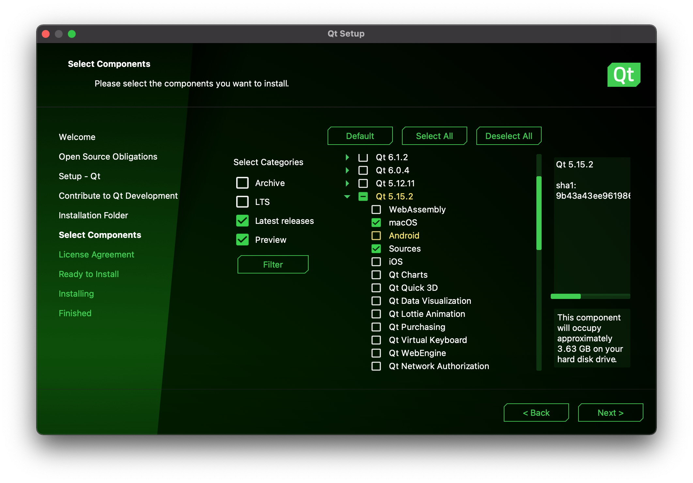
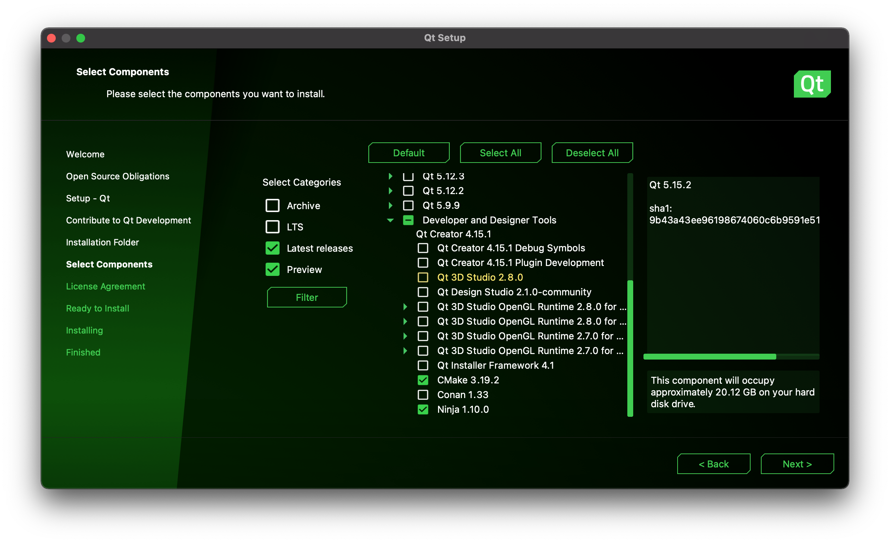

```bash
> ~/c/e/01_base_app_trimesh on master ⨯ ~/Qt/5.15.2/clang_64/bin/qmake CONFIG+=skd_no_version_check .
> make -j4

error: member initializer 'QGLWidget' does not name a non-static data member or base class

GLcanvas::GLcanvas(QWidget *parent) : QGLWidget(parent)
                                      ^~~~~~~~~~~~~~~~~
```

### *2021-07-17*

Suspicous I am lacking GL code.  

* From Marco Livesu's [note](http://www.informit.com/articles/article.aspx?p=1405557&seqNum=2) on [line 111](https://github.com/mlivesu/cinolib/blob/e88d8bec10ca2210d920fbc042b56333dcd0c4a4/include/cinolib/gui/qt/glcanvas.cpp#L111) of `GLCanvas::initializeGL`, seems we are mixing both `QPainter` and native GL.  
* The `GLCanvas` that inherits from `QGLCanvas` is must be lacking a non-static data member or base class.  
* The installation record shows no check marks by the `Qt 3D Studio OpenGL Runtime...`
* Try clean uninstall and then reinstall.  Appears the Qt 3D Studio is available only for version 5.15.1 but not 5.15.2.
  * From `/Users/sparta/Qt/` launch the `MaintenanceTool.app`, select `Uninstall only`.  Confirmed once uninstalled finished, the `/Users/sparta/Qt` folder is non-existent

Finally, success with `01_base_app_trimesh.pro` on `/Users/sparta/cinolib/examples/01_base_app_trimesh/`.

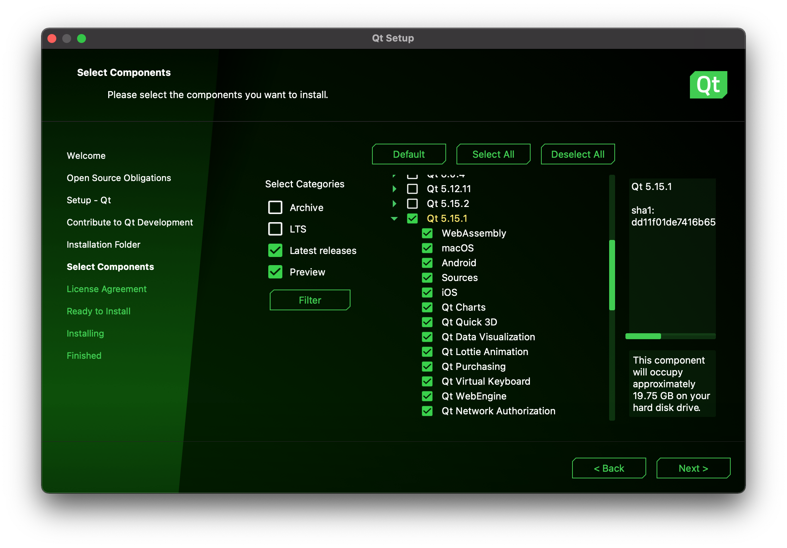
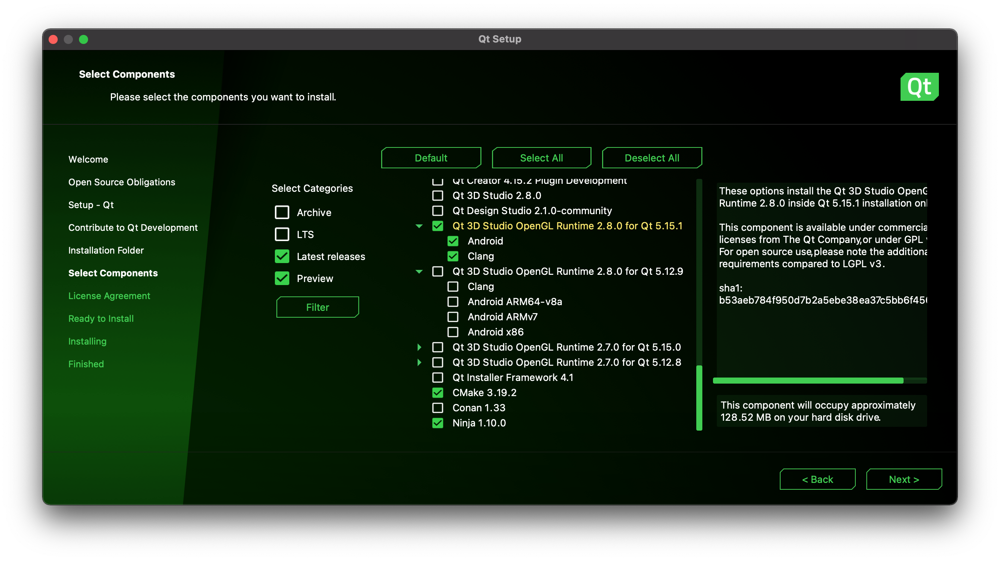
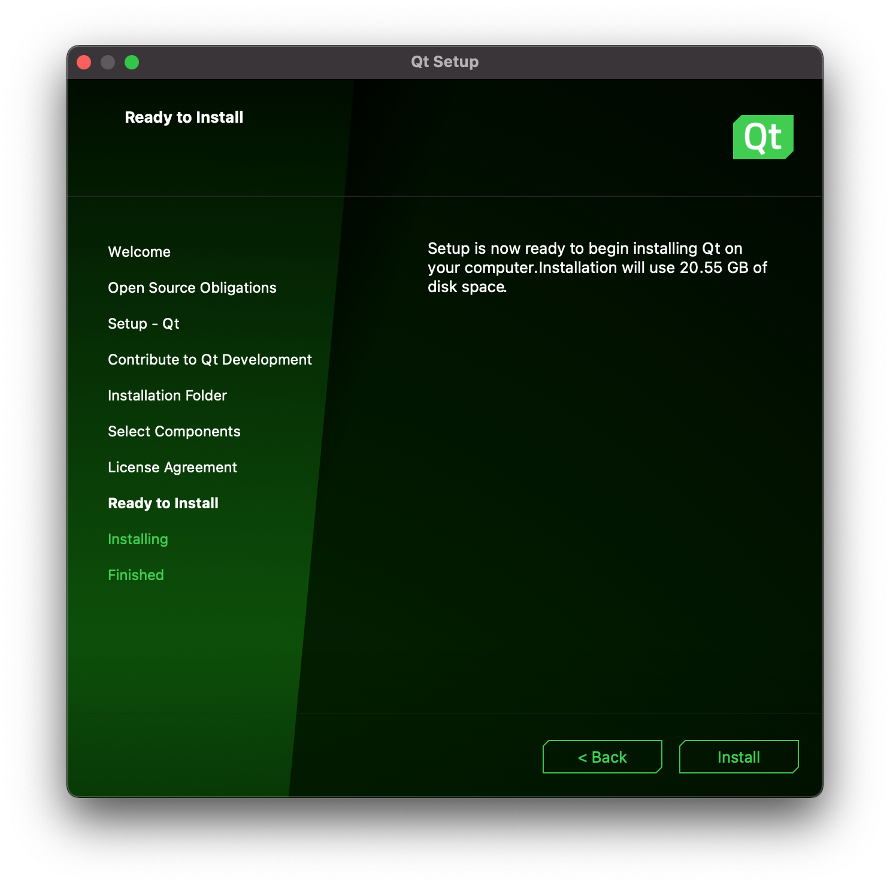
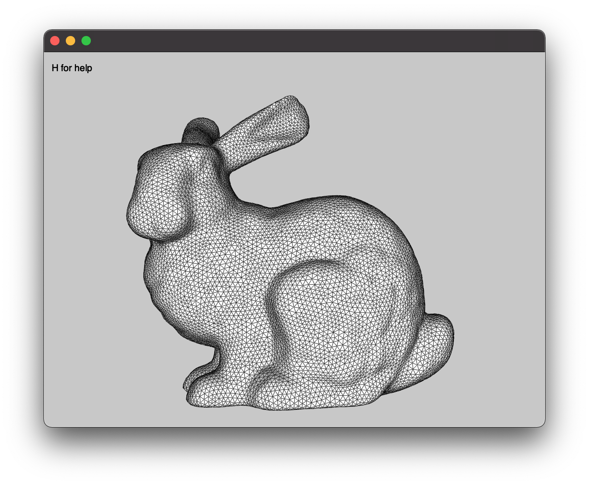
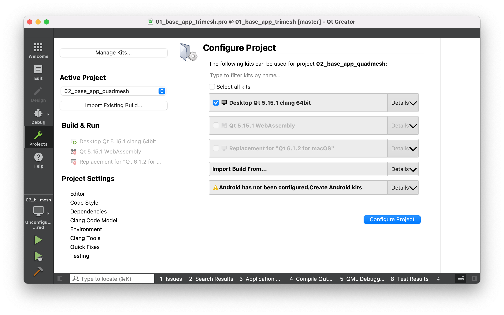
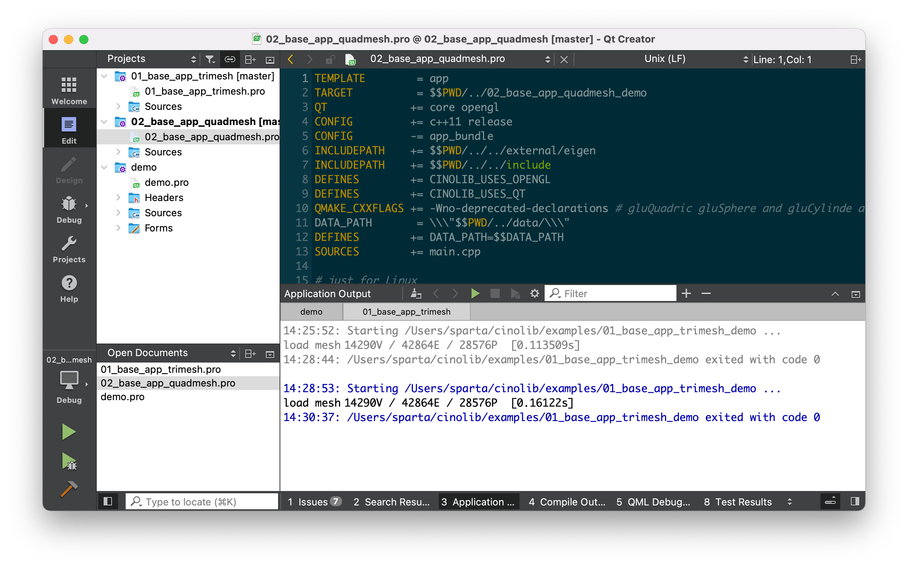
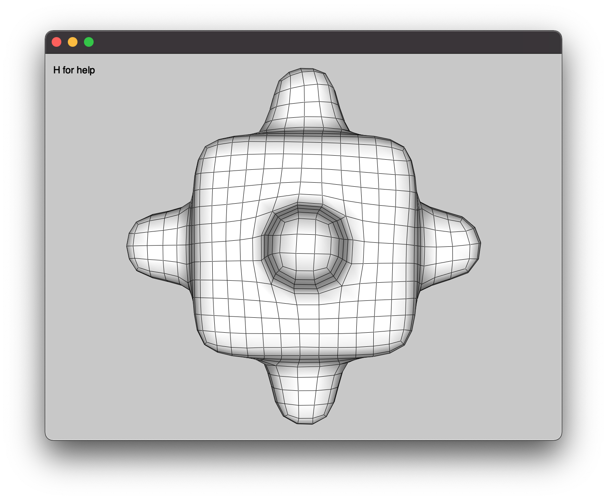
