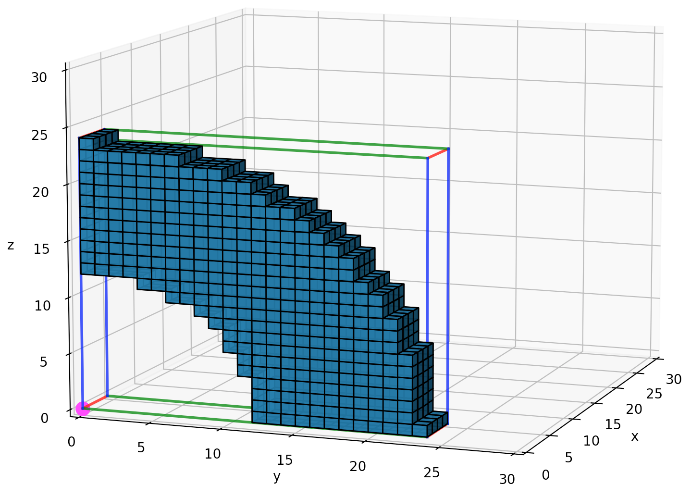

# unit test - femur

## Title

Demonstration of the Pixel To Geometry (PTG) workflow through 3D reconstruction of the right, normal human femur, AM50. 

## Introduction

## Objective

## Methods

### Data

* 
* > [Figure](fig/qtr_cyl_ir3_or6_pixperlen1.png): Quarter cylinder, H=1 len, IR=3 len, OR=6 len, pix/len = 1.

* 
* > [Figure](fig/qtr_cyl_ir3_or6_pixperlen2.png): Quarter cylinder, H=1 len, IR=3 len, OR=6 len, pix/len = 2.

* 
* > [Figure](fig/qtr_cyl_ir3_or6_pixperlen3.png): Quarter cylinder, H=1 len, IR=3 len, OR=6 len, pix/len = 3.

* 
* > [Figure](fig/qtr_cyl_ir3_or6_pixperlen4.png): Quarter cylinder, H=1 len, IR=3 len, OR=6 len, pix/len = 4.

### Workflow

## Results

To come.

## Discussion

## Conclusion

To come.

## Appendix

## References

* Digital Morphology [Digimorph](http://www.digimorph.org/)
* [OsiriX DICOM Viewer](https://www.osirix-viewer.com/)
* [OsiriX Foundation](https://www.osirixfoundation.com/)
* [OsiriX Open Source](https://github.com/pixmeo/osirix)
* [Slicer](https://github.com/Slicer)
* SlicerMorph [GitHub](https://github.com/SlicerMorph/) and [website](https://slicermorph.github.io/)
