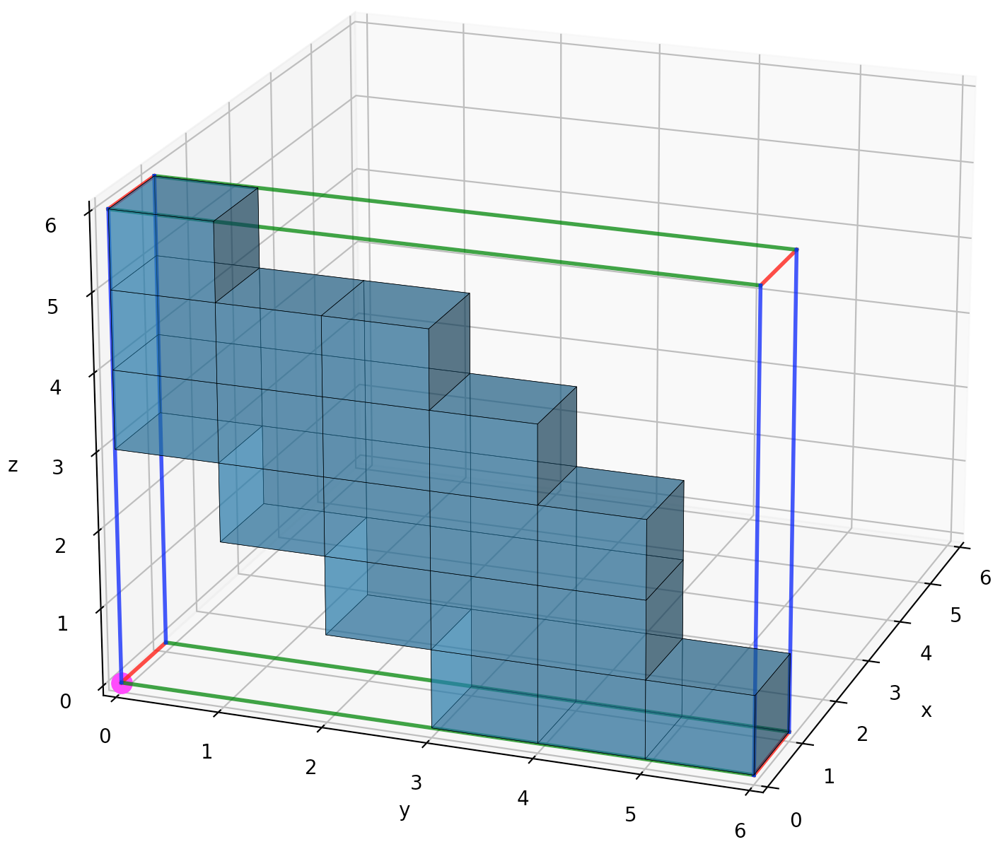
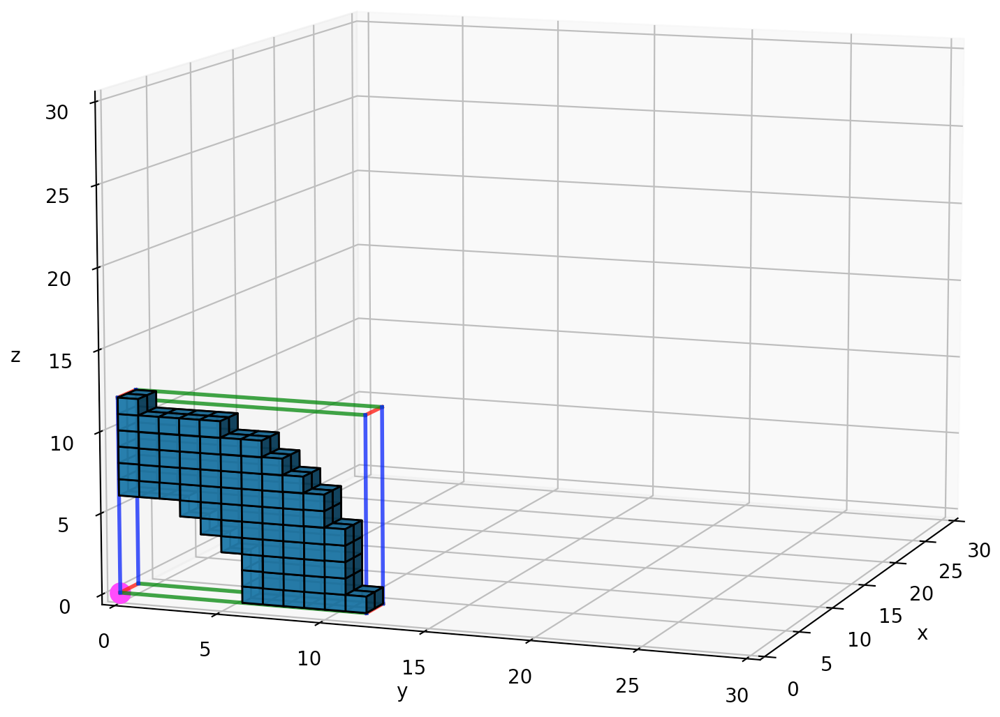
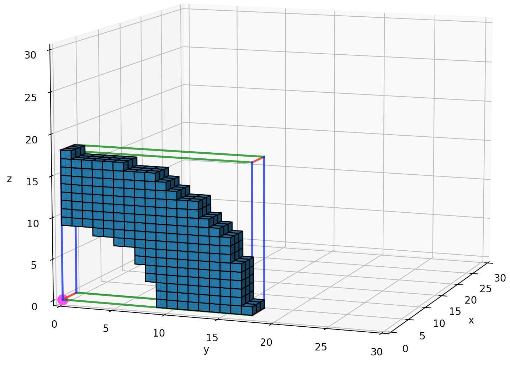
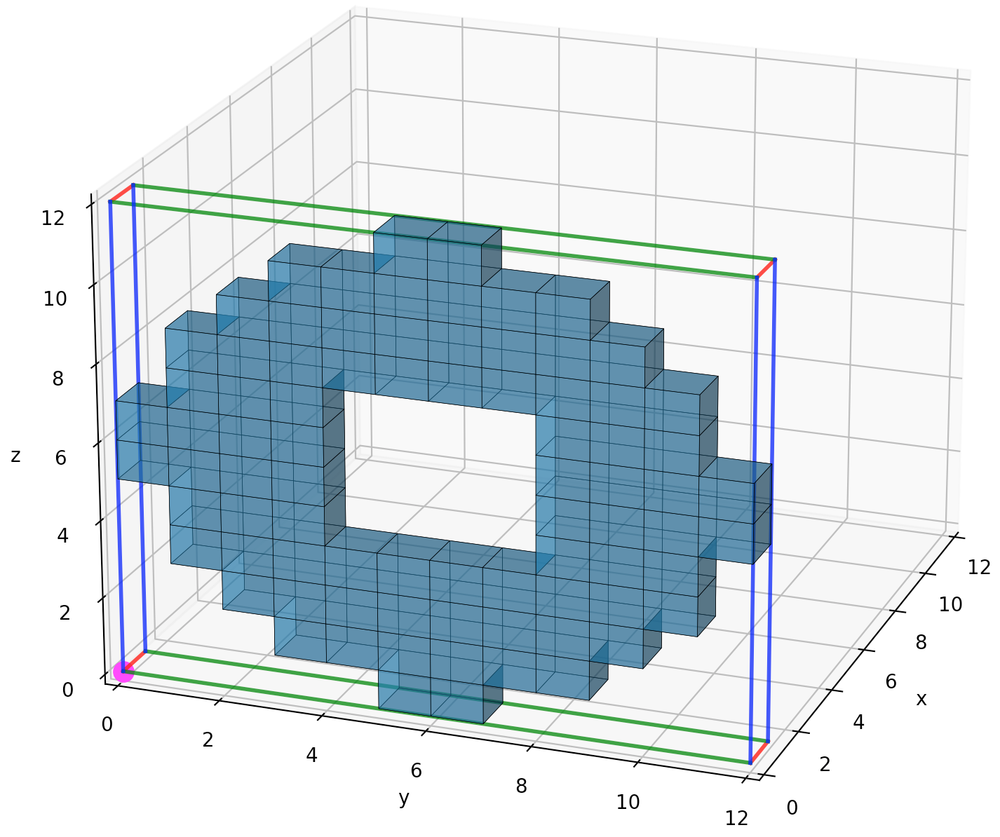
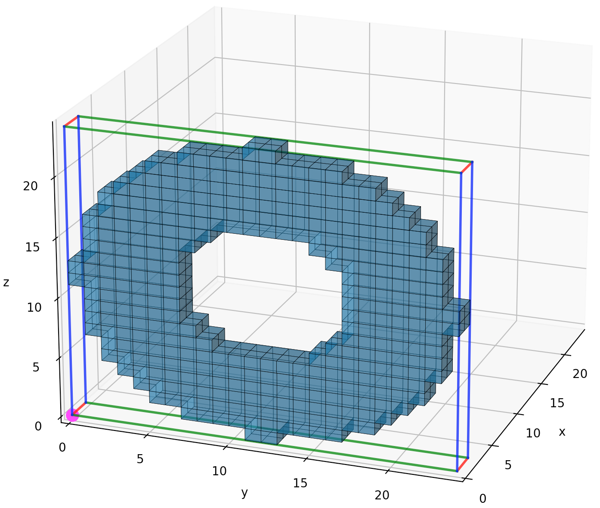
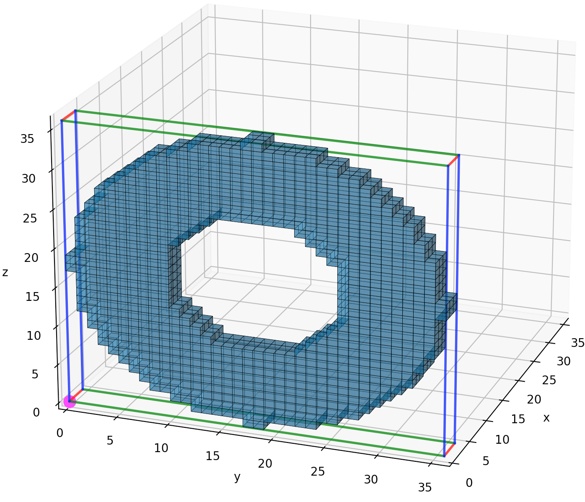

# unit test - femur

## Title

Demonstration of the Pixel To Geometry (PTG) workflow through 3D reconstruction of the right, normal human femur, AM50. 

## Introduction

## Objective

## Methods

* numpy-stl on [pypi](https://pypi.org/project/numpy-stl/) and on [GitLab](https://github.com/WoLpH/numpy-stl).

### Data

The client driver file, [pixel_to_mesh_example.py](../examples/pixel_to_mesh_example.py), created the following pixel shapes:

* 
* > [Figure](fig/qtr_cyl_ir3_or6_pixperlen1.png): Quarter cylinder, H=1 len, IR=3 len, OR=6 len, pix/len = 1.

* 
* > [Figure](fig/qtr_cyl_ir3_or6_pixperlen2.png): Quarter cylinder, H=1 len, IR=3 len, OR=6 len, pix/len = 2.

* 
* > [Figure](fig/qtr_cyl_ir3_or6_pixperlen3.png): Quarter cylinder, H=1 len, IR=3 len, OR=6 len, pix/len = 3.

* 
* > [Figure](fig/cyl_ir3_or6_pixperlen1.png): Cylinder, H=1 len, ID=6 len, OD=12 len, pix/len = 1.

* 
* > [Figure](fig/cyl_ir3_or6_pixperlen2.png): Cylinder, H=1 len, ID=6 len, OD=12 len, pix/len = 2.

* 
* > [Figure](fig/cyl_ir3_or6_pixperlen3.png): Cylinder, H=1 len, ID=6 len, OD=12 len, pix/len = 3.

### Workflow

## Results

## Discussion

## Conclusion

## Appendix

## References

* Bauer, Eric.  [Human femur](https://sketchfab.com/3d-models/human-femur-a9c1f1a88b104c3fbfe975fa10b31b31) available in three formats, Stereolithography (stl), Generated GLTF (gltf), Generated USDZ (usdz), 165 MB, 3.5M triangles, 1.7M vertices, materials 1, ["Human Femur"](https://skfb.ly/6ursH) by Eric Bauer is licensed under [Creative Commons Attribution](http://creativecommons.org/licenses/by/4.0/), 10 Nov 2019.  [Elon University](https://www.elon.edu/u/directory/profile/?user=ebauer).
* Digital Morphology [Digimorph](http://www.digimorph.org/)
* [OsiriX DICOM Viewer](https://www.osirix-viewer.com/)
* [OsiriX Foundation](https://www.osirixfoundation.com/)
* [OsiriX Open Source](https://github.com/pixmeo/osirix)
* [Slicer](https://github.com/Slicer)
* SlicerMorph [GitHub](https://github.com/SlicerMorph/) and [website](https://slicermorph.github.io/)
* Soodmand 2018.  (Correspondence: ehsan.soodmand@gmail.com, Biomechanics and Implant Technology Research Laboratory, Department of Orthopaedics, University Medicine Rostock, Doberaner Strasse 142, 18057 Rostock, Germany, https://forbiomit.med.uni-rostock.de/en/about-us/staff)
  * Soodmand E, Kluess D, Varady PA, Cichon R, Schwarze M, Gehweiler D, Niemeyer F, Pahr D, Woiczinski M. Interlaboratory comparison of femur surface reconstruction from CT data compared to reference optical 3D scan. Biomedical engineering online. 2018 Dec;17(1):1-0.
  * [Link](https://biomedical-engineering-online.biomedcentral.com/articles/10.1186/s12938-018-0461-0)
