# unit test PTM

## pixel sea (stacked layers)

> *DICOM*

## masks (stacked layers)

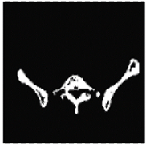
> *Deep Learning U-Net*

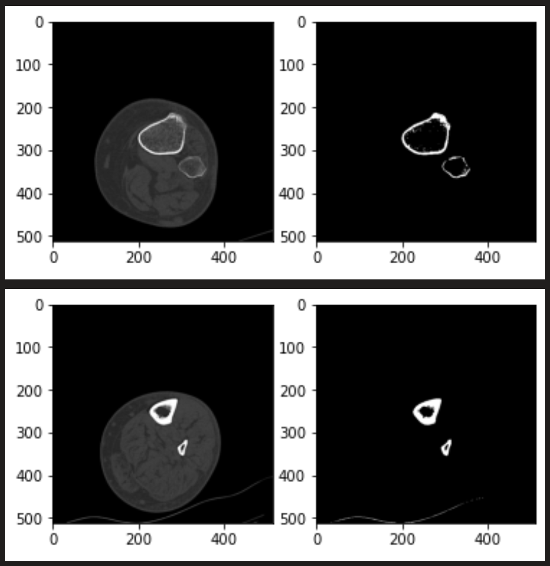
> *Thresholding example, tibia and fibula.*

## halos (outer and inner curvature)

### Active Contour Model ("snakes") 
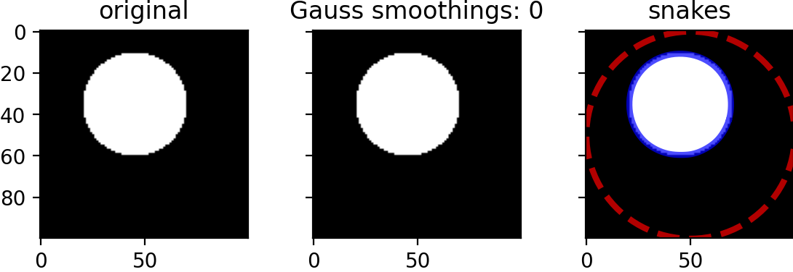
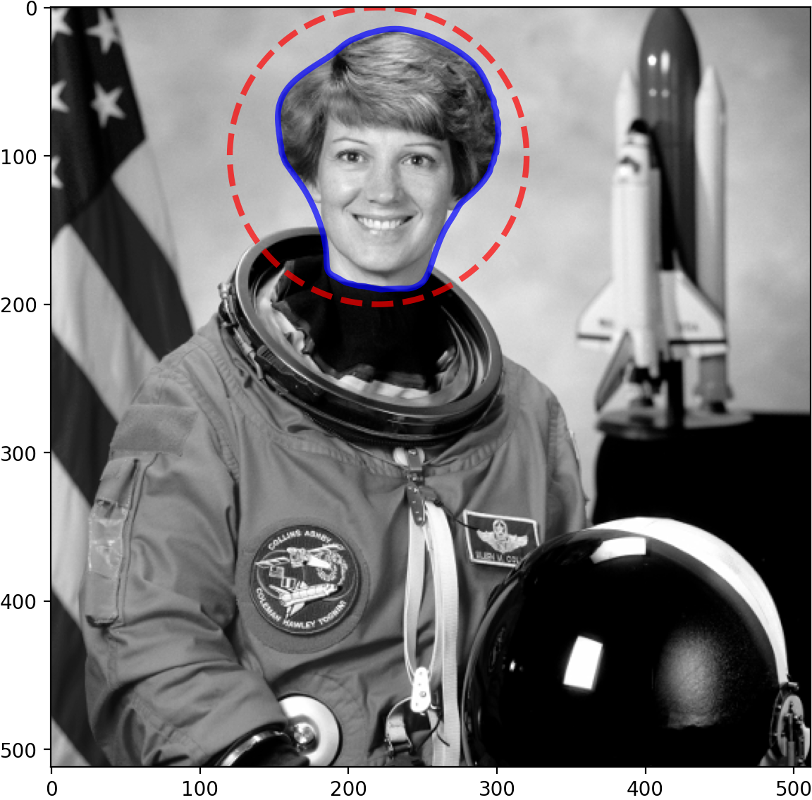

> *Active Contour Model ("snakes")*

## Quadrant disection

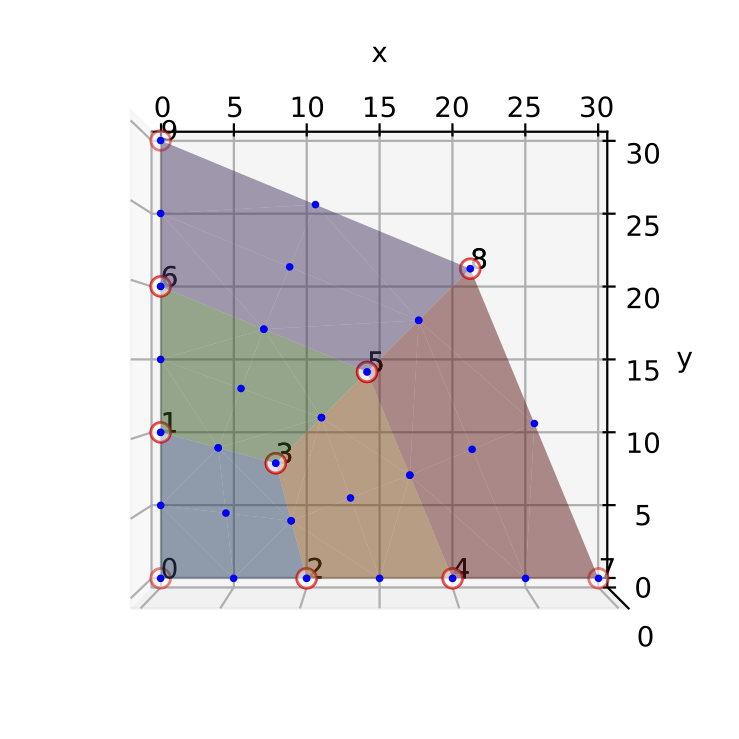 
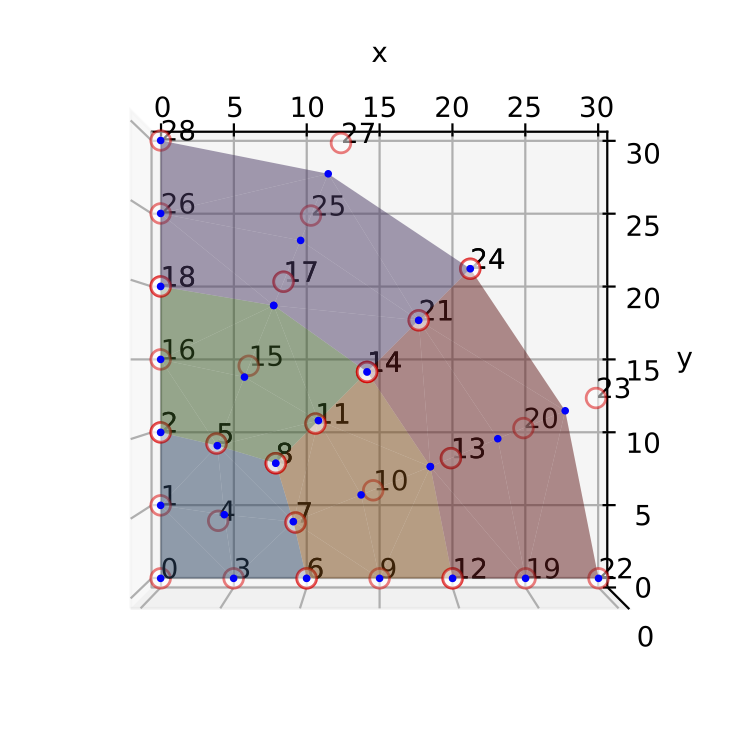
_1_2.png)

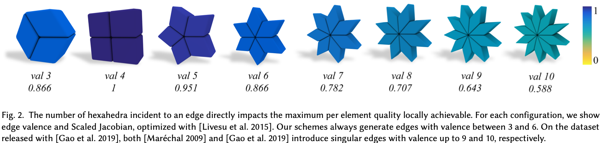
> *Livesu 2021: Optimal Dual Schemes for Adaptive Grid Based Hexmeshing*

## Curvature Mapping

## Hex Mesh End Cap

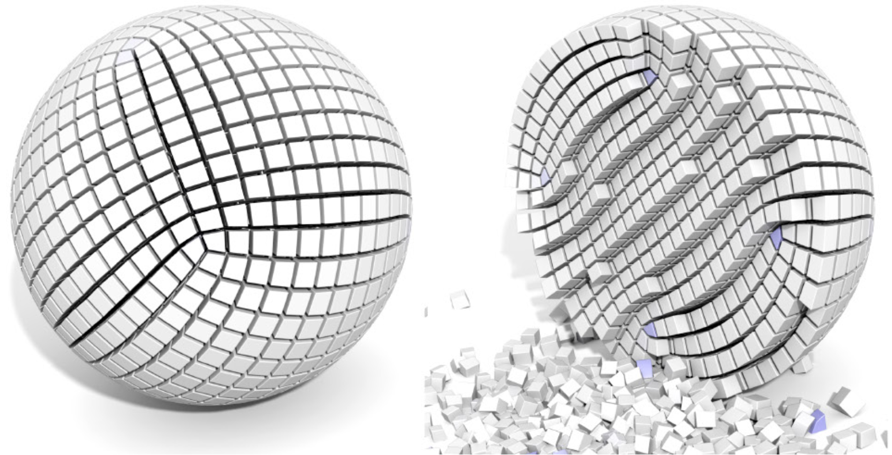
> *Corman and Crane 2019: Symmetric Moving Frames*

## Skeletonize, Stack, Mesh

`pixels -> trisurface`

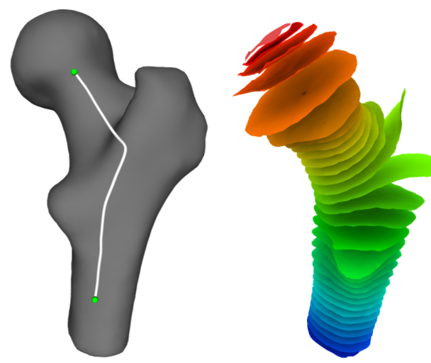

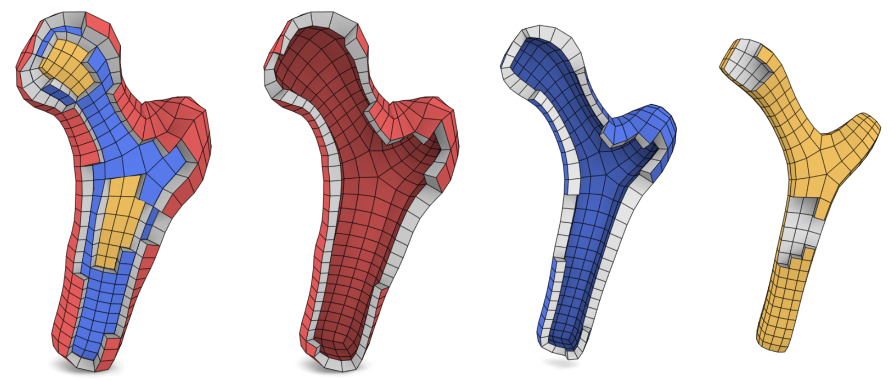

> *Livesu 2017: Explicit Cylindrical Maps for General Tubular Shapes*

## *Alternative*

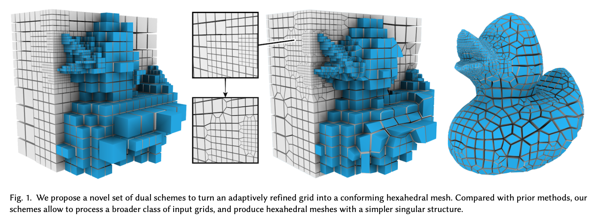
> *Livesu 2021: Optimal Dual Schemes for Adaptive Grid Based Hexmeshing*
