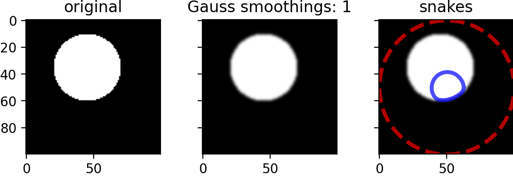
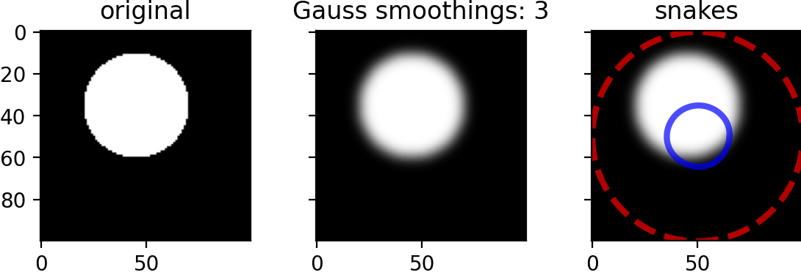

# Snakes

* Also known as the Active Contour Model
* Scikit-image [reference](https://scikit-image.org/docs/stable/auto_examples/edges/plot_active_contours.html#sphx-glr-auto-examples-edges-plot-active-contours-py)

## Pixel -> Halo

2021-06-14. Given a 2D slice of a medical image, find the halo, a closed loop of the external surface, e.g., exterior boundary of a slice of a femur on CT.

* `pixel -> snake -> halo_p1`
* `halo_p1 -> halo_p2`

where `halo_p1` is a periodic modified linear Bezier halo and `halo_p2` is a periodic modified quadratic Bezier halo.

## Unit Test

* From [`snakes_baseline.py`](snakes_baseline.py)
    * Using default values ` snake = active_contour(img_smoothed, init)`
    * which are explicitly 
    
```bash
`def active_contour(image, snake, alpha=0.01, beta=0.1,
                   w_line=0, w_edge=1, gamma=0.01,
                   max_px_move=1.0,
                   max_iterations=2500, convergence=0.1,
                   *,
                   boundary_condition='periodic',
                   coordinates='rc'):
```






## Baseline reproduction

