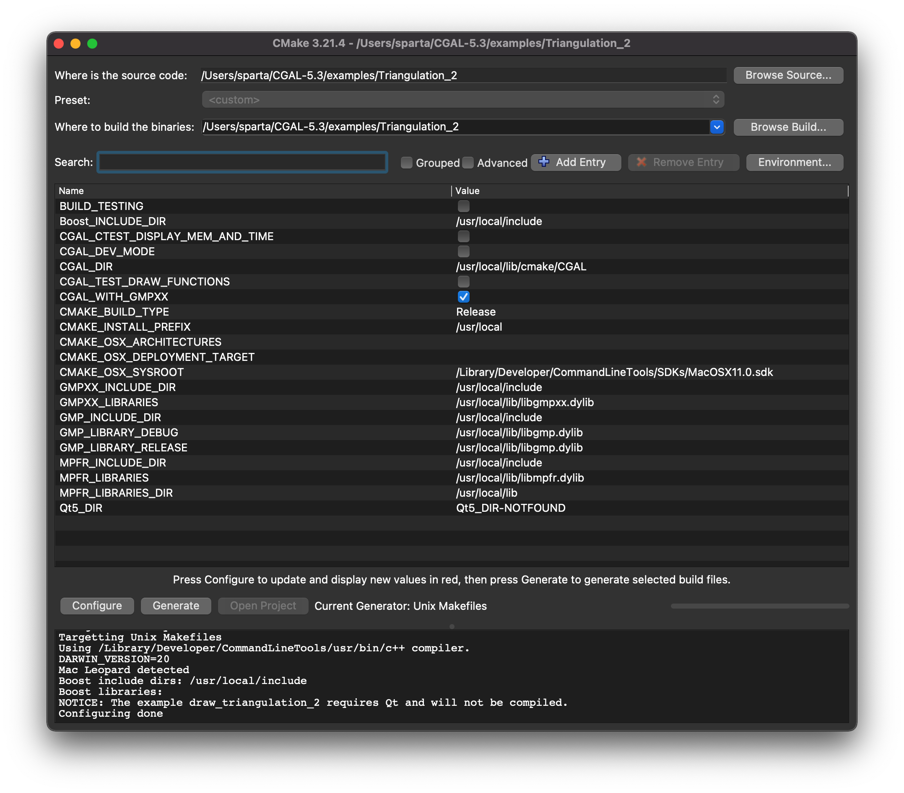

# Smallshire Tutorial

## Goals

* [CGAL](https://www.cgal.org) Computational Geometry Algorithms Library
* wrap *conforming and constrained triangulations*

```python
# import outer_Python_module.inner_Python_module_in_C++
import mesher.cgal_mesher  
```

## Workflow Overview

* into 2D domain, insert vertex as (x, y) point pair
* a constraint is a straight edge between two points, chained to create a closed loop
* rule: no triangulation can cross a constraint edge
* mesher: wraps around a triangulation, and understands seed points
* seeds allow control of include or exclude certain triangles in the triangulations
* conform to the 
  * Delaunay property by inserting new vertices
  * Gabriel property by inserting new vertices
  * mesh refinement minimum angle constrain and maximum edge length
  * Lloyd optimization

## Folder structure

```bash
mesher  # project
|-- examples
|   |-- triangulate.py  # example program
|-- lib  # third-party libraries
|   |-- pybind11  # pybind11 to define bindings
|   |   |-- include
|   |       |-- pybind11
|   |           |-- pybind11.h
|   |-- cgal  # the library being wrapped
|       |-- include
|           |-- CGAL
|               |-- Constrained_Delaunay_triangulation_2.h
|-- src
|   |-- mesher  # outer Python package
|   |   |-- __init__.py
|   |   |-- cgal_mesher.cpp  # inner Python module in C++
|   |-- tests-cpp  # C++ tests, e.g., Catch
|-- tests-python  # Python tests, e.g., py.test
|-- CMakeLists.txt  # C++ build with CMake
|-- setup.py  # Python packaging with setuptools
```

## Prerequisites

* VS Code extension: [CMake Tools](https://marketplace.visualstudio.com/items?itemName=ms-vscode.cmake-tools) by Microsoft, Extend CMake support in Visual Studio Code
* CMake [installation](https://cmake.org/install/)
  * Linux, macOS, and Windows pre-compiled [binaries](https://cmake.org/download/)
  * copy `CMake.app` into the `/Aplications` folder, then run it and follow the Tool mesh item "How to Install for Command Link Use", which makes `cmake` available in the `PATH`.
    * macOS: `cmake-3.21.4-macos-universal.dmg`
    * `PATH="/Applications/CMake.app/Contents/bin":"$PATH"` in `~/.bash_profile`
    * Alternative: manually add the install directory, `/Applications/CMake.app/Contents/bin` to the PATH
    * Alternative to pre-compiled binaries is to download the CMake source and build CMake.
* CGAL library [binaries](https://www.cgal.org/download.html)
  * Since version 5.0, CGAL is a header-only library by default, which means there is no need to build CGAL prior to its use.  However, some CGAL dependencies must still be installed.
  * `> brew install cgal` on macOS version 5.3
    * installs to `/usr/local/lib/cmake/CGAL`
  * cgal documentation on [installation](https://doc.cgal.org/latest/Manual/usage.html)
  * `> brew cleanup`
  * `sudo chown -R $(whoami):admin /usr/local/* && sudo chmod -R g+rwx /usr/local/*`
* CGAL has the following prequisites
  * a supported [compiler](https://doc.cgal.org/latest/Manual/thirdparty.html#seccompilers)
    * *to build a program with CGAL, C++14 or later is required; CGAL 5.3 is continuously tested on the following OS/compiler combinations*
      * Linux
        * gnu g++ 8.3 or later
        * clang compiler version 11.1.0
      * Mac
        * gnu g++ 8.3 or later
        * Apple clang compiler versions 10.0.1 and 12.0.0
      * Windows
        * gnu g++ 8.3 or later
        * MS Visual C++ 14.0, 15.9, 16.10 (Visual Studio 2015, 2017, 2019)
 * CMake
 * Boost
 * GNU Multiple Precision Arithmetic (GMP) and GNU Multiple Precision Floating-Point Reliably (MPFR) Libraries
   * https://gmplib.org/

#### GMP

Download `gmp-6.2.1.tar.xz` and unzip to `~/Downloads/gmp-6.2.1`

```bash
> cd ~/Downloads/gmp-6.2.1
> ./configure
...
configure: summary of build options:

  Version:           GNU MP 6.2.1
  Host type:         haswell-apple-darwin20.6.0
  ABI:               64
  Install prefix:    /usr/local
  Compiler:          gcc
  Static libraries:  yes
  Shared libraries:  yes
```

Run self-tests

```bash
make check
```

Install to default location of `/usr/local`

```bash
make install
...
/Library/Developer/CommandLineTools/usr/bin/ranlib: file: /usr/local/lib/libgmp.a(repl-vsnprintf.o) has no symbols
 ./install-sh -c -d '/usr/local/include'
 /usr/bin/install -c -m 644 gmp.h '/usr/local/include'
 ./install-sh -c -d '/usr/local/lib/pkgconfig'
 /usr/bin/install -c -m 644 gmp.pc '/usr/local/lib/pkgconfig'
/Library/Developer/CommandLineTools/usr/bin/make  install-data-hook

> make check
```

### brew updates

```bash
[sparta ~]$ brew doctor
Please note that these warnings are just used to help the Homebrew maintainers
with debugging if you file an issue. If everything you use Homebrew for is
working fine: please do not worry or file an issue; just ignore this. Thanks!

Warning: Your Command Line Tools are too outdated.
Update them from Software Update in System Preferences or run:
  softwareupdate --all --install --force

If that does not show you any updates, run:
  sudo rm -rf /Library/Developer/CommandLineTools
  sudo xcode-select --install

Alternatively, manually download them from:
  https://developer.apple.com/download/all/.
You should download the Command Line Tools for Xcode 13.0.
```

```bash
> softwareupdate --all --install --force
Finding available software
Downloading macOS Big Sur 11.6.1
```

### cgal quickstart

Following the [quickstart](https://doc.cgal.org/latest/Manual/usage.html#secgettingcgal), download the examples [here](https://github.com/CGAL/cgal/releases/download/v5.3/CGAL-5.3-examples.tar.xz), then extract and move to `$HOME`, then

```bash
> cd $HOME/CGAL-5.3/examples/Triangulation_2 # go to an example directory

> cmake -DCMAKE_BUILD_TYPE=Release . # configure the examples
-- The C compiler identification is AppleClang 12.0.0.12000032
-- The CXX compiler identification is AppleClang 12.0.0.12000032
-- Detecting C compiler ABI info
-- Detecting C compiler ABI info - done
-- Check for working C compiler: /Library/Developer/CommandLineTools/usr/bin/cc - skipped
-- Detecting C compile features
-- Detecting C compile features - done
-- Detecting CXX compiler ABI info
-- Detecting CXX compiler ABI info - done
-- Check for working CXX compiler: /Library/Developer/CommandLineTools/usr/bin/c++ - skipped
-- Detecting CXX compile features
-- Detecting CXX compile features - done
-- Using header-only CGAL
-- Targetting Unix Makefiles
-- Using /Library/Developer/CommandLineTools/usr/bin/c++ compiler.
-- DARWIN_VERSION=20
-- Mac Leopard detected
-- Found GMP: /usr/local/lib/libgmp.dylib
-- Found MPFR: /usr/local/lib/libmpfr.dylib
-- Found Boost: /usr/local/lib/cmake/Boost-1.76.0/BoostConfig.cmake (found suitable version "1.76.0", minimum required is "1.48")
-- Boost include dirs: /usr/local/include
-- Boost libraries:
-- NOTICE: The example draw_triangulation_2 requires Qt and will not be compiled.
-- Configuring done
-- Generating done
-- Build files have been written to: /Users/sparta/CGAL-5.3/examples/Triangulation_2

> make # build the examples
> ~/C/e/Triangulation_2 make                                           (siblenv) 1561ms  Sat Oct 30 13:40:56 2021
[  2%] Building CXX object CMakeFiles/triangulation_prog1.dir/triangulation_prog1.cpp.o
[  4%] Linking CXX executable triangulation_prog1
[  4%] Built target triangulation_prog1
[  6%] Building CXX object CMakeFiles/terrain_with_info.dir/terrain_with_info.cpp.o
[  8%] Linking CXX executable terrain_with_info
[  8%] Built target terrain_with_info
[ 10%] Building CXX object CMakeFiles/regular.dir/regular.cpp.o
[ 12%] Linking CXX executable regular
[ 12%] Built target regular
[ 14%] Building CXX object CMakeFiles/polygon_triangulation.dir/polygon_triangulation.cpp.o
[ 16%] Linking CXX executable polygon_triangulation
[ 16%] Built target polygon_triangulation
[ 18%] Building CXX object CMakeFiles/low_dimensional.dir/low_dimensional.cpp.o
[ 20%] Linking CXX executable low_dimensional
[ 20%] Built target low_dimensional
[ 22%] Building CXX object CMakeFiles/polylines_triangulation.dir/polylines_triangulation.cpp.o
[ 25%] Linking CXX executable polylines_triangulation
[ 25%] Built target polylines_triangulation
[ 27%] Building CXX object CMakeFiles/info_insert_with_transform_iterator_2.dir/info_insert_with_transform_iterator_2.cpp.o
[ 29%] Linking CXX executable info_insert_with_transform_iterator_2
[ 29%] Built target info_insert_with_transform_iterator_2
[ 31%] Building CXX object CMakeFiles/info_insert_with_pair_iterator_regular_2.dir/info_insert_with_pair_iterator_regular_2.cpp.o
[ 33%] Linking CXX executable info_insert_with_pair_iterator_regular_2
[ 33%] Built target info_insert_with_pair_iterator_regular_2
[ 35%] Building CXX object CMakeFiles/info_insert_with_pair_iterator_2.dir/info_insert_with_pair_iterator_2.cpp.o
[ 37%] Linking CXX executable info_insert_with_pair_iterator_2
[ 37%] Built target info_insert_with_pair_iterator_2
[ 39%] Building CXX object CMakeFiles/info_insert_with_zip_iterator_2.dir/info_insert_with_zip_iterator_2.cpp.o
[ 41%] Linking CXX executable info_insert_with_zip_iterator_2
[ 41%] Built target info_insert_with_zip_iterator_2
[ 43%] Building CXX object CMakeFiles/for_loop_2.dir/for_loop_2.cpp.o
[ 45%] Linking CXX executable for_loop_2
[ 45%] Built target for_loop_2
[ 47%] Building CXX object CMakeFiles/copy_triangulation_2.dir/copy_triangulation_2.cpp.o
[ 50%] Linking CXX executable copy_triangulation_2
[ 50%] Built target copy_triangulation_2
[ 52%] Building CXX object CMakeFiles/draw_triangulation_2.dir/draw_triangulation_2.cpp.o
[ 54%] Linking CXX executable draw_triangulation_2
[ 54%] Built target draw_triangulation_2
[ 56%] Building CXX object CMakeFiles/terr_trian.dir/terr_trian.cpp.o
[ 58%] Linking CXX executable terr_trian
[ 58%] Built target terr_trian
[ 60%] Building CXX object CMakeFiles/hierarchy.dir/hierarchy.cpp.o
[ 62%] Linking CXX executable hierarchy
[ 62%] Built target hierarchy
[ 64%] Building CXX object CMakeFiles/constrained_plus.dir/constrained_plus.cpp.o
[ 66%] Linking CXX executable constrained_plus
[ 66%] Built target constrained_plus
[ 68%] Building CXX object CMakeFiles/constrained_hierarchy_plus.dir/constrained_hierarchy_plus.cpp.o
[ 70%] Linking CXX executable constrained_hierarchy_plus
[ 70%] Built target constrained_hierarchy_plus
[ 72%] Building CXX object CMakeFiles/adding_handles.dir/adding_handles.cpp.o
[ 75%] Linking CXX executable adding_handles
[ 75%] Built target adding_handles
[ 77%] Building CXX object CMakeFiles/segment_soup_to_polylines.dir/segment_soup_to_polylines.cpp.o
[ 79%] Linking CXX executable segment_soup_to_polylines
[ 79%] Built target segment_soup_to_polylines
[ 81%] Building CXX object CMakeFiles/print_cropped_voronoi.dir/print_cropped_voronoi.cpp.o
[ 83%] Linking CXX executable print_cropped_voronoi
[ 83%] Built target print_cropped_voronoi
[ 85%] Building CXX object CMakeFiles/voronoi.dir/voronoi.cpp.o
[ 87%] Linking CXX executable voronoi
[ 87%] Built target voronoi
[ 89%] Building CXX object CMakeFiles/constrained.dir/constrained.cpp.o
[ 91%] Linking CXX executable constrained
[ 91%] Built target constrained
[ 93%] Building CXX object CMakeFiles/terrain.dir/terrain.cpp.o
[ 95%] Linking CXX executable terrain
[ 95%] Built target terrain
[ 97%] Building CXX object CMakeFiles/colored_face.dir/colored_face.cpp.o
[100%] Linking CXX executable colored_face
[100%] Built target colored_face
⋊> ~/C/e/Triangulation_2
```

```bash
⋊> ~/C/e/Triangulation_2 pwd                                      (siblenv)  Sun Oct 31 07:36:17 2021
/Users/sparta/CGAL-5.3/examples/Triangulation_2
⋊> ~/C/e/Triangulation_2 cmake-gui .
```



### Download CGAL for macOS

* CGAL GitHub reference: https://github.com/CGAL/cgal/
* package manager (tried that above, but not finding GMP)
* with source archive

#### Source Archive

* ref: https://github.com/CGAL/cgal/releases
* CGAL-5.3 released 2021-06-06
* installation ref: https://doc.cgal.org/latest/Manual/usage.html
  * tried 1: quick start with 2: prerequisites
    * `>cd ~; rm -rf CGAL-5.3` and start fresh
  * now try 3: "Using CGAL Source Archive"
    * download `CGAL-5.3.tar.xz` (22.2 MB) from [here](https://www.cgal.org/download.html) and unpack `>tar xf CGAL-5.3.tar.xz`
    * move the `CGAL-5.3` folder from `Downloads` to `~`
    * creates a `CGAL-5.3` directory as follows:

|Directory | Contents |
|---|---|
| auxiliary (Windows only) | precompiled GMP and MPFR for Windows
| cmake/modules | modules for finding and using libraries
| demo |demo programs (most of them need Qt, geomview or other third-party products)
| doc_html | documentation (HTML)
| examples | example programs
| include | header files
| scripts | some useful scripts (e.g. for creating CMakeLists.txt files)
| src | source files auxiliary (Windows only) | precompiled GMP and MPFR for Windows
| cmake/modules | modules for finding and using libraries
| demo | demo programs (most of them need Qt, geomview or other third-party products)
| doc_html | documentation (HTML)
| examples | example programs
| include | header files
| scripts | some useful scripts (e.g. for creating CMakeLists.txt files)
| src | source files 

```bash
> cd ~/CGAL-5.3/
> cmake .

⋊> ~/CGAL-5.3 cmake .                                      (siblenv) 26.8s  Sun Oct 31 08:23:59 2021
== Setting paths ==
-- Build CGAL from release in directory CGAL-5.3
-- Packagenames: CGAL-5.3
== Setting paths (DONE) ==

== Generate version files ==
-- CGAL_MAJOR_VERSION=5
-- CGAL_MINOR_VERSION=3
-- CGAL_BUGFIX_VERSION=0
-- Targetting Unix Makefiles
-- Using /Library/Developer/CommandLineTools/usr/bin/c++ compiler.
-- DARWIN_VERSION=20
-- Mac Leopard detected
-- USING CMake version: 3.21.4
-- System: Darwin
== Generate version files (DONE) ==

-- Build type:
-- USING CXXFLAGS = ' '
-- USING EXEFLAGS = ' '
== Detect external libraries ==
== Detect external libraries (DONE) ==

== Generating build files ==
== Generating build files (DONE) ==

CMake Warning at cmake/modules/CGAL_enable_end_of_configuration_hook.cmake:99 (message):
  =======================================================================

  CGAL performance notice:

  The variable CMAKE_BUILD_TYPE is set to "".  For performance reasons, you
  should set CMAKE_BUILD_TYPE to "Release".

  Set CGAL_DO_NOT_WARN_ABOUT_CMAKE_BUILD_TYPE to TRUE if you want to disable
  this warning.

  =======================================================================
Call Stack (most recent call first):
  CMakeLists.txt:9223372036854775807 (CGAL_run_at_the_end_of_configuration)


-- Configuring done
-- Generating done
-- Build files have been written to: /Users/sparta/CGAL-5.3
```

```bash
> make install
```