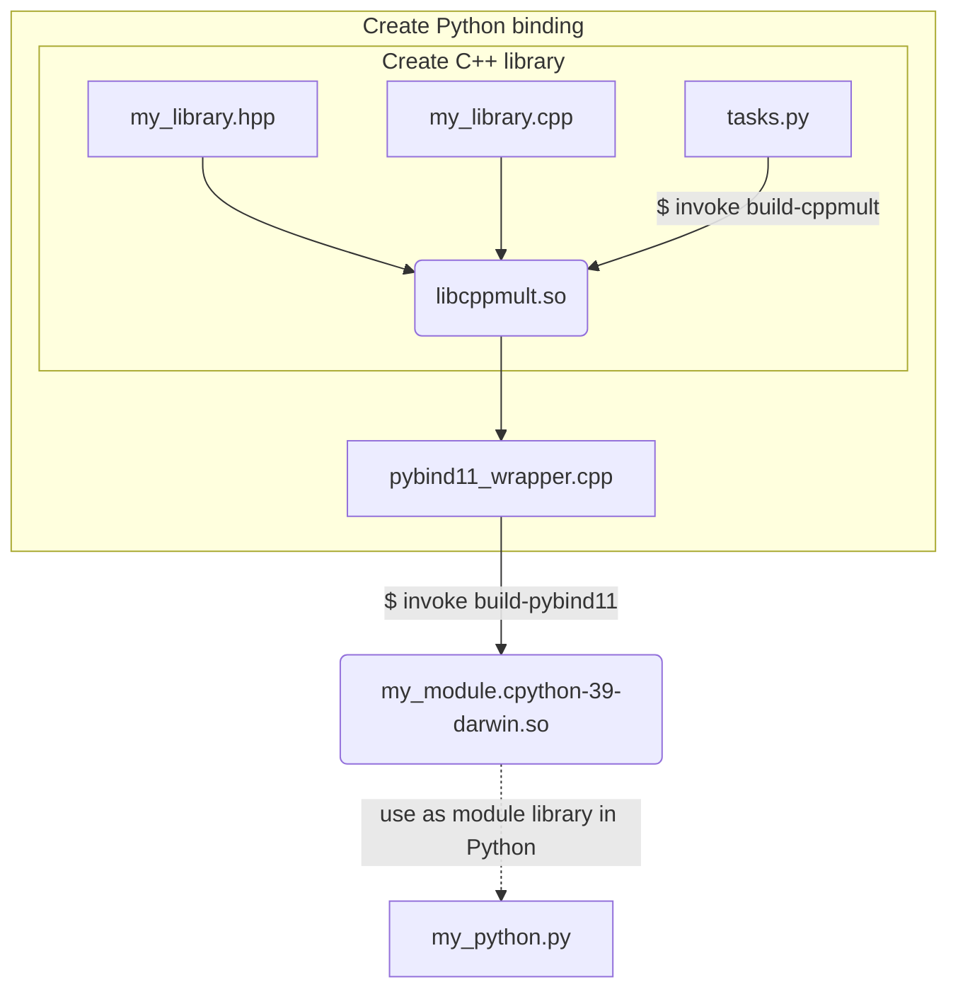

# Real Python example of pybind11

## Workflow used on Real Python site

Reference: https://realpython.com/python-bindings-overview/#pybind11

*See [Mermaid cheat sheet](https://jojozhuang.github.io/tutorial/mermaid-cheat-sheet/) for flow diagram examples.*




```Python
#!/usr/bin/env python
# my_python.py
from . import my_module as mm
```

## Configuration

```bash
> conda activate siblenv
> cd ~/sibl/geo/src/bind/realpython

# if not already installed in the siblenv environment, install invoke and pybind11
> python -m pip install invoke
> python -m pip install pybind11
```

## Source Files

* [`cppmult.cpp`](cppmult.cpp)
* [`cppmult.hpp`](cppmult.hpp)
* [`tasks.py`](tasks.py)
* [`pybind11_wrapper`](pybind11_wrapper.cpp)

## Output Files 

*Tested on macOS 2021-10-25*

```bash
> invoke build-cppmult                   (siblenv)  Mon Oct 25 18:48:52 2021
==================================================
= Building C++ Library
* Complete (Chad says hi!)
```

created `libcppmult.so` and

```bash
> invoke build-pybind11             (siblenv) 665ms Mon Oct 25 18:50:11 2021
==================================================
= Building C++ Library
* Complete (Chad says hi!)
==================================================
= Building PyBind11 Module
* Complete
```

created `pybind11_example.cpython-39-darwin.so`.

## Testing File

*Dot not use the original name, `pybind11_test.py`, since this interferes with the `pytest -v` auto discovery used with continuous integration on this repository.*

```bash
> python pybind11_testing.py                (siblenv)  Mon Oct 25 18:56:39 2021
    In cppmult: int 6 float 2.3 returning 13.8
    In Python: int: 6 float 2.3 return val 13.8
```

```bash
> python                                 (siblenv)  Mon Oct 25 19:01:32 2021

Python 3.9.5 (default, May 18 2021, 12:31:01)
[Clang 10.0.0 ] :: Anaconda, Inc. on darwin
Type "help", "copyright", "credits" or "license" for more information.

>>> import pybind11_example as pp
>>> dir(pp)
['__doc__', '__file__', '__loader__', '__name__', '__package__', '__spec__', 'cpp_function']
>>> pp.__doc__
'pybind11 example plugin'
>>>
```

## References

* [Real Python](https://realpython.com/python-bindings-overview/#pybind11)
* [Real Python GitHub repo](https://github.com/realpython/materials/tree/master/python-bindings)
